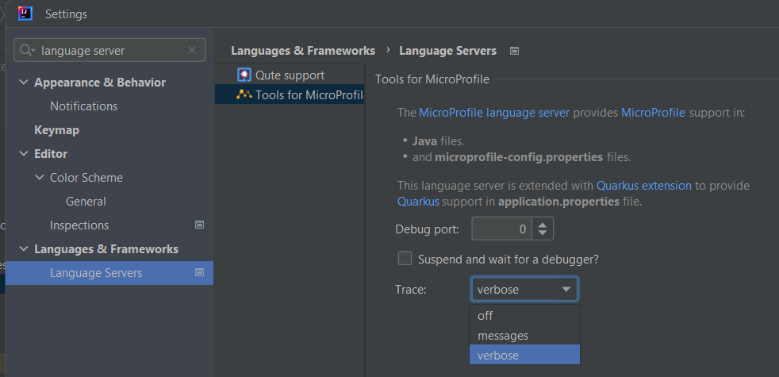

# LSP4IJ

## Description
<!-- Plugin description -->

LSP4IJ is a free and open-source [Language Server protocol (LSP)](https://microsoft.github.io/language-server-protocol/) client compatible with all flavours of IntelliJ.

<!-- Plugin description end -->

LSP4IJ provides:

* Language server `extension points` to add any language server:
  * `com.redhat.devtools.lsp4ij.server` extension point to define a language server.
  * `com.redhat.devtools.lsp4ij.languageMapping` to associate an Intellij language with a language server definition.
* an `LSP Consoles view` to tracks LSP requests, responses and notifications in a console:


* a `Language Servers settings page` to configure the LSP trace level, the debug port to use to debug language server:



## Who is using LSP4IJ?

Here are some projects that use LSP4IJ:

 * [Quarkus Tools for IntelliJ](https://github.com/redhat-developer/intellij-quarkus)

## Requirements

* Intellij IDEA 2022.2 or more recent (we **try** to support the last 4 major IDEA releases)
* Java JDK (or JRE) 17 or more recent

## Contributing

This is an open source project open to anyone. Contributions are extremely welcome!

 
### Building

Project is managed by Gradle. So building is quite easy.

#### Building the plugin distribution file

Run the following command:

```sh
./gradlew buildPlugin
```
The plugin distribution file is located in ```build/distributions```.

#### Testing

You can also easily test the plugin. Just run the following command:

```sh
./gradlew runIde
```

#### Testing the CI builds

You can also download and install CI builds of the latest commits or a specific pull request:

- open the [`Build plugin zip` workflow](https://github.com/redhat-developer/lsp4ij/actions/workflows/buildZip.yml)
- click on the build you are interested in
- scroll down and download the `LSP4IJ <version>.zip` file
- install `LSP4IJ <version>.zip` into IntelliJ IDEA by following these [instructions](https://www.jetbrains.com/help/idea/managing-plugins.html#install_plugin_from_disk).

#### Testing nightly builds

You can easily install nightly builds from the nightly channel:

- in IntelliJ, open `Setting > Plugins > [Gear icon] > Manage Plugin Repositories...`
- Add `https://plugins.jetbrains.com/plugins/nightly/23257` and press `OK`

- install the latest `LSP4IJ` version

Nightly builds are published once a day.

Data and Telemetry
==================
The JetBrains IntelliJ Quarkus Tools plugin collects anonymous [usage data](USAGE_DATA.md) and sends it to Red Hat servers to help improve our products and services. Read our [privacy statement](https://developers.redhat.com/article/tool-data-collection) to learn more. This extension respects the Red Hat Telemetry setting which you can learn more about at [https://github.com/redhat-developer/intellij-redhat-telemetry#telemetry-reporting](https://github.com/redhat-developer/intellij-redhat-telemetry#telemetry-reporting)

## Feedback

File a bug in [GitHub Issues](https://github.com/redhat-developer/lsp4ij/issues).

## License

Eclipse Public License 2.0.
See [LICENSE](LICENSE) file.