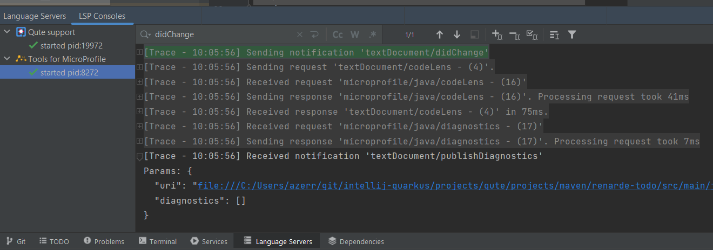
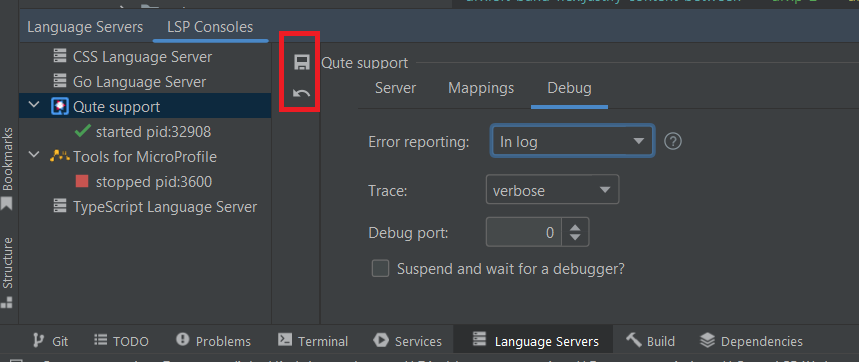
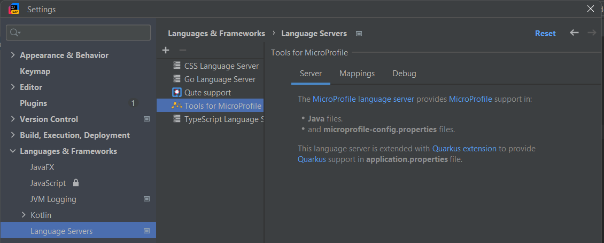
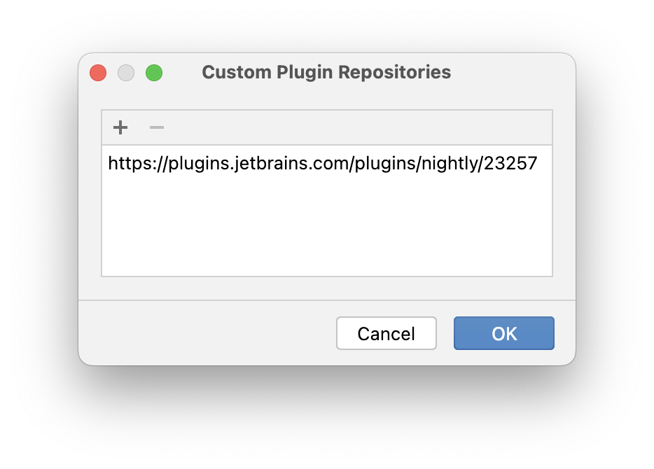
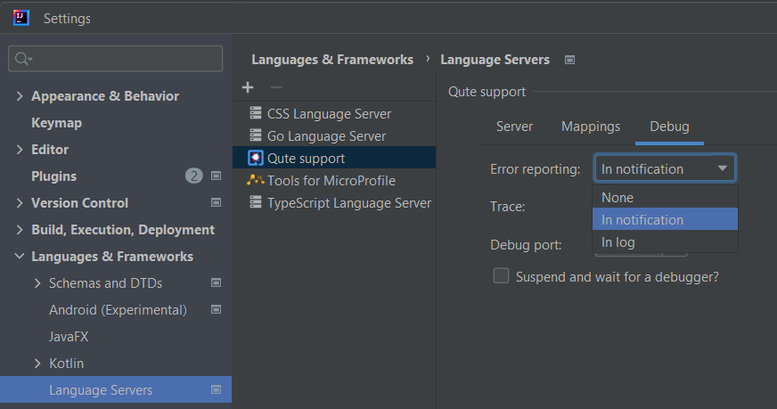
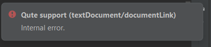
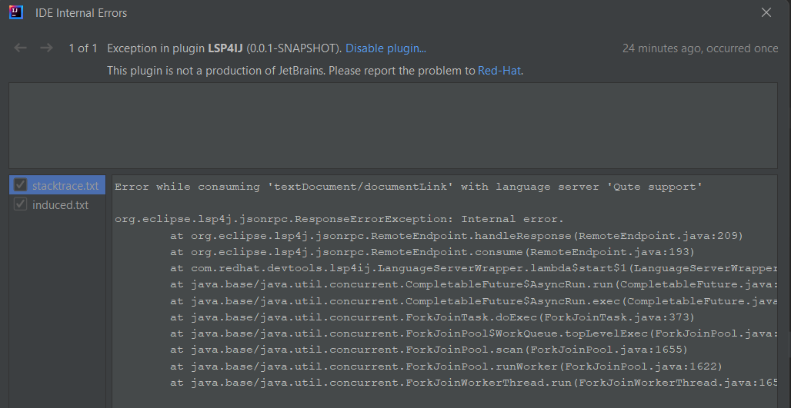
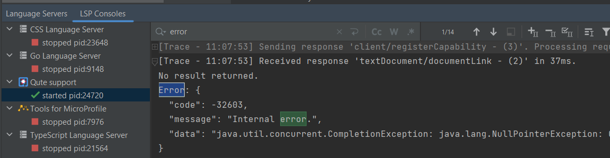

# LSP4IJ

[plugin-repo]: https://plugins.jetbrains.com/plugin/23257-lsp4ij
[plugin-version-svg]: https://img.shields.io/jetbrains/plugin/v/23257-lsp4ij.svg
[plugin-downloads-svg]: https://img.shields.io/jetbrains/plugin/d/23257-lsp4ij.svg
[plugin-rating-svg]: https://img.shields.io/jetbrains/plugin/r/rating/23257


[![JetBrains plugins][plugin-version-svg]][plugin-repo]
[![JetBrains Plugin Rating][plugin-rating-svg]][plugin-repo]
[![JetBrains plugins][plugin-downloads-svg]][plugin-repo]

## Description
<!-- Plugin description -->

LSP4IJ is a free and open-source 

 * [Language Server protocol (LSP)](https://microsoft.github.io/language-server-protocol/) client compatible with all flavours of IntelliJ.
 * [Debug Adapter Protocol](https://microsoft.github.io/debug-adapter-protocol/) support with [Debug Adapter Protocol Run/Debug configuration](./docs/dap/UserGuide.md).

It allows you to integrate any `language server` that communicates with its client via `stdio`:

* by `developing an IntelliJ plugin` with LSP `extension points`:
  * [com.redhat.devtools.lsp4ij.server](./docs/DeveloperGuide.md#extension-point-declaration) extension point to define a language server.
  * [com.redhat.devtools.lsp4ij.languageMapping](./docs/DeveloperGuide.md#declare-file-mappings) to associate an IntelliJ language with a language server definition.
* by manually adding [language server definitions](./docs/UserDefinedLanguageServer.md), 
supporting custom server settings. This approach doesn't require developing a specific IntelliJ plugin.

LSP4IJ also provides:

* an [LSP Consoles view](./docs/UserGuide.md#lsp-console) to tracks LSP requests, responses and notifications in a console:



If you select the language server node, you can configure it the same way as in the [Language Servers preferences page](./docs/UserGuide.md#language-servers-preferences)



and use the left toolbar to `Apply` or `Reset` the settings.

* a [Language Servers preferences page](./docs/UserGuide.md#language-servers-preferences) to configure the LSP trace level, the debug port to use to debug language server:



You can find more documentation in:

 * [the developer guide](./docs/DeveloperGuide.md), providing step-by-step instructions on how to integrate a language server in LSP4J in an external IntelliJ plugin.
 * [the User-defined language server documentation](./docs/UserDefinedLanguageServer.md), explaining how to integrate a language server in LSP4J with few settings. 
 * [the user guide](./docs/UserGuide.md), which explains how to use LSP console and Language Server preferences.
 * [the LSP Support overview](./docs/LSPSupport.md), describing which LSP features are implemented, and how.

<!-- Plugin description end -->

## Articles

 * [Meet LSP4IJ, a new LSP Client for JetBrains-based IDEs](https://idetools.dev/blog/lsp4ij-announcement/)
 * [Meet LSP4IJ, a new Debug Adapter Protocol for JetBrains-based IDEs](https://idetools.dev/blog/lsp4ij-dap-announcement/)

## Who is using LSP4IJ?

Here are some projects that use LSP4IJ:

 * [Quarkus Tools for IntelliJ](https://github.com/redhat-developer/intellij-quarkus)
 * [Inga for IntelliJ](https://github.com/seachicken/intellij-inga)
 * [IntelliJ SumnekoLua](https://github.com/CppCXY/Intellij-SumnekoLua)
 * [Haskell LSP for IntelliJ](https://github.com/rockofox/intellij-haskell-lsp)
 * [Zowe™ COBOL Language Support](https://github.com/zowe/zowe-cobol-language-support-intellij)
 * [ZigBrains](https://github.com/FalsePattern/ZigBrains)
 * [Pyright for PyCharm](https://github.com/InSyncWithFoo/pyright-for-pycharm)
 * [Intellij EmmyLua2](https://github.com/EmmyLua/Intellij-EmmyLua2)
 * [Lean4ij](https://github.com/onriv/lean4ij)
 * [Intellij KCL](https://github.com/kcl-lang/intellij-kcl)
 * [Ruff for PyCharm](https://github.com/koxudaxi/ruff-pycharm-plugin)
 * [Intellij Gleam](https://github.com/themartdev/intellij-gleam)
 * [Liberty Tools for IntelliJ](https://github.com/OpenLiberty/liberty-tools-intellij)
 * [Vespa Schema Language Support](https://github.com/vespa-engine/vespa/tree/master/integration/schema-language-server/clients/intellij)
 * [Jimmer DTO LSP](https://github.com/Enaium/jimmer-dto-lsp)
 * [Qt Tools for Android Studio](https://code.qt.io/cgit/qt-labs/android-studio-tools.git/)
 * [Clojure LSP Intellij](https://github.com/clojure-lsp/clojure-lsp-intellij)
 * [GroovyScript for IntelliJ](https://github.com/IntegerLimit/GroovyScriptPlugin)
 * [Redscript Intellij](https://github.com/pawrequest/redscript-intellij)
 * [AngelScript Language Server for IntelliJ](https://github.com/sashi0034/angel-intellij)
 * [RobotCode - Robot Framework Support](https://robotcode.io)
 * [IntelliJ-gno](https://github.com/gnoverse/intellij-gno)
 * [SAP CDS Language Support for IntelliJ](https://github.com/cap-js/cds-intellij)
 * [RyeCharm](https://github.com/InSyncWithFoo/ryecharm)
 * [Huly Code](https://github.com/hcengineering/huly-code)

## Requirements

* Intellij IDEA 2023.3 or more recent (we **try** to support the last 4 major IDEA releases)
* Java JDK (or JRE) 17 or more recent

## Contributing

This is an open source project open to anyone. Contributions are extremely welcome!

 
### Building

Project is managed by Gradle. So building is quite easy.

#### Building the plugin distribution file

Run the following command:

```sh
./gradlew buildPlugin
```
The plugin distribution file is located in ```build/distributions```.

#### Testing

You can also easily test the plugin. Just run the following command:

```sh
./gradlew runIde
```

#### Testing the CI builds

You can also download and install CI builds of the latest commits or a specific pull request:

- open the [`Build plugin zip` workflow](https://github.com/redhat-developer/lsp4ij/actions/workflows/buildZip.yml)
- click on the build you are interested in
- scroll down and download the `LSP4IJ <version>.zip` file
- install `LSP4IJ <version>.zip` into IntelliJ IDEA by following these [instructions](https://www.jetbrains.com/help/idea/managing-plugins.html#install_plugin_from_disk).

#### Testing nightly builds

You can easily install nightly builds from the nightly channel:

- in IntelliJ, open `Setting > Plugins > [Gear icon] > Manage Plugin Repositories...`
- Add `https://plugins.jetbrains.com/plugins/nightly/23257` and press `OK`

- install the latest `LSP4IJ` version

Nightly builds are published once a day.

Data and Telemetry
==================
If the [Red Hat Telemetry](https://github.com/redhat-developer/intellij-redhat-telemetry) plugin is installed, the LSP4IJ plugin will collect anonymous [usage data](USAGE_DATA.md) and send it to Red Hat servers to help improve our products and services. Read our [privacy statement](https://developers.redhat.com/article/tool-data-collection) to learn more. This extension respects the Red Hat Telemetry setting which you can learn more about at [https://github.com/redhat-developer/intellij-redhat-telemetry#telemetry-reporting](https://github.com/redhat-developer/intellij-redhat-telemetry#telemetry-reporting)

## Feedback

File a bug in [GitHub Issues](https://github.com/redhat-developer/lsp4ij/issues).

You can have 2 kinds of errors:

 * an error from LSP4IJ, in this case, the error will be reported in the standard IntelliJ log.
 * an error coming from the language server.

For the second case, you can customize the error reporting with the `Debug / Error reporting` combo box 
by opening the `Languages & Frameworks / Language Servers` preferences:



You can select:
 * `None` : in this case the language server error will be ignored.
 * `In notification` (default value) : in this case the language server error appear as a `notification`:

 The error notification shows 3 possible actions:
   * `Disable error reporting` : sets the error reporting to `None`.
   * `Report error in Log` : sets the error reporting to `In log`. 
   * `Open LSP4IJ documentation` : opens this documentation. 
 * `In log` : in this case the language server error will be logged in the standard `IntelliJ log`:


You can see this error's details in the [LSP Consoles view](./docs/UserGuide.md#lsp-console) (by setting the `Debug / Trace` combo box in `verbose`):



## License

Eclipse Public License 2.0.
See [LICENSE](LICENSE) file.
