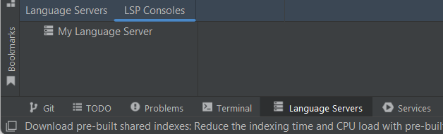
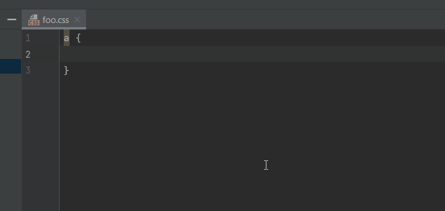
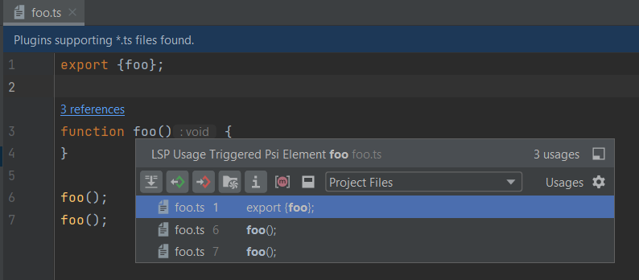

# Developer guide

This section provides step-by-step instructions for contributing an LSP language server in your IntelliJ plugin.

## Reference LSP4IJ

### plugin.xml

The first step is to reference LSP4IJ. LSP4IJ uses `com.redhat.devtools.lsp4ij` as plugin Id.

You
need [to declare dependency in your plugin.xml](https://plugins.jetbrains.com/docs/intellij/plugin-dependencies.html#3-dependency-declaration-in-pluginxml)
like this:

```xml
<idea-plugin>
    ...

    <depends>com.redhat.devtools.lsp4ij</depends>

    ...
</idea-plugin>
```

### Exclude all LSP4J dependencies

LSP4IJ depends on [Eclipse LSP4J](https://github.com/eclipse-lsp4j/lsp4j) (Java binding for
the [Language Server Protocol](https://microsoft.github.io/language-server-protocol) and
the [Debug Adapter Protocol](https://microsoft.github.io/debug-adapter-protocol).). It provides its own version of LSP4J
and its classes are loaded in the LSP4IJ plugin class loader.

If your IntelliJ Plugin contributes a Java-based language server, it must not embed its own version of LSP4J, in order to avoid conflicts with the version provided by
LSP4IJ. Failing to do so will result in `ClassCastException` errors to be thrown.
Make sure that the LSP4J dependency in your plugin is either declared with a `runtimeOnly` scope or excluded entirely,
if it's referenced as a transitive dependency.

Here is an example from the [build.gradle.kts](https://github.com/redhat-developer/intellij-quarkus/blob/main/build.gradle.kts) of the [Quarkus Tools](https://github.com/redhat-developer/intellij-quarkus) project,
excluding the LSP4J
dependency from the [Qute Language Server](https://github.com/redhat-developer/quarkus-ls/tree/master/qute.ls):

```kotlin
implementation("com.redhat.microprofile:com.redhat.qute.ls:0.17.0") {
  exclude("org.eclipse.lsp4j")
}
```

## Write Server-related code

## LanguageServerFactory

Create an implementation
of [LanguageServerFactory](https://github.com/redhat-developer/lsp4ij/blob/main/src/main/java/com/redhat/devtools/lsp4ij/LanguageServerFactory.java)
to expose your `my.language.server.MyLanguageServer`,
implementing [`StreamConnectionProvider`](https://github.com/redhat-developer/lsp4ij/blob/main/src/main/java/com/redhat/devtools/lsp4ij/server/StreamConnectionProvider.java) :

```java
package my.language.server;

import com.intellij.openapi.project.Project;
import com.redhat.devtools.lsp4ij.LanguageServerFactory;
import com.redhat.devtools.lsp4ij.client.LanguageClientImpl;
import com.redhat.devtools.lsp4ij.server.StreamConnectionProvider;
import org.jetbrains.annotations.NotNull;

public class MyLanguageServerFactory implements LanguageServerFactory {

    @Override
    public @NotNull StreamConnectionProvider createConnectionProvider(@NotNull Project project) {
        return new MyLanguageServer(project);
    }

    @Override // If you need to provide client specific features
    public @NotNull LanguageClientImpl createLanguageClient(@NotNull Project project) {
        return new MyLanguageClient(project);
    }

    @Override // If you need to expose a custom server API
    public @NotNull Class<? extends LanguageServer> getServerInterface() {
        return MyCustomServerAPI.class;
    }

}
```

In this sample `MyCustomServerAPI` interface could look like this:

```java
import org.eclipse.lsp4j.jsonrpc.services.JsonRequest;
import org.eclipse.lsp4j.services.LanguageServer;

import java.util.concurrent.CompletableFuture;

public interface MyCustomServerAPI  extends LanguageServer {

    @JsonRequest("my/applications")
    CompletableFuture<List<Application>> getApplications();
}
```

If you need to provide client specific features (e.g. commands), you can override the `createLanguageClient` method to
return your custom LSP client implementation.

If you need to expose a custom server API, i.e. custom commands supported by your language server, you can override
the `createLanguageClient` method to return a custom interface extending LSP4J's LanguageServer API.

### StreamConnectionProvider Implementation

Your `MyLanguageServer` needs to implement
the [StreamConnectionProvider](https://github.com/redhat-developer/lsp4ij/blob/main/src/main/java/com/redhat/devtools/lsp4ij/server/StreamConnectionProvider.java)
API which :

* manages the language server lifecycle (start/stop)
* returns the input/error stream of LSP requests, responses, notifications.

Frequently, a language server process is started through a runtime like Java, Node.js, etc. In this case you
need to
extend [OSProcessStreamConnectionProvider](https://github.com/redhat-developer/lsp4ij/blob/main/src/main/java/com/redhat/devtools/lsp4ij/server/OSProcessStreamConnectionProvider.java) or [ProcessStreamConnectionProvider](https://github.com/redhat-developer/lsp4ij/blob/main/src/main/java/com/redhat/devtools/lsp4ij/server/ProcessStreamConnectionProvider.java)

#### OSProcessStreamConnectionProvider

Even though [OSProcessStreamConnectionProvider](#osprocessstreamconnectionprovider) is experimental, 
it is recommended to extend it instead of [ProcessStreamConnectionProvider](#processstreamconnectionprovider) because the former internally uses the
IntelliJ [OSProcessHandler](https://github.com/JetBrains/intellij-community/blob/master/platform/platform-util-io/src/com/intellij/execution/process/OSProcessHandler.java) class 
which wraps a process and allows to track the process state via a 
[ProcessListener](https://github.com/JetBrains/intellij-community/blob/master/platform/util/src/com/intellij/execution/process/ProcessListener.java) listener.

In addition, OSProcessStreamConnectionProvider allows to log errors from the language server in the `Log tab` of the 
[LSP console](https://github.com/redhat-developer/lsp4ij/blob/main/docs/UserGuide.md#lsp-console).

Here is a basic sample which starts the `path/to/my/language/server/main.js` language server written in JavaScript, with
the Node.js runtime found in "path/to/nodejs/node.exe":

```java
package my.language.server;

import com.intellij.execution.configurations.GeneralCommandLine;
import com.redhat.devtools.lsp4ij.server.OSProcessStreamConnectionProvider;

public class MyLanguageServer extends OSProcessStreamConnectionProvider {

    public MyLanguageServer() {
        GeneralCommandLine commandLine = new GeneralCommandLine("path/to/nodejs/node.exe", "path/to/my/language/server/main.js");
        super.setCommandLine(commandLine);
    }
}
```

#### ProcessStreamConnectionProvider

Here is a basic sample which starts the `path/to/my/language/server/main.js` language server written in JavaScript, with
the Node.js runtime found in "path/to/nodejs/node.exe":

```java
package my.language.server;

import com.redhat.devtools.lsp4ij.server.ProcessStreamConnectionProvider;

import java.util.Arrays;
import java.util.List;

public class MyLanguageServer extends ProcessStreamConnectionProvider {

    public MyLanguageServer() {
        List<String> commands = Arrays.asList("path/to/nodejs/node.exe", "path/to/my/language/server/main.js");
        super.setCommands(commands);
    }
}
```

If your language server is written in Java, you can
use [JavaProcessCommandBuilder](https://github.com/redhat-developer/lsp4ij/blob/main/src/main/java/com/redhat/devtools/lsp4ij/server/JavaProcessCommandBuilder.java) to build the launch command:

```java
package my.language.server;

import com.intellij.openapi.project.Project;
import com.redhat.devtools.lsp4ij.server.JavaProcessCommandBuilder;
import com.redhat.devtools.lsp4ij.server.ProcessStreamConnectionProvider;

import java.util.Arrays;
import java.util.List;

public class MyLanguageServer extends ProcessStreamConnectionProvider {

    public MyLanguageServer(Project project) {
        List<String> commands = new JavaProcessCommandBuilder(project, "myLanguageServerId")
                .setJar("path/to/my/language/server/server.jar")
                .create();
        super.setCommands(commands);
    }
}
```

This builder takes care of filling command with the current Java runtime, and adds additional debug flags if the settings of the
language server `myLanguageServerId` defines a debug port.

You can see a complete example
with the [QuteServer](https://github.com/redhat-developer/intellij-quarkus/blob/main/src/main/java/com/redhat/devtools/intellij/qute/lsp/QuteServer.java) implementation.

### LanguageClientImpl

It is not required, but you can override the [LanguageClientImpl](https://github.com/redhat-developer/lsp4ij/blob/main/src/main/java/com/redhat/devtools/lsp4ij/client/LanguageClientImpl.java) to, for instance:

* add some IJ listeners when the language client is created.
* override some LSP methods.

```java
package my.language.server;

import com.intellij.openapi.project.Project;
import com.redhat.devtools.lsp4ij.client.LanguageClientImpl;

public class MyLanguageClient extends LanguageClientImpl {
    public MyLanguageClient(Project project) {
        super(project);
    }
}
```

If your language server manages custom LSP requests, it is recommended to extend [IndexAwareLanguageClient](https://github.com/redhat-developer/lsp4ij/blob/main/src/main/java/com/redhat/devtools/lsp4ij/client/IndexAwareLanguageClient.java), to ensure it won't be adversely affected by indexing operations.

You can see a full example
with [QuteLanguageClient](https://github.com/redhat-developer/intellij-quarkus/blob/main/src/main/java/com/redhat/devtools/intellij/qute/lsp/QuteLanguageClient.java)

## workspace/didChangeConfiguration

If you need to send a `workspace/didChangeConfiguration` with your settings, you can:

 * override and implement `LanguageClientImpl#createSettings()` to create the settings to send
 * call `LanguageClientImpl#triggerChangeConfiguration()` to send the settings from your custom listener (ex : track the change of your settings)

if you need to send a `workspace/didChangeConfiguration` when server is started, you can override and 
implement `LanguageClientImpl#handleServerStatusChanged(ServerStatus serverStatus)` like this:

```java
@Override
public void handleServerStatusChanged(ServerStatus serverStatus) {
    if (serverStatus == ServerStatus.started) {
        triggerChangeConfiguration();
    }
}
```

## Extension point declaration

The next step is to declare the server in your plugin.xml with the `com.redhat.devtools.lsp4ij.server` extension point
referencing your `my.language.server.MyLanguageServerFactory`:

```xml
<extensions defaultExtensionNs="com.redhat.devtools.lsp4ij">
    <server id="myLanguageServerId"
            name="My Language Server"
            factoryClass="my.language.server.MyLanguageServerFactory">
        <description><![CDATA[
        Some description written in HTML to display it in the LSP consoles view and Language Servers settings.
        ]]>
        </description>
    </server>
</extensions>

```

A that point, once the declaration is done, your server should appear in the `LSP Consoles` view:



## Declare file mappings

Once the server is defined in your `plugin.xml`, you still need to associate an IntelliJ language with the `server` defined by the id attribute.
You can use three kinds of mappings:

* [Language mapping](#language-mapping) with the `com.redhat.devtools.lsp4ij.languageMapping` extension point
  used to associate a [Language](https://plugins.jetbrains.com/docs/intellij/custom-language-support.html) with a
  language server.
* [File type mapping](#file-type-mapping) with the `com.redhat.devtools.lsp4ij.fileTypeMapping` extension point
  used to associate a [File type](https://www.jetbrains.com/help/idea/creating-and-registering-file-types.html) with a
  language server.
* [File name pattern mapping](#file-name-pattern-mapping) with the `com.redhat.devtools.lsp4ij.fileNamePatternMapping`
  extension point
  used to associate a simple pattern file name (ex: `*.less`) with a language server.
  This mapping can be very helpful if you need to support syntax coloration with TextMate.
  Indeed, when you manually define
  a [File type](https://www.jetbrains.com/help/idea/creating-and-registering-file-types.html) for some file name
  patterns, **you loose the TextMate syntax coloration**.

### Language mapping

Here is a sample snippet to associate the `XML` language with the `myLanguageServerId` server:

```xml
<extensions defaultExtensionNs="com.redhat.devtools.lsp4ij">

    <languageMapping language="XML"
                     serverId="myLanguageServerId"/>

</extensions>
```

#### Language ID

Some language servers use
the [TextDocumentItem#languageId](https://microsoft.github.io/language-server-protocol/specifications/lsp/3.17/specification/#textDocumentItem)
field to identify the document on the server side.
For instance the [vscode-css-languageservice](https://github.com/microsoft/vscode-css-languageservice) (used by the
vscode CSS language server) expects the `languageId` to be `css` or `less`.
To do that, you can declare it with the `languageId` attribute:

```xml
<extensions defaultExtensionNs="com.redhat.devtools.lsp4ij">

    <languageMapping language="CSS"
                     serverId="myLanguageServerId"
                     languageId="css"/>

</extensions>
```

#### Document Matcher

If the language check is not enough, you can implement a
custom [DocumentMatcher](https://github.com/redhat-developer/lsp4ij/blob/main/src/main/java/com/redhat/devtools/lsp4ij/DocumentMatcher.java).
For instance your language server could be mapped to the `Java` language, and you could implement a DocumentMatcher
to check if the module containing the file contains certain Java classes in its classpath.

The DocumentMatcher is executed in a non blocking read action.

A document matcher looks like this:

```java
package my.language.server;

import com.intellij.openapi.project.Project;
import com.intellij.openapi.vfs.VirtualFile;
import com.redhat.devtools.lsp4ij.AbstractDocumentMatcher;
import org.jetbrains.annotations.NotNull;

public class MyDocumentMatcher extends AbstractDocumentMatcher {

    @Override
    public boolean match(@NotNull VirtualFile virtualFile, @NotNull Project project) {
        return true;
    }
}
```

and it must be registered as language mapping, with the `documentMatcher` attribute:

```xml
<extensions defaultExtensionNs="com.redhat.devtools.lsp4ij">

    <languageMapping language="XML"
                     serverId="myLanguageServerId"
                     documentMatcher="my.language.server.MyDocumentMatcher"/>

</extensions>
```

### File type mapping

If your plugin does not define an
IntelliJ [Language](https://plugins.jetbrains.com/docs/intellij/custom-language-support.html)
but just a [File type](https://www.jetbrains.com/help/idea/creating-and-registering-file-types.html), you can
use `fileTypeMapping`
instead of using `languageMapping`.

A good example is if you want to associate the existing `CSS` file type to the
`CSS language server` in `IntelliJ Community`, which only defines the CSS file type, but not the CSS language.

```xml
<extensions defaultExtensionNs="com.redhat.devtools.lsp4ij">

    <fileTypeMapping fileType="CSS"
                     serverId="myLanguageServerId"
                     languageId="css"/>

</extensions>
```

### File name pattern mapping

If your plugin does not define
a [File type](https://www.jetbrains.com/help/idea/creating-and-registering-file-types.html),
you can use `fileNamePatternMapping` instead of using `fileTypeMapping`.

A good example is if you want to associate `*.less` files to the `CSS language server`
where `LESS file type` doesn't exist in `IntelliJ Community`.

Using `fileNamePatternMapping` is recommended if you want to keep the `TextMate`-based syntax coloration.
(using [File type](https://www.jetbrains.com/help/idea/creating-and-registering-file-types.html) will override and
disable the syntax coloration with TextMate).

A good example is if you want to associate
the [TypeScript Language Server](./user-defined-ls/typescript-language-server.md)
without breaking existing syntax coloration managed with `TextMate` in `IntelliJ Community`.

```xml
<extensions defaultExtensionNs="com.redhat.devtools.lsp4ij">

    <fileNamePatternMapping patterns="*.less;*.scss"
                            serverId="myLanguageServerId"
                            languageId="css"/>

</extensions>
```

## Special cases

In general, LSP4IJ maps language server features to specific Intellij APIs. However, in some cases, the mapping needs to
be declared explicitly in your plugin.xml.

### Folding support

LSP folding support is implemented via the `lang.foldingBuilder` extension point, which requires binding to an IntelliJ language.
Your plugin.xml needs to specifically bind LSP4IJ's `LSPFoldingRangeBuilder` to that IntelliJ language:

```xml
<!-- LSP textDocument/folding -->
<lang.foldingBuilder language="MyLanguage"
                     implementationClass="com.redhat.devtools.lsp4ij.features.foldingRange.LSPFoldingRangeBuilder"
                     order="first"/>
```

See specific [folding implementation details](./LSPSupport.md#folding-range) for more details.

### Signature help

LSP Signature Help support is implemented via the `codeInsight.parameterInfo` extension point, which requires binding to an IntelliJ language.
Your plugin.xml needs to specifically bind LSP4IJ's `LSPParameterInfoHandler` to that IntelliJ language:

```xml
<!-- LSP textDocument/signatureHelp -->
<codeInsight.parameterInfo
        language="MyLanguage"
        implementationClass="com.redhat.devtools.lsp4ij.features.signatureHelp.LSPParameterInfoHandler"/>
```

See specific [Signature help implementation details](./LSPSupport.md#signature-help) for more details.

### Document symbol

[textDocument/documentSymbol](https://microsoft.github.io/language-server-protocol/specifications/lsp/3.17/specification/#textDocument_documentSymbol) is implemented via the `lang.psiStructureViewFactory` extension point, which requires binding to an IntelliJ language.
Your plugin.xml needs to specifically bind LSP4IJ's `LSPDocumentSymbolStructureViewFactory` to that IntelliJ language:

```xml
<!-- LSP textDocument/documentSymbol -->
<lang.psiStructureViewFactory
        language="MyLanguage"
        implementationClass="com.redhat.devtools.lsp4ij.features.documentSymbol.LSPDocumentSymbolStructureViewFactory"/>
```

See specific [Document symbol implementation details](./LSPSupport.md#document-symbol) for more details.

## Language Server Manager

If you need to `enable/disable` and / or `start/stop` your language server, LSP4IJ provides the [LanguageServerManager](https://github.com/redhat-developer/lsp4ij/blob/main/src/main/java/com/redhat/devtools/lsp4ij/LanguageServerManager.java) API which provides this support:

### Enable / Disable

By default, a language server is enabled : in other words, when the IDE starts, LSP4IJ tracks the opened files and starts the matching language servers.
If you need to manage this `enabled` state programmatically, your [LanguageServerFactory](#languageserverfactory) must implement [LanguageServerEnablementSupport](https://github.com/redhat-developer/lsp4ij/blob/main/src/main/java/com/redhat/devtools/lsp4ij/LanguageServerEnablementSupport.java):

```java
package my.language.server;

import com.intellij.openapi.project.Project;
import com.redhat.devtools.lsp4ij.LanguageServerFactory;
import com.redhat.devtools.lsp4ij.LanguageServerEnablementSupport;
import com.redhat.devtools.lsp4ij.client.LanguageClientImpl;
import com.redhat.devtools.lsp4ij.server.StreamConnectionProvider;
import org.jetbrains.annotations.NotNull;

public class MyLanguageServerFactory implements LanguageServerFactory, LanguageServerEnablementSupport {

    @Override
    public boolean isEnabled(@NotNull Project project) {
        // Get enabled state from your settings
        boolean enabled = ...
        return enabled;
    }

    @Override
    public void setEnabled(boolean enabled, Project project) {
        // Update enabled state from your settings
    }

}
```

### Start / Stop

To `start` your language server you can use the [LanguageServerManager](https://github.com/redhat-developer/lsp4ij/blob/main/src/main/java/com/redhat/devtools/lsp4ij/LanguageServerManager.java) API.

```java
Project project = ...
LanguageServerManager.getInstance(project).start("myLanguageServerId");
```

Here the language server will only start if there is an open file corresponding to your language server.

You can force the start of the language server with:

```java
LanguageServerManager.StartOptions options = new LanguageServerManager.StartOptions();
options.setForceStart(true);
Project project = ...
LanguageServerManager.getInstance(project).start("myLanguageServerId", options);
```

To `stop` your language server you can use the [LanguageServerManager](https://github.com/redhat-developer/lsp4ij/blob/main/src/main/java/com/redhat/devtools/lsp4ij/LanguageServerManager.java) API.

```java
Project project = ...
LanguageServerManager.getInstance(project).stop("myLanguageServerId");
```

Here the language server will be stopped and disabled.

If you just want to stop the language server without disabling it, you can write:

```java
LanguageServerManager.StopOptions options = new LanguageServerManager.StopOptions();
options.setWillDisable(false);
Project project = ...
LanguageServerManager.getInstance(project).stop("myLanguageServerId", options);
```

### Get language server

If you need to execute an LSP Command, please read [here](#execute-a-command)

If you need to get your language server and execute something with it, you can write code like this:

```java
LanguageServerManager.getInstance(project)
        .getLanguageServer("myLanguageServerId")
        .thenAccept(languageServerItem -> {
            if (languageServerItem != null) {
                // Language server item exists here...
              
                // Get the LSP4J LanguageServer
                org.eclipse.lsp4j.services.LanguageServer ls = languageServerItem.getServer();
              
                // Do something with the language server
                
            }});
```

Here `LanguageServerItem#getServer()` is used because we are sure that language server is initialized.

Here a sample which consumes custom services with [MyCustomApi](#languageserverfactory) 

```java
import org.eclipse.lsp4j.jsonrpc.services.JsonRequest;
import org.eclipse.lsp4j.services.LanguageServer;

import java.util.concurrent.CompletableFuture;

public interface MyCustomServerAPI  extends LanguageServer {

    @JsonRequest("my/applications")
    CompletableFuture<List<Application>> getApplications();
}
```

to get list of Application:

```java
CompletableFuture<List<Application>> applications =
  LanguageServerManager.getInstance(project)
    .getLanguageServer("myLanguageServerId")
    .thenApply(languageServerItem -> 
                    languageServerItem != null ? languageServerItem.getServer() // here getServer is used because we are sure that server is initialized  
                    : null)
    .thenCompose(ls -> {
      if (ls == null) {
          return CompletableFuture.completedFuture(Collections.emptyList());
      }
      MyCustomServerAPI myServer = (MyCustomServerAPI) ls;
      return myServer.getApplications();}
    );
```

If you need to get your language server and store it in a field to keep a connection and reuse it several times, you can:

 * store the result in a languageServerFuture field:

```java
Project project = ...
CompletableFuture<@Nullable LanguageServerItem> languageServerFuture = 
        LanguageServerManager.getInstance(project)
            .getLanguageServer("myLanguageServerId");
```
 * consume it several times:

```java
CompletableFuture<List<Application>> applications = 
     languageServerFuture
     .thenCompose(languageServerItem -> {
       if (languageServerItem != null) {
         return CompletableFuture.completedFuture(null);
       }
       return languageServerItem.getInitializedServer(); // here getInitializedServer is used because language server could be stopped and must be restarted
     })
    .thenCompose(ls -> {
      if (ls == null) {
          return CompletableFuture.completedFuture(Collections.emptyList());
      }
      MyCustomServerAPI myServer = (MyCustomServerAPI) ls;
      return myServer.getApplications();}
    );
```

## Keep a Language Server alive with a Lease

If you need a reference to your language server and need to execute operations with it, 
for an extended period of time, you can use `LanguageServerItem.keepAlive()` method to create
a `Lease` on the item. The lease represents a request for lsp4ij not to terminate the language 
server until the `Lease` is disposed.

```java
Project project = ...
CompletableFuture<Lease<LanguageServerItem>> serverLease = 
        LanguageServerManager.getInstance(project).getLanguageServer("myLanguageServerId")
        .thenApply(item -> item.keepAlive());
```

As long as the lease has not been disposed this will request lsp4ij not arbitrarily terminate the language
server under 'normal circumstances'. This means that the server will not be terminated for example when
there are no more open editors.

To get access to your language server from the lease call the `get()` method on the lease.
This will return a LanuageServerItem that is guaranteed to have an 'active' server at that time.

```java
import com.intellij.openapi.util.Disposer;
...

serverLease.thenAccept(lease -> {
    try {
       while (...we need to do suff...) {
          // Fetch list of 'applications' using some custom protocol on 'MyLanguageServer'
          List<Application> applications = ((MyLanguageServer)lease.get().getServer()).getApplications();   
          ... do something with the result...
       }
    } catch (ServerWasStoppedException e) {   
        // handle the case where the server was unexpectedly terminated
        ...
    } finally {
       // Release the lease when the server is no longer needed
       Disposer.dispose(lease);
    }
});
```

Note that it is still possible under some circumstance that the server might get terminated despite having 
active leases: 

  - the server process could crash unexpectedly. 
  - a user could stop the language server from lsp4ij UI (but see [LSP Client Features API](./LSPApi.md#lsp-client-features)
    for a way to disable this user ability by overriding `canStopServerByUser()`)
  - when the IDE shuts down all language servers will be terminated regardles of active leases.

You should be prepared to handle these kinds of situations in a graceful manner. You can detect whether
this has happened by handling `ServerWasStoppedException` thrown from `Lease.get()`.

Once you are done using the server and no longer need it to remain alive, you 
should `dispose` the lease. This tells lsp4ij that you are not using it anymore
and it is okay to stop the server (presuming there is nothing else still using it, be 
it another active `Lease` or any open editors).

For more information on the correct way to `dispose` a disposable, see the 
JavaDoc on `com.intellij.openapi.Disposable` and [here](https://plugins.jetbrains.com/docs/intellij/disposers.html#the-disposer-singleton).

## LSP commands

### LSPCommandAction

If the language server support requires to implement a custom client command, you can extend
[LSPCommandAction.java](https://github.com/redhat-developer/lsp4ij/blob/main/src/main/java/com/redhat/devtools/lsp4ij/commands/LSPCommandAction.java) and register it
in `plugin.xml` with a `standard` action element.

### Default commands

LSP4IJ provides default LSP commands that you language servers leverage.

#### editor.action.triggerSuggest

[TriggerSuggestAction.java](https://github.com/redhat-developer/lsp4ij/blob/main/src/main/java/com/redhat/devtools/lsp4ij/commands/editor/TriggerSuggestAction.java) emulates Visual Studio Code's `editor.action.triggerSuggest` command,
to trigger code completion after selecting a completion item.

This command is used for instance with the [CSS Language Server](./user-defined-ls/vscode-css-language-server.md)
to reopen completion after `applying color completion item`:



#### editor.action.showReferences

[ShowReferencesAction.java](https://github.com/redhat-developer/lsp4ij/blob/main/src/main/java/com/redhat/devtools/lsp4ij/commands/editor/ShowReferencesAction.java) emulates Visual Studio Code's `editor.action.showReferences` command,
to show the LSP references in a popup.

This command is used for instance with the [TypeScript Language Server](./user-defined-ls/typescript-language-server.md)
to open `references/implementations` in a popup when  clicking on a `Codelens` :



### Execute a command

If you need to `execute an LSP org.eclipse.lsp4j.Command` of your language server in a `View` for example, you can use `CommandExecutor` like this:

```java
Command command = new Command("My command", "command.from.your.ls");
LSPCommandContext commandContext = new LSPCommandContext(command, project);
commandContext.setPreferredLanguageServerId("myLanguageServerId");
CommandExecutor.executeCommand(commandContext)
        .response()
        .thenAccept(r -> {
        // Do something with the workspace/executeCommand Object response
        });
```

# Workspace Configuration

[workspace/configuration](https://microsoft.github.io/language-server-protocol/specifications/lsp/3.17/specification/#workspace_configuration) is implemented, but it requires to implement and override:

 * `LanguageClientImpl#createSettings()` which must return a Gson JsonObject of your configuration.
 * or `LanguageClientImpl#findSettings(String section)` if you don't want to work with GSon JsonObject.
 
# Semantic tokens colors provider

Before you start reading this section, please read the [User Guide](UserGuide.md#semantic-tokens-support) to configure support for semantic tokens.

When the language server supports semantic tokens, the decoded token type and token modifiers must be translated to an IntelliJ `TextAttributeKeys`.
using the [SemanticTokensColorsProvider](https://github.com/redhat-developer/lsp4ij/blob/main/src/main/java/com/redhat/devtools/lsp4ij/features/semanticTokens/SemanticTokensColorsProvider.java) API:

```java
public interface SemanticTokensColorsProvider {

    /**
     * Returns the {@link TextAttributesKey} to use for colorization for the given token type and given token modifiers and null otherwise.
     *
     * @param tokenType      the token type.
     * @param tokenModifiers the token modifiers.
     * @param file           the Psi file.
     * @return the {@link TextAttributesKey} to use for colorization for the given token type and given token modifiers and null otherwise.
     */
    @Nullable
    TextAttributesKey getTextAttributesKey(@NotNull String tokenType,
                                           @NotNull List<String> tokenModifiers,
                                           @NotNull PsiFile file);
}
```

By default, LSP4IJ uses the [DefaultSemanticTokensColorsProvider](https://github.com/redhat-developer/lsp4ij/blob/main/src/main/java/com/redhat/devtools/lsp4ij/features/semanticTokens/DefaultSemanticTokensColorsProvider.java),
but you can use your own provider with the `semanticTokensColorsProvider` extension point:

```xml
<extensions defaultExtensionNs="com.redhat.devtools.lsp4ij">

  <semanticTokensColorsProvider
                   serverId="myLanguageServerId"
                   class="my.language.server.MySemanticTokensColorsProvider" />

</extensions>
```

# Customize LSP features

If you need to customize LSP (completion, diagnostics, etc) features please read [LSP API](./LSPApi.md). 