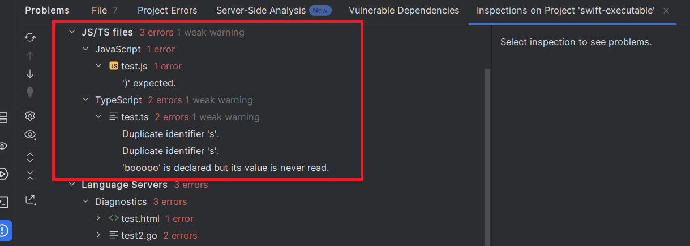

## LSP Client Features

The [LSPClientFeatures](https://github.com/redhat-developer/lsp4ij/blob/main/src/main/java/com/redhat/devtools/lsp4ij/client/features/LSPClientFeatures.java) API allows you to customize the behavior of LSP features, including:

- [LSP codeAction feature](#lsp-codeAction-feature)
- [LSP codeLens feature](#lsp-codeLens-feature)
- [LSP color feature](#lsp-color-feature)
- [LSP completion feature](#lsp-completion-feature)
- [LSP declaration feature](#lsp-declaration-feature)
- [LSP definition feature](#lsp-definition-feature)
- [LSP diagnostic feature](#lsp-diagnostic-feature)
- [LSP documentHighlight feature](#lsp-documentHighlight-feature)
- [LSP documentLink feature](#lsp-documentLink-feature)
- [LSP documentSymbol feature](#lsp-documentSymbol-feature)
- [LSP foldingRange feature](#lsp-foldingRange-feature)
- [LSP formatting feature](#lsp-formatting-feature)
- [LSP selection feature](#lsp-selection-feature)
- [LSP hover feature](#lsp-hover-feature)
- [LSP implementation feature](#lsp-implementation-feature)
- [LSP inlayHint feature](#lsp-inlayHint-feature)
- [LSP progress feature](#lsp-progress-feature) 
- [LSP references feature](#lsp-references-feature)
- [LSP rename feature](#lsp-rename-feature)
- [LSP semanticTokens feature](#lsp-semanticTokens-feature)
- [LSP signatureHelp feature](#lsp-signatureHelp-feature)
- [LSP typeDefinition feature](#lsp-typeDefinition-feature)
- [LSP usage feature](#lsp-usage-feature)
- [LSP workspace symbol feature](#lsp-workspace-symbol-feature)
- [LSP breadcrumbs feature](#lsp-breadcrumbs-feature)
- [LSP editor behavior feature](#lsp-editor-behavior-feature)
- [Language server installer](#language-server-installer)

You can extend these default features by:

- Creating custom classes that extend the `LSP*Feature` classes (e.g., creating a class `MyLSPFormattingFeature` that extends the [LSPFormattingFeature](https://github.com/redhat-developer/lsp4ij/blob/main/src/main/java/com/redhat/devtools/lsp4ij/client/features/LSPFormattingFeature.java) to customize formatting support) and overriding specific methods to modify behavior.
- Registering your custom classes using `LanguageServerFactory#createClientFeatures()`.

```java
package my.language.server;

import com.intellij.openapi.project.Project;
import com.redhat.devtools.lsp4ij.LanguageServerFactory;
import com.redhat.devtools.lsp4ij.client.features.LSPClientFeatures;
import org.jetbrains.annotations.NotNull;

public class MyLanguageServerFactory implements LanguageServerFactory {

    @Override
    public @NotNull LSPClientFeatures createClientFeatures() {
        return new LSPClientFeatures()
                .setCompletionFeature(new MyLSPCompletionFeature()) // customize LSP completion feature
                .setDiagnosticFeature(new MyLSPDiagnosticFeature()) // customize LSP diagnostic feature
                .setFormattingFeature(new MyLSPFormattingFeature()); // customize LSP formatting feature         
    }
}
```

| API                                                          | Description                                                                                                                                                                                                                                                                                                                                                                                    | Default Behaviour |
|--------------------------------------------------------------|------------------------------------------------------------------------------------------------------------------------------------------------------------------------------------------------------------------------------------------------------------------------------------------------------------------------------------------------------------------------------------------------|-------------------|
| boolean isEnabled(VirtualFile)                               | Returns `true` if the language server is enabled for the given file and `false` otherwise.                                                                                                                                                                                                                                                                                                     | `true`            |
| void initializeParams(InitializeParams)                      | This method is invoked just before [LanguageServer#initialize(InitializeParams)](https://github.com/eclipse-lsp4j/lsp4j/blob/651eb49e1f4cd90439808885ddaad0862b330908/org.eclipse.lsp4j/src/main/java/org/eclipse/lsp4j/services/LanguageServer.java#L50) <br/>to enable customization of the language server's initialization parameters (e.g., {@link InitializeParams#getWorkDoneToken()}). |                   |
| void handleServerStatusChanged(ServerStatus)                 | Callback invoked when language server status changed.                                                                                                                                                                                                                                                                                                                                          |                   |
| URI getFileUri(VirtualFile file)                             | Returns the file Uri from the given virtual file and null otherwise (to use default `FileUriSupport.DEFAULT.getFileUri`).                                                                                                                                                                                                                                                                      | `null`            |
| VirtualFile findFileByUri(String fileUri)                    | Returns the virtual file found by the given file Uri and null otherwise (to use default `FileUriSupport.DEFAULT.findFileByUri`).                                                                                                                                                                                                                                                               | `null`            |
| boolean isCaseSensitive(PsiFile file)                        | Returns `true` if the language grammar for the given file is case-sensitive and `false` otherwise.                                                                                                                                                                                                                                                                                             | `false`           | 
| String getLineCommentPrefix(PsiFile file)                    | Returns the language grammar line comment prefix for the file.                                                                                                                                                                                                                                                                                                                                 |                   | 
| String getBlockCommentPrefix(PsiFile file)                   | Returns the language grammar block comment prefix for the file.                                                                                                                                                                                                                                                                                                                                |                   | 
| String getBlockCommentSuffix(PsiFile file)                   | Returns the language grammar block comment suffix for the file.                                                                                                                                                                                                                                                                                                                                |                   | 
| String getStatementTerminatorCharacters(PsiFile file)        | Returns the language grammar statement terminator characters for the file.                                                                                                                                                                                                                                                                                                                     |                   | 
| boolean keepServerAlive()                                    | Returns `true` if the server is kept alive even if all files associated with the language server are closed and `false` otherwise.                                                                                                                                                                                                                                                             | `false`           |
| boolean canStopServerByUser()                                | Returns `true` if the user can stop the language server in LSP console from the context menu and `false` otherwise.                                                                                                                                                                                                                                                                            | `true`            |
| Project getProject()                                         | Returns the project.                                                                                                                                                                                                                                                                                                                                                                           |                   |
| LanguageServerDefinition getServerDefinition()               | Returns the language server definition.                                                                                                                                                                                                                                                                                                                                                        |                   |
| boolean isServerDefinition(@NotNull String languageServerId) | Returns `true` if the given language server id matches the server definition and `false` otherwise.                                                                                                                                                                                                                                                                                            |                   |
| ServerStatus getServerStatus()                               | Returns the server status.                                                                                                                                                                                                                                                                                                                                                                     |                   |
| LanguageServer getLanguageServer()                           | Returns the LSP4J language server.                                                                                                                                                                                                                                                                                                                                                             |                   |

```java
package my.language.server;

import com.redhat.devtools.lsp4ij.client.features.LSPClientFeatures;

public class MyLSPClientFeatures extends LSPClientFeatures {

    @Override
    public boolean keepServerAlive() {
        // Kept alive the server even if all files associated with the language server are closed
        return true;
    }
}
```

```java
package my.language.server;

import com.intellij.openapi.project.Project;
import com.redhat.devtools.lsp4ij.LanguageServerFactory;
import com.redhat.devtools.lsp4ij.client.features.LSPClientFeatures;
import org.jetbrains.annotations.NotNull;

public class MyLanguageServerFactory implements LanguageServerFactory {

    @Override
    public @NotNull LSPClientFeatures createClientFeatures() {
        return new MyLSPClientFeatures() // customize LSP general features
                .setCompletionFeature(new MyLSPCompletionFeature()) // customize LSP completion feature
                .setDiagnosticFeature(new MyLSPDiagnosticFeature()) // customize LSP diagnostic feature
                .setFormattingFeature(new MyLSPFormattingFeature()); // customize LSP formatting feature         
    }
}
```

## LSP Base Feature

| API                                                          | Description                                                                                     | Default Behaviour |
|--------------------------------------------------------------|-------------------------------------------------------------------------------------------------|-------------------|
| Project getProject()                                         | Returns the project.                                                                            |                   |
| LanguageServerDefinition getServerDefinition()               | Returns the language server definition.                                                         |                   |
| boolean isServerDefinition(@NotNull String languageServerId) | Returns true if the given language server id matches the server definition and false otherwise. |                   |
| ServerStatus getServerStatus()                               | Returns the server status.                                                                      |                   |
| LanguageServer getLanguageServer()                           | Returns the LSP4J language server.                                                              |                   |

### Disable a given LSP Feature

All `LSP*Feature` classes extend [AbstractLSPDocumentFeature](https://github.com/redhat-developer/lsp4ij/blob/main/src/main/java/com/redhat/devtools/lsp4ij/client/features/LSPAbstractFeature.java), which declares the `isEnabled` method that returns `true` by default:

```java
public boolean isEnabled(@NotNull PsiFile file) {
    return true;
}
```

By overriding this method, you can return `false` to disable a given LSP feature for your language server. This method is called before starting the language server.

### Supported LSP Feature

All `LSP*Feature` classes extend [AbstractLSPDocumentFeature](https://github.com/redhat-developer/lsp4ij/blob/main/src/main/java/com/redhat/devtools/lsp4ij/client/features/LSPAbstractFeature.java), which declares the `isSupported` method that uses the server capabilities:

```java
public boolean isSupported(@NotNull PsiFile file) {

}
```

This method is called after starting the language server to collect the LSP server capabilities.

### Project Access

If you need the `Project` instance in your LSP feature to retrieve the settings of the current project, you can use the `getProject()` getter method.

```java
public class MyLSPCodeLensFeature extends LSPCodeLensFeature {

    @Override
    public boolean isEnabled(@NotNull PsiFile file) {
        return MySettings.getInstance(super.getProject()).isCodeLensEnabled();
    }

}
```

### Server Status

If you need to check the server status, you can use the `getServerStatus()` getter method.

```java
public class MyLSPCodeLensFeature extends LSPCodeLensFeature {

    @Override
    public boolean isEnabled(@NotNull PsiFile file) {
        // Here, code lens will be disabled if the language server is not started
        // (the LSP CodeLens will not force the start of the language server)
        var serverStatus = super.getServerStatus();
        return serverStatus == ServerStatus.starting || serverStatus == ServerStatus.started;
    }

}
```

## LSP CodeAction Feature

| API                                         | Description                                                                                                                                                                                                                        | Default Behaviour           |
|---------------------------------------------|------------------------------------------------------------------------------------------------------------------------------------------------------------------------------------------------------------------------------------|-----------------------------|
| boolean isEnabled(PsiFile file)             | Returns `true` if the LSP feature is enabled for the given file and `false` otherwise.                                                                                                                                             | `true`                      |
| boolean isSupported(PsiFile file)           | Returns `true` if the LSP feature is supported for the given file and `false` otherwise. <br/>This supported state is called after starting the language server, which matches the file and user with the LSP server capabilities. | Check the server capability |
| String getText(CodeAction codeAction)       | Returns the IntelliJ intention action text from the given LSP code action and `null` to ignore the code action.                                                                                                                    | `codeAction.getTitle()`     |
| String getFamilyName(CodeAction codeAction) | Returns the IntelliJ intention action family name from the given LSP code action.                                                                                                                                                  | Label of `CodeActionKind`   |
| String getText(Command command)             | Returns the IntelliJ intention action text from the given LSP command and `null` to ignore the command.                                                                                                                            | `command.getTitle()`        |
| String getFamilyName(Command command)       | Returns the IntelliJ intention action family name from the given LSP command.                                                                                                                                                      | "LSP Command"               |

## LSP CodeLens Feature

| API                                                                                                             | Description                                                                                                                                                                                                                        | Default Behaviour                  |
|-----------------------------------------------------------------------------------------------------------------|------------------------------------------------------------------------------------------------------------------------------------------------------------------------------------------------------------------------------------|------------------------------------|
| boolean isEnabled(PsiFile file)                                                                                 | Returns `true` if the LSP feature is enabled for the given file and `false` otherwise.                                                                                                                                             | `true`                             |
| boolean isSupported(PsiFile file)                                                                               | Returns `true` if the LSP feature is supported for the given file and `false` otherwise. <br/>This supported state is called after starting the language server, which matches the file and user with the LSP server capabilities. | Check the server capability        |
| CodeVisionEntry createCodeVisionEntry(CodeLens codeLens, String providerId, LSPCodeLensContext codeLensContext) | Creates an IntelliJ `CodeVisionEntry` from the given LSP `CodeLens` and `null` otherwise (to ignore the LSP `CodeLens`).                                                                                                           |                                    |
| String getText(CodeLens codeLens)                                                                               | Returns the code vision entry text from the LSP `CodeLens` and `null` otherwise (to ignore the LSP `CodeLens`).                                                                                                                    | `codeLens.getCommand().getTitle()` |

Here is an example of code that avoids creating an IntelliJ `CodeVisionEntry` when the LSP `CodeLens` command is equal to `Run`:

```java
package my.language.server;

import com.redhat.devtools.lsp4ij.client.features.LSPCodeLensFeature;
import org.jetbrains.annotations.NotNull;
import org.jetbrains.annotations.Nullable;

public class MyLSPCodeLensFeature extends LSPCodeLensFeature {

    @Override
    @Nullable
    public String getText(CodeLens codeLens) {
        Command command = codeLens.getCommand();
        if ("Run".equals(command)) {
            return null;
        }
        return super.getText(codeLens);
    }

}
```

## LSP Color Feature

| API                                                                                  | Description                                                                                                                                                                                                                        | Default Behaviour           |
|--------------------------------------------------------------------------------------|------------------------------------------------------------------------------------------------------------------------------------------------------------------------------------------------------------------------------------|-----------------------------|
| boolean isEnabled(PsiFile file)                                                      | Returns `true` if the LSP feature is enabled for the given file and `false` otherwise.                                                                                                                                             | `true`                      |
| boolean isSupported(PsiFile file)                                                    | Returns `true` if the LSP feature is supported for the given file and `false` otherwise. <br/>This supported state is called after starting the language server, which matches the file and user with the LSP server capabilities. | Check the server capability |

## LSP Completion Feature

| API                                                                                   | Description                                                                                                                                                                                                                        | Default Behaviour                                                                     |
|---------------------------------------------------------------------------------------|------------------------------------------------------------------------------------------------------------------------------------------------------------------------------------------------------------------------------------|---------------------------------------------------------------------------------------|
| boolean isEnabled(PsiFile file)                                                       | Returns `true` if the LSP feature is enabled for the given file and `false` otherwise.                                                                                                                                             | `true`                                                                                |
| boolean isSupported(PsiFile file)                                                     | Returns `true` if the LSP feature is supported for the given file and `false` otherwise. <br/>This supported state is called after starting the language server, which matches the file and user with the LSP server capabilities. | Check the server capability                                                           |
| LookupElement createLookupElement(CompletionItem item, LSPCompletionContext context)  | Create a completion lookup element from the given LSP completion item and context and null otherwise.                                                                                                                              |                                                                                       |
| void renderLookupElement(LookupElementPresentation presentation, CompletionItem item) | Update the given IntelliJ lookup element presentation with the given LSP completion item.                                                                                                                                          |                                                                                       |
| String getItemText(CompletionItem item)                                               | Returns the IntelliJ lookup item text from the given LSP completion item  and null otherwise.                                                                                                                                      | `item.getLabel()`                                                                     |
| String getTypeText(CompletionItem item)                                               | Returns the IntelliJ lookup type text from the given LSP completion item and null otherwise.                                                                                                                                       | `item.getDetail()`                                                                    |
| Icon getIcon(CompletionItem item)                                                     | Returns the IntelliJ lookup icon from the given LSP completion item and null otherwise.                                                                                                                                            | default icon from `item.getKind()`                                                    |
| boolean isStrikeout(CompletionItem item)                                              | Returns true if the IntelliJ lookup is strike out and false otherwise.                                                                                                                                                             | use `item.getDeprecated()` or `item.getTags().contains(CompletionItemTag.Deprecated)` |
| String getTailText(CompletionItem item)                                               | Returns the IntelliJ lookup tail text from the given LSP completion item and null otherwise.                                                                                                                                       | `item.getLabelDetails().getDetail()`                                                  |
| boolean isItemTextBold(CompletionItem item)                                           | Returns the IntelliJ lookup item text bold from the given LSP completion item and null otherwise.                                                                                                                                  | `item.getKind() == CompletionItemKind.Keyword`                                        |
| boolean useContextAwareSorting(PsiFile file)                                          | Returns `true` if client-side context-aware completion sorting should be used for the specified file and `false` otherwise.                                                                                                        | `false`                                                                               |
| boolean useTemplateForInvocationOnlySnippet(PsiFile file)                             | Returns `true` if an editor template should be used for invocation-only snippets and `false` otherwise.                                                                                                                            | `true`                                                                                |

## LSP Declaration Feature

| API                               | Description                                                                                                                                                                                                                        | Default Behaviour           |
|-----------------------------------|------------------------------------------------------------------------------------------------------------------------------------------------------------------------------------------------------------------------------------|-----------------------------|
| boolean isEnabled(PsiFile file)   | Returns `true` if the LSP feature is enabled for the given file and `false` otherwise.                                                                                                                                             | `true`                      |
| boolean isSupported(PsiFile file) | Returns `true` if the LSP feature is supported for the given file and `false` otherwise. <br/>This supported state is called after starting the language server, which matches the file and user with the LSP server capabilities. | Check the server capability |

## LSP Definition Feature

| API                               | Description                                                                                                                                                                                                                        | Default Behaviour           |
|-----------------------------------|------------------------------------------------------------------------------------------------------------------------------------------------------------------------------------------------------------------------------------|-----------------------------|
| boolean isEnabled(PsiFile file)   | Returns `true` if the LSP feature is enabled for the given file and `false` otherwise.                                                                                                                                             | `true`                      |
| boolean isSupported(PsiFile file) | Returns `true` if the LSP feature is supported for the given file and `false` otherwise. <br/>This supported state is called after starting the language server, which matches the file and user with the LSP server capabilities. | Check the server capability |

## LSP Diagnostic Feature

| API                                                                                                                   | Description                                                                                     | Default Behaviour |
|-----------------------------------------------------------------------------------------------------------------------|-------------------------------------------------------------------------------------------------|-------------------|
| boolean isEnabled(PsiFile file)                                                                                       | Returns `true` if the LSP feature is enabled for the given file and `false` otherwise.          | `true`            |
| void createAnnotation(Diagnostic diagnostic, Document document, List<IntentionAction> fixes, AnnotationHolder holder) | Creates an IntelliJ annotation in the given holder using the provided LSP diagnostic and fixes. |                   |
| HighlightSeverity getHighlightSeverity(Diagnostic diagnostic)                                                         | Returns the IntelliJ `HighlightSeverity` from the given diagnostic and `null` otherwise.        |                   |
| String getMessage(Diagnostic diagnostic)                                                                              | Returns the message of the given diagnostic.                                                    |                   |
| String getToolTip(Diagnostic diagnostic)                                                                              | Returns the annotation tooltip from the given LSP diagnostic.                                   |                   |
| ProblemHighlightType getProblemHighlightType(List<DiagnosticTag> tags)                                                | Returns the `ProblemHighlightType` from the given tags and `null` otherwise.                    |                   |

Here is an example of code that avoids creating an IntelliJ annotation when the LSP diagnostic code is equal to `ignore`:

```java
package my.language.server;

import com.intellij.lang.annotation.HighlightSeverity;
import com.redhat.devtools.lsp4ij.client.features.LSPDiagnosticFeature;
import org.eclipse.lsp4j.Diagnostic;
import org.jetbrains.annotations.NotNull;
import org.jetbrains.annotations.Nullable;

public class MyLSPDiagnosticFeature extends LSPDiagnosticFeature {

    @Override
    public @Nullable HighlightSeverity getHighlightSeverity(@NotNull Diagnostic diagnostic) {
        if (diagnostic.getCode() != null &&
                diagnostic.getCode().isLeft() &&
                "ignore".equals(diagnostic.getCode().getLeft())) {
            // return a null HighlightSeverity when LSP diagnostic code is equals
            // to 'ignore' to avoid creating an IntelliJ annotation
            return null;
        }
        return super.getHighlightSeverity(diagnostic);
    }

}
```

### Customize Inspections

LSP4IJ supports [Inspect Code...](UserGuide.md#inspections) which show all diagnostics
in the `Language Servers` local inspection tool node.

You can show diagnostics from your language server node in a custom local inspection tool. Here a sample which shows JavaScript and TypeScript
files form a custom `JS/TS files` node:



Create 2 local inspection tool classes like this:

```java
package my.language.server.inspections;

import com.redhat.devtools.lsp4ij.inspections.LSPLocalInspectionToolBase;

public class JavaScriptLocalInspectionTool extends LSPLocalInspectionToolBase {

  public static final String ID = "JavaScriptLocalInspectionTool";
  
}
```
and 

```java
package my.language.server.inspections;

import com.redhat.devtools.lsp4ij.inspections.LSPLocalInspectionToolBase;

public class TypeScriptLocalInspectionTool extends LSPLocalInspectionToolBase {

  public static final String ID = "TypeScriptLocalInspectionTool";
  
}
```

and declare them like this:

```xml
<localInspection id="TypeScriptLocalInspectionTool"
                 language=""
                 enabledByDefault="true"
                 groupName="JS/TS files"
                 displayName="TypeScript"
                 implementationClass="my.language.server.inspections.TypeScriptLocalInspectionTool"/>
<localInspection id="JavaScriptLocalInspectionTool"
                 language=""
                 enabledByDefault="true"
                 groupName="JS/TS files"
                 displayName="JavaScript"
                 implementationClass="my.language.server.inspections.JavaScriptLocalInspectionTool"/>
```

Create a diagnostic feature like this:

```java
package my.language.server;

import com.intellij.codeInspection.LocalInspectionTool;
import com.intellij.psi.PsiFile;
import com.redhat.devtools.lsp4ij.client.features.LSPDiagnosticFeature;
import my.language.server.inspections.JavaScriptLocalInspectionTool;
import my.language.server.inspections.TypeScriptLocalInspectionTool;
import org.jetbrains.annotations.NotNull;

public class MyLSPDiagnosticFeature extends LSPDiagnosticFeature {

    @Override
    public boolean isInspectionApplicableFor(@NotNull PsiFile file,
                                             @NotNull LocalInspectionTool inspection) {
        if (file.getName().endsWith(".ts")) {
            return TypeScriptLocalInspectionTool.ID.equals(inspection.getID());
        }
        if (file.getName().endsWith(".js")) {
            return JavaScriptLocalInspectionTool.ID.equals(inspection.getID());
        }
        return super.isInspectionApplicableFor(file, inspection);
    }
}
```


## LSP DocumentHighlight Feature

| API                               | Description                                                                                                                                                                                                                        | Default Behaviour           |
|-----------------------------------|------------------------------------------------------------------------------------------------------------------------------------------------------------------------------------------------------------------------------------|-----------------------------|
| boolean isEnabled(PsiFile file)   | Returns `true` if the LSP feature is enabled for the given file and `false` otherwise.                                                                                                                                             | `true`                      |
| boolean isSupported(PsiFile file) | Returns `true` if the LSP feature is supported for the given file and `false` otherwise. <br/>This supported state is called after starting the language server, which matches the file and user with the LSP server capabilities. | Check the server capability |

## LSP DocumentLink Feature

| API                               | Description                                                                                                                                                                                                                        | Default Behaviour           |
|-----------------------------------|------------------------------------------------------------------------------------------------------------------------------------------------------------------------------------------------------------------------------------|-----------------------------|
| boolean isEnabled(PsiFile file)   | Returns `true` if the LSP feature is enabled for the given file and `false` otherwise.                                                                                                                                             | `true`                      |
| boolean isSupported(PsiFile file) | Returns `true` if the LSP feature is supported for the given file and `false` otherwise. <br/>This supported state is called after starting the language server, which matches the file and user with the LSP server capabilities. | Check the server capability |

## LSP DocumentSymbol Feature

| API                                                                                       | Description                                                                                                                                                                                                                        | Default Behaviour           |
|-------------------------------------------------------------------------------------------|------------------------------------------------------------------------------------------------------------------------------------------------------------------------------------------------------------------------------------|-----------------------------|
| boolean isEnabled(PsiFile file)                                                           | Returns `true` if the LSP feature is enabled for the given file and `false` otherwise.                                                                                                                                             | `true`                      |
| boolean isSupported(PsiFile file)                                                         | Returns `true` if the LSP feature is supported for the given file and `false` otherwise. <br/>This supported state is called after starting the language server, which matches the file and user with the LSP server capabilities. | Check the server capability |
| StructureViewTreeElement getStructureViewTreeElement(DocumentSymbolData documentSymbol)   |                                                                                                                                                                                                                                    |                             |
| String getPresentableText(DocumentSymbol documentSymbol, PsiFile psiFile)                 |                                                                                                                                                                                                                                    |                             |
| Icon getIcon(DocumentSymbol documentSymbol, PsiFile psiFile)                              |                                                                                                                                                                                                                                    |                             |
| String getPresentableText(DocumentSymbol documentSymbol, PsiFile psiFile, boolean unused) |                                                                                                                                                                                                                                    |                             |
| void navigate(DocumentSymbol documentSymbol, PsiFile psiFile, boolean requestFocus)       |                                                                                                                                                                                                                                    |                             |                                                                                        | | |
| boolean canNavigate(DocumentSymbol documentSymbol, PsiFile psiFile)                       |                                                                                                                                                                                                                                    |                             |

Here is an example of code to customize the document symbol used in `Structure`:

```java
package com.redhat.devtools.lsp4ij.client;

import com.intellij.ide.structureView.StructureViewTreeElement;
import com.intellij.psi.PsiFile;
import com.redhat.devtools.lsp4ij.client.features.LSPDocumentSymbolFeature;
import com.redhat.devtools.lsp4ij.features.documentSymbol.DocumentSymbolData;
import org.eclipse.lsp4j.DocumentSymbol;
import org.eclipse.lsp4j.SymbolKind;
import org.jetbrains.annotations.NotNull;
import org.jetbrains.annotations.Nullable;

import javax.swing.*;

public class MyLSPDocumentSymbolFeature extends LSPDocumentSymbolFeature {

    @Override
    public @Nullable StructureViewTreeElement getStructureViewTreeElement(DocumentSymbolData documentSymbol) {
        if ("ignore".equals(documentSymbol.getDocumentSymbol().getName())) {
            // Ignore document symbol with "ignore" name.
            return null;
        }
        return super.getStructureViewTreeElement(documentSymbol);
    }

    @Override
    public @Nullable Icon getIcon(@NotNull DocumentSymbol documentSymbol, @NotNull PsiFile psiFile, boolean unused) {
        if (documentSymbol.getKind() == SymbolKind.Class) {
            // Returns custom icon for 'Class' symbol kind
            return ...;
        }
        return super.getIcon(documentSymbol, psiFile, unused);
    }

    @Override
    public @Nullable String getPresentableText(@NotNull DocumentSymbol documentSymbol, @NotNull PsiFile psiFile) {
        if (documentSymbol.getKind() == SymbolKind.Class) {
            // Returns custom presentable text for 'Class' symbol kind
            return ...;
        }
        return super.getPresentableText(documentSymbol, psiFile);
    }

    @Override
    public @Nullable String getLocationString(@NotNull DocumentSymbol documentSymbol, @NotNull PsiFile psiFile) {
        if (documentSymbol.getKind() == SymbolKind.Class) {
            // Returns custom location string for 'Class' symbol kind
            return ...;
        }
        return super.getLocationString(documentSymbol, psiFile);
    }
}
```

## LSP FoldingRange Feature

| API                                                                   | Description                                                                                                                                                                                                                        | Default Behaviour                                                                                                                                                                                   |
|-----------------------------------------------------------------------|------------------------------------------------------------------------------------------------------------------------------------------------------------------------------------------------------------------------------------|-----------------------------------------------------------------------------------------------------------------------------------------------------------------------------------------------------|
| boolean isEnabled(PsiFile file)                                       | Returns `true` if the LSP feature is enabled for the given file and `false` otherwise.                                                                                                                                             | `true`                                                                                                                                                                                              |
| boolean isSupported(PsiFile file)                                     | Returns `true` if the LSP feature is supported for the given file and `false` otherwise. <br/>This supported state is called after starting the language server, which matches the file and user with the LSP server capabilities. | Check the server capability                                                                                                                                                                         |
| boolean isCollapsedByDefault(PsiFile file, FoldingRange foldingRange) | Returns `true` if the folding range in the given file should be collapsed by default and `false` otherwise.                                                                                                                        | `true` for file header comments and imports when the respective values for `kind` are specified by the language server and those regions are configured as collapsed by default in the IDE settings |

## LSP Formatting Feature

| API                                                            | Description                                                                                                                                                                                                                        | Default Behaviour                                      |
|----------------------------------------------------------------|------------------------------------------------------------------------------------------------------------------------------------------------------------------------------------------------------------------------------------|--------------------------------------------------------|
| boolean isEnabled(PsiFile file)                                | Returns `true` if the LSP feature is enabled for the given file and `false` otherwise.                                                                                                                                             | `true`                                                 |
| boolean isSupported(PsiFile file)                              | Returns `true` if the LSP feature is supported for the given file and `false` otherwise. <br/>This supported state is called after starting the language server, which matches the file and user with the LSP server capabilities. | Check the server capability                            |
| boolean isRangeFormattingSupported(PsiFile file)               | Returns `true` if the range formatting is supported for the given file and `false` otherwise.                                                                                                                                      | Check the server capability                            |
| boolean isExistingFormatterOverrideable(PsiFile file)          | Returns `true` if existing formatters are overrideable and `false` otherwise.                                                                                                                                                      | `false`                                                |
| boolean isOnTypeFormattingEnabled(PsiFile file)                | Whether or not server-side on-type formatting is enabled if `textDocument/onTypeFormatting` is supported by the server.                                                                                                            | `true`                                                 |
| boolean isFormatOnCloseBrace(PsiFile file)                     | Whether or not to format the file when close braces are typed.                                                                                                                                                                     | `false`                                                |
| boolean getFormatOnCloseBraceCharacters(PsiFile file)          | The specific close brace characters that should trigger on-type formatting in the file.                                                                                                                                            | The language's standard close brace characters.        |
| boolean getFormatOnCloseBraceScope(PsiFile file)               | The scope that should be formatted when a close brace is typed. Allowed values are `CODE_BLOCK` and `FILE`.                                                                                                                        | `CODE_BLOCK`                                           |
| boolean isFormatOnStatementTerminator(PsiFile file)            | Whether or not to format the file when statement terminators are typed.                                                                                                                                                            | `false`                                                |
| boolean getFormatOnStatementTerminatorCharacters(PsiFile file) | The specific statement terminator characters that should trigger on-type formatting in the file.                                                                                                                                   | None.                                                  |
| boolean getFormatOnStatementTerminatorScope(PsiFile file)      | The scope that should be formatted when a statement terminator is typed. Allowed values are `STATEMENT`, `CODE_BLOCK` and `FILE`.                                                                                                  | `STATEMENT`                                            |
| boolean isFormatOnCompletionTrigger(PsiFile file)              | Whether or not to format the file when completion triggers are typed.                                                                                                                                                              | `false`                                                |
| boolean getFormatOnCompletionTriggerCharacters(PsiFile file)   | The specific completion trigger characters that should trigger on-type formatting in the file.                                                                                                                                     | The language's standard completion trigger characters. |

Here is an example of code that allows executing the LSP formatter even if there is a specific formatter registered by an IntelliJ plugin:

```java
package my.language.server;

import com.intellij.psi.PsiFile;
import com.redhat.devtools.lsp4ij.client.features.LSPFormattingFeature;
import org.jetbrains.annotations.NotNull;

public class MyLSPFormattingFeature extends LSPFormattingFeature {

    @Override
    protected boolean isExistingFormatterOverrideable(@NotNull PsiFile file) {
        // By default, isExistingFormatterOverrideable returns false if it has a custom formatter with psi
        // returns true even if there is a custom formatter
        return true;
    }
}
```

## LSP Selection Feature

Integrates the LSP [`textDocument/selectionRange`](https://microsoft.github.io/language-server-protocol/specifications/lsp/3.17/specification/#textDocument_selectionRange) feature.

| API                                                   | Description                                                                                                                                                                                                                        | Default Behaviour           |
|-------------------------------------------------------|------------------------------------------------------------------------------------------------------------------------------------------------------------------------------------------------------------------------------------|-----------------------------|
| boolean isEnabled(PsiFile file)                       | Returns `true` if the LSP feature is enabled for the given file and `false` otherwise.                                                                                                                                             | `true`                      |
| boolean isSupported(PsiFile file)                     | Returns `true` if the LSP feature is supported for the given file and `false` otherwise. <br/>This supported state is called after starting the language server, which matches the file and user with the LSP server capabilities. | Check the server capability |

## LSP Hover Feature

| API                                                    | Description                                                                                                                                                                                                                        | Default Behaviour           |
|--------------------------------------------------------|------------------------------------------------------------------------------------------------------------------------------------------------------------------------------------------------------------------------------------|-----------------------------|
| boolean isEnabled(PsiFile file)                        | Returns `true` if the LSP feature is enabled for the given file and `false` otherwise.                                                                                                                                             | `true`                      |
| boolean isSupported(PsiFile file)                      | Returns `true` if the LSP feature is supported for the given file and `false` otherwise. <br/>This supported state is called after starting the language server, which matches the file and user with the LSP server capabilities. | Check the server capability |
| String getContent(MarkupContent content, PsiFile file) | Returns the HTML content from the given LSP Markup content and null otherwise.                                                                                                                                                     |                             |

## LSP Implementation Feature

| API                               | Description                                                                                                                                                                                                                        | Default Behaviour           |
|-----------------------------------|------------------------------------------------------------------------------------------------------------------------------------------------------------------------------------------------------------------------------------|-----------------------------|
| boolean isEnabled(PsiFile file)   | Returns `true` if the LSP feature is enabled for the given file and `false` otherwise.                                                                                                                                             | `true`                      |
| boolean isSupported(PsiFile file) | Returns `true` if the LSP feature is supported for the given file and `false` otherwise. <br/>This supported state is called after starting the language server, which matches the file and user with the LSP server capabilities. | Check the server capability |

## LSP InlayHint Feature

| API                               | Description                                                                                                                                                                                                                        | Default Behaviour           |
|-----------------------------------|------------------------------------------------------------------------------------------------------------------------------------------------------------------------------------------------------------------------------------|-----------------------------|
| boolean isEnabled(PsiFile file)   | Returns `true` if the LSP feature is enabled for the given file and `false` otherwise.                                                                                                                                             | `true`                      |
| boolean isSupported(PsiFile file) | Returns `true` if the LSP feature is supported for the given file and `false` otherwise. <br/>This supported state is called after starting the language server, which matches the file and user with the LSP server capabilities. | Check the server capability |

## LSP Progress Feature

| API                                                             | Description                                                     | Default Behaviour |
|-----------------------------------------------------------------|-----------------------------------------------------------------|-------------------|
| String getProgressTaskTitle(String title)                       | Returns the progress task title.                                |                   |
| void updateMessage(String message, ProgressIndicator indicator) | Update the given progress indicator text with the given message |                   |

## LSP References Feature

| API                               | Description                                                                                                                                                                                                                        | Default Behaviour           |
|-----------------------------------|------------------------------------------------------------------------------------------------------------------------------------------------------------------------------------------------------------------------------------|-----------------------------|
| boolean isEnabled(PsiFile file)   | Returns `true` if the LSP feature is enabled for the given file and `false` otherwise.                                                                                                                                             | `true`                      |
| boolean isSupported(PsiFile file) | Returns `true` if the LSP feature is supported for the given file and `false` otherwise. <br/>This supported state is called after starting the language server, which matches the file and user with the LSP server capabilities. | Check the server capability |

## LSP Rename Feature

| API                               | Description                                                                                                                                                                                                                        | Default Behaviour           |
|-----------------------------------|------------------------------------------------------------------------------------------------------------------------------------------------------------------------------------------------------------------------------------|-----------------------------|
| boolean isEnabled(PsiFile file)   | Returns `true` if the LSP feature is enabled for the given file and `false` otherwise.                                                                                                                                             | `true`                      |
| boolean isSupported(PsiFile file) | Returns `true` if the LSP feature is supported for the given file and `false` otherwise. <br/>This supported state is called after starting the language server, which matches the file and user with the LSP server capabilities. | Check the server capability |

## LSP SemanticTokens Feature

| API                                                                                                          | Description                                                                                                                                                                                                                        | Default Behaviour           |
|--------------------------------------------------------------------------------------------------------------|------------------------------------------------------------------------------------------------------------------------------------------------------------------------------------------------------------------------------------|-----------------------------|
| boolean isEnabled(PsiFile file)                                                                              | Returns `true` if the LSP feature is enabled for the given file and `false` otherwise.                                                                                                                                             | `true`                      |
| boolean isSupported(PsiFile file)                                                                            | Returns `true` if the LSP feature is supported for the given file and `false` otherwise. <br/>This supported state is called after starting the language server, which matches the file and user with the LSP server capabilities. | Check the server capability |
| TextAttributesKey getTextAttributesKey(@NotNull String tokenType, List<String> tokenModifiers, PsiFile file) | Returns the TextAttributesKey to use for colorization for the given token type and given token modifiers and null otherwise.                                                                                                       |                             |

```java
package my.language.server;

import com.intellij.psi.PsiFile;
import com.redhat.devtools.lsp4ij.client.features.LSPSemanticTokensFeature;
import org.jetbrains.annotations.NotNull;

public class MyLSPSemanticTokensFeature extends LSPSemanticTokensFeature {

    @Override
    public @Nullable TextAttributesKey getTextAttributesKey(@NotNull String tokenType,
                                                            @NotNull List<String> tokenModifiers,
                                                            @NotNull PsiFile file) {
        if ("myClass".equals(tokenType)) {
            TextAttributesKey myClass = ...
            return myClass;
        }
        if ("ignore".equals(tokenType)) {
            return null;
        }
        return super.getTextAttributesKey(tokenType, tokenModifiers, file);
    }
}
```

### Semantic Tokens File View Providers

LSP4IJ can help incorporate a file's semantic tokens information so that it's readily available and can be used to
implement specific behavior based on whether an element is a declaration or reference, string or numeric literal,
comment, etc., based on the reported semantic tokens. This is implemented via a custom `FileViewProviderFactory` and
`FileViewProvider`. LSP4IJ includes default implementations of these for TextMate files and plain text files associated
with abstract files types which otherwise lack PSI element structure, and it provides a simple way for other file types
to gain access to the same features.

#### LSPSemanticTokensFileViewProviderFactory

Most files use a `SingleRootFileViewProvider`, and those that do can use `LSPSemanticTokensFileViewProviderFactory`.
If specialized behavior is needed, `LSPSemanticTokensFileViewProviderFactory` can be subclassed and implemented to
return more complex `LSPSemanticTokensFileViewProvider` implementations as described below.

If the custom LSP integration's files are based on a specific language ID, the factory should be registered in 
`plugin.xml` using `lang.fileViewProviderFactory` (using the simple factory):

```xml
<lang.fileViewProviderFactory
        language="myLanguageId"
        implementationClass="com.redhat.devtools.lsp4ij.features.semanticTokens.viewProvider.LSPSemanticTokensFileViewProviderFactory"/>
```

If its files are not based on specific language ID, it should be registered using `fileType.fileViewProviderFactory`
(using a custom factory):

```xml
<fileType.fileViewProviderFactory
        fileType="myFileTypeName"
        implementationClass="com.myProduct.semanticTokens.viewProvider.MyCustomSemanticTokensFileViewProviderFactory"/>
```

#### LSPSemanticTokensFileViewProvider

Files that require something more complex than `SingleRootFileViewProvider` should subclass the required file view
provider implementation, implement the `LSPSemanticTokensFileViewProvider` interface, create a
`LSPSemanticTokensFileViewProviderHelper` member variable in the constructor(s), and delegate the
`LSPSemanticTokensFileViewProvider` interface to the helper, e.g.:

```java
public class MyCustomSemanticTokensFileViewProvider extends ComplexFileViewProvider implements LSPSemanticTokensFileViewProvider {

    private final LSPSemanticTokensFileViewProviderHelper helper;

    public MyCustomSemanticTokensFileViewProvider(@NotNull PsiManager manager,
                                                  @NotNull VirtualFile virtualFile,
                                                  boolean eventSystemEnabled,
                                                  @NotNull Language language) {
        super(manager, virtualFile, eventSystemEnabled, language);
        this.helper = new LSPSemanticTokensFileViewProviderHelper(this);
    }

    public MyCustomSemanticTokensFileViewProvider(@NotNull PsiManager manager,
                                                  @NotNull VirtualFile virtualFile,
                                                  boolean eventSystemEnabled) {
        super(manager, virtualFile, eventSystemEnabled);
        this.helper = new LSPSemanticTokensFileViewProviderHelper(this);
    }

    @Override
    public boolean isEnabled() {
        return helper.isEnabled();
    }

    @Override
    public boolean isKeyword(int offset) {
        return helper.isKeyword(offset);
    }

    // Delegate the rest of the required interface...
}
```

#### Declaration Elements

If the JetBrains IDE can determine that an element is a _declaration_, it provides certain standard features, e.g.,
the **Navigate | Declaration or Usages** action automatically shows usages of the declaration. It is therefore important
that custom LSP integrations help the IDE determine which elements are declarations. The IDE uses the interface
`PsiNameIdentifierOwner` and its method `getNameIdentifier()` to determine this. As a result, custom LSP integrations
with PSI element hierarchies should ensure that the PSI element type that is used for declarations -- even if it's also
used for non-declarations -- implement that interface and return a non-`null` PSI element from `getNameIdentifier()` for
declaration elements.

Custom LSP integrations that use a semantic tokens-based file view provider as described above can determine whether or
not a given semantic token-backed element is a declaration or definition as follows:

```java
LSPSemanticTokensFileViewProvider fileViewProvider = LSPSemanticTokensFileViewProvider.getInstance(element);
boolean isDeclaration = (fileViewProvider != null) && fileViewProvider.isDeclaration(element.getTextOffset());
```

When an element is determined to be for a declaration, `getNameIdentifier()` should return either that entire element, e.g.:

```java
public class MyPsiElement extends PsiElementBase implements PsiNameIdentifierOwner {
    // Existing implementation...

    @Override
    @Nullable
    public PsiElement getNameIdentifier() {
        LSPSemanticTokensFileViewProvider fileViewProvider = LSPSemanticTokensFileViewProvider.getInstance(this);
        return (fileViewProvider != null) && fileViewProvider.isDeclaration(getTextOffset()) ? this : null;
    }
}
```

or, if appropriate, the the child/descendant element that represents the declaration's name identifier.

## LSP SignatureHelp Feature

| API                               | Description                                                                                                                                                                                                                        | Default Behaviour           |
|-----------------------------------|------------------------------------------------------------------------------------------------------------------------------------------------------------------------------------------------------------------------------------|-----------------------------|
| boolean isEnabled(PsiFile file)   | Returns `true` if the LSP feature is enabled for the given file and `false` otherwise.                                                                                                                                             | `true`                      |
| boolean isSupported(PsiFile file) | Returns `true` if the LSP feature is supported for the given file and `false` otherwise. <br/>This supported state is called after starting the language server, which matches the file and user with the LSP server capabilities. | Check the server capability |

## LSP TypeDefinition Feature

| API                               | Description                                                                                                                                                                                                                        | Default Behaviour           |
|-----------------------------------|------------------------------------------------------------------------------------------------------------------------------------------------------------------------------------------------------------------------------------|-----------------------------|
| boolean isEnabled(PsiFile file)   | Returns `true` if the LSP feature is enabled for the given file and `false` otherwise.                                                                                                                                             | `true`                      |
| boolean isSupported(PsiFile file) | Returns `true` if the LSP feature is supported for the given file and `false` otherwise. <br/>This supported state is called after starting the language server, which matches the file and user with the LSP server capabilities. | Check the server capability |

## LSP Usage Feature

| API                               | Description                                                                                                                                                                                                                        | Default Behaviour           |
|-----------------------------------|------------------------------------------------------------------------------------------------------------------------------------------------------------------------------------------------------------------------------------|-----------------------------|
| boolean isEnabled(PsiFile file)   | Returns `true` if the LSP feature is enabled for the given file and `false` otherwise.                                                                                                                                             | `true`                      |
| boolean isSupported(PsiFile file) | Returns `true` if the LSP feature is supported for the given file and `false` otherwise. <br/>This supported state is called after starting the language server, which matches the file and user with the LSP server capabilities. | Check the server capability |

## LSP Workspace Symbol Feature

| API                         | Description                                                                                                                                                                              | Default Behaviour                      |
|-----------------------------|------------------------------------------------------------------------------------------------------------------------------------------------------------------------------------------|----------------------------------------|
| boolean isEnabled()         | Returns `true` if the LSP feature is enabled and `false` otherwise.                                                                                                                      | `true` when server is starting/started |
| boolean isSupported()       | Returns `true` if the LSP feature is supported and `false` otherwise. <br/>This supported state is called after starting the language server, which matches the LSP server capabilities. | Check the server capability            |
| boolean supportsGotoClass() | Returns `true` if the LSP feature is efficient enough to support the IDE's Go To Class action which may be invoked frequently and `false` otherwise.                                     | `false`                                |

## LSP Breadcrumbs Feature

Unlike most features above, `LSPBreadcrumbsFeature` does **not** correspond directly to an LSP feature, but it does build upon `LSPDocumentSymbolFeature` to add breadcrumbs and sticky lines behavior to the IDE. It is _enabled by default_ for all language server definitions except for the HTML and XML language server definition templates. Those implementing custom language server integrations can opt out of these features if desired by overriding the respective methods listed below.

| API                             | Description                                                                                                  | Default Behaviour |
|---------------------------------|--------------------------------------------------------------------------------------------------------------|-------------------|
| boolean isEnabled(PsiFile file) | Returns `true` if the the document symbols-based breadcrumbs info provider is enabled and `false` otherwise. | `true`            |
=======

## LSP Editor Behavior Feature

Unlike most features above, `LSPEditorFeature` does **not** correspond to an LSP feature. Instead it represents IDE editor behavior features, enhancements, and fixes that, alongside the language server-provided features, help provide an optimal editor experience for LSP4IJ-integrated file types. Note that these features are _disabled by default_ for `LanguageServerDefinition` and _enabled by default_ for `UserDefinedLanguageServerDefinition`. Those implementing custom language server integrations can opt into these features if desired by overriding the respective methods listed below.

| API                                                            | Description                                                                                                                       | Default Behaviour                                                                                    |
|----------------------------------------------------------------|-----------------------------------------------------------------------------------------------------------------------------------|------------------------------------------------------------------------------------------------------|
| boolean isEnableStringLiteralImprovements(PsiFile file)        | Returns `true` if editor improvements for string literals are enabled and `false` otherwise.                                      | `true` for user-defined language server definitions; otherwise `false`                               |
| boolean isEnableStatementTerminatorImprovements(PsiFile file)  | Returns `true` if editor improvements for statement terminators are enabled and `false` otherwise.                                | `true` for user-defined language server definitions; otherwise `false`                               |
| boolean isEnableEnterBetweenBracesFix(PsiFile file)            | Returns `true` if the fix for [IJPL-159454](https://youtrack.jetbrains.com/issue/IJPL-159454) is enabled and `false` otherwise.   | `true` for user-defined language server definitions; otherwise `false`                               |
| boolean isEnableTextMateNestedBracesImprovements(PsiFile file) | Returns `true` if editor improvements for nested braces/brackets/parentheses in TextMate files are enabled and `false` otherwise. | `true` for user-defined language server definitions; otherwise `false`                               |
| boolean isEnableSemanticTokensFileViewProvider(PsiFile file)   | Returns `true` if the semantic tokens-based file view provider is enabled and `false` otherwise.                                  | `true`, but a file view provider must be registered for non-user-defined language server definitions |
=======

## Language server installer

If you need to verify whether your language server is correctly installed, and install it if necessary, 
you can extend the [LanguageServerInstallerBase](https://github.com/redhat-developer/lsp4ij/blob/main/src/main/java/com/redhat/devtools/lsp4ij/installation/LanguageServerInstallerBase.java) like this:

```java
package my.language.server;

import com.intellij.openapi.progress.ProgressIndicator;
import com.intellij.openapi.progress.ProgressManager;
import com.redhat.devtools.lsp4ij.installation.LanguageServerInstallerBase;
import org.jetbrains.annotations.NotNull;

/**
 * A custom implementation of the {@link LanguageServerInstallerBase} class for installing a language server.
 * <p>
 * This class provides the logic to check if the language server is installed and performs the actual installation process
 * in steps, updating the progress indicator accordingly.
 */
public class MyLanguageServerInstaller extends LanguageServerInstallerBase {

    /**
     * Checks if the language server is installed.
     * <p>
     * This implementation returns {@code true} to indicate the server is installed, but you should modify it to check
     * the actual installation state of your language server.
     * 
     * @return true if the server is installed, false otherwise.
     */
    @Override
    protected boolean checkServerInstalled(@NotNull ProgressIndicator indicator) {
        // check here if your language server is correctly installed
        progress("Checking if the language server is installed...", indicator);
        // Check if user has canceled the server installer task
        ProgressManager.checkCanceled();
        return true;
    }

    /**
     * Installs the language server in steps, updating the progress indicator during the process.
     * <p>
     * This implementation provides two installation steps. You can modify this method to match the actual installation
     * steps for your language server.
     * 
     * @param indicator the {@link ProgressIndicator} to update the installation progress.
     * @throws Exception if an error occurs during the installation process.
     */
    @Override
    protected void install(@NotNull ProgressIndicator indicator) throws Exception {
        // process installation of step 1: downloading server components
        progress("Downloading server components...", 0.25, indicator);
        // Check if user has canceled the server installer task
        ProgressManager.checkCanceled();

        // process installation of step 2: configuring server
        progress("Configuring server...", 0.5, indicator);
        // Check if user has canceled the server installer task
        ProgressManager.checkCanceled();
        
        // process installation of step 3: finalizing installation
        progress("Finalizing installation...", 0.75, indicator);
        // Check if user has canceled the server installer task
        ProgressManager.checkCanceled();
        
        // process installation of step 4: installation complete
        progress("Installation complete!", 1.0, indicator);
        // Check if user has canceled the server installer task
        ProgressManager.checkCanceled();
    }
}
```

and register your language server installer like this:

```java
package my.language.server;

import com.intellij.openapi.project.Project;
import com.redhat.devtools.lsp4ij.LanguageServerFactory;
import com.redhat.devtools.lsp4ij.client.features.LSPClientFeatures;
import org.jetbrains.annotations.NotNull;

public class MyLanguageServerFactory implements LanguageServerFactory {

    @Override
    public @NotNull LSPClientFeatures createClientFeatures() {
        return new LSPClientFeatures()
                .setServerInstaller(new MyLanguageServerInstaller()); // customize language server installer         
    }
}
```
