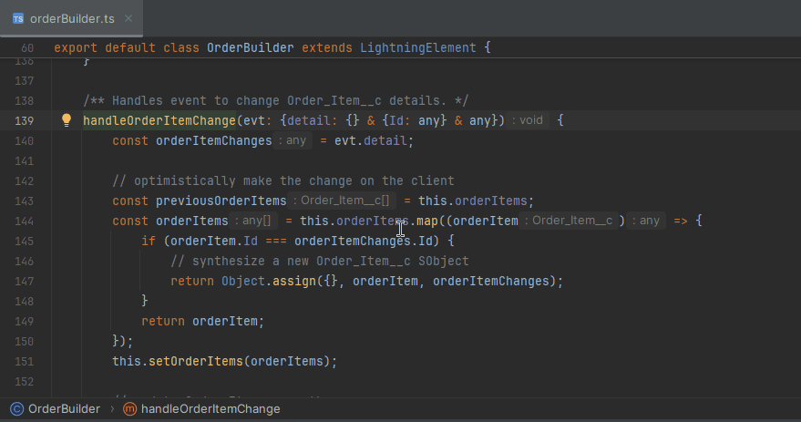

# LSP support

The current implementation of `LSP4IJ` does not yet fully adhere to the [LSP (Language Server Protocol) specification](https://microsoft.github.io/language-server-protocol/). 
This section provides an overview of the supported LSP features for IntelliJ:

## Base support

Current state of [Base protocol](https://microsoft.github.io/language-server-protocol/specifications/lsp/3.17/specification/#baseProtocol) support:

* ✅ [$/cancelRequest](https://microsoft.github.io/language-server-protocol/specifications/lsp/3.17/specification/#cancelRequest).
* ✅ [$/progress](https://microsoft.github.io/language-server-protocol/specifications/lsp/3.17/specification/#progress) (see [implementation details](#progress-support))

## Text Document Synchronization

Current state of [Text Document Synchronization](https://microsoft.github.io/language-server-protocol/specifications/lsp/3.17/specification/#textDocument_synchronization) support:

 * ✅ [textDocument/didOpen](https://microsoft.github.io/language-server-protocol/specifications/lsp/3.17/specification/#textDocument_didOpen).
 * ✅ [textDocument/didChange](https://microsoft.github.io/language-server-protocol/specifications/lsp/3.17/specification/#textDocument_didChange).
 * ✅ [textDocument/didClose](https://microsoft.github.io/language-server-protocol/specifications/lsp/3.17/specification/#textDocument_didClose).
 * ✅ [textDocument/didSave](https://microsoft.github.io/language-server-protocol/specifications/lsp/3.17/specification/#textDocument_didSave).
 * ❌ [textDocument/willSave](https://microsoft.github.io/language-server-protocol/specifications/lsp/3.17/specification/#textDocument_willSave).
 * ❌ [textDocument/willSaveWaitUntil](https://microsoft.github.io/language-server-protocol/specifications/lsp/3.17/specification/#textDocument_willSaveWaitUntil).
 
Notebooks are not supported.
 
## Language Features

Current state of [Language Features]( https://microsoft.github.io/language-server-protocol/specifications/lsp/3.17/specification/#languageFeatures) support:

 * ✅ [textDocument/definition](https://microsoft.github.io/language-server-protocol/specifications/lsp/3.17/specification/#textDocument_definition) (see [implementation details](#go-to-definition))
 * ✅ [textDocument/documentHighlight](https://microsoft.github.io/language-server-protocol/specifications/lsp/3.17/specification/#textDocument_documentHighlight) (see [implementation details](#document-highlight))
 * ✅ [textDocument/publishDiagnostics](https://microsoft.github.io/language-server-protocol/specifications/lsp/3.17/specification/#textDocument_publishDiagnostics) (see [implementation details](#publish-diagnostics))
 * ✅ [textDocument/diagnostic](https://microsoft.github.io/language-server-protocol/specifications/lsp/3.17/specification/#textDocument_pullDiagnostics) (see [implementation details](#pull-diagnostics))
 * ✅ [workspace/diagnostic/refresh](https://microsoft.github.io/language-server-protocol/specifications/lsp/3.17/specification/#diagnostic_refresh) 
 * ✅ [textDocument/documentLink](https://microsoft.github.io/language-server-protocol/specifications/lsp/3.17/specification/#textDocument_documentLink) (see [implementation details](#document-link))
 * ❌ [documentLink/resolve](https://microsoft.github.io/language-server-protocol/specifications/lsp/3.17/specification/#documentLink_resolve).
 * ✅ [textDocument/hover](https://microsoft.github.io/language-server-protocol/specifications/lsp/3.17/specification/#textDocument_hover) (see [implementation details](#hover))
 * ✅ [textDocument/codeLens](https://microsoft.github.io/language-server-protocol/specifications/lsp/3.17/specification/#textDocument_codeLens) (see [implementation details](#codeLens))
 * ✅ [codeLens/resolve](https://microsoft.github.io/language-server-protocol/specifications/lsp/3.17/specification/#codeLens_resolve)
 * ✅ [workspace/codeLens/refresh](https://microsoft.github.io/language-server-protocol/specifications/lsp/3.17/specification/#codeLens_refresh)
 * ✅ [textDocument/inlayHint](https://microsoft.github.io/language-server-protocol/specifications/lsp/3.17/specification/#textDocument_inlayHint) (see [implementation details](#inlay-hint))
 * ❌ [inlayHint/resolve](https://microsoft.github.io/language-server-protocol/specifications/lsp/3.17/specification/#inlayHint_resolve)
 * ✅ [workspace/inlayHint/refresh](https://microsoft.github.io/language-server-protocol/specifications/lsp/3.17/specification/#workspace_inlayHint_refresh) 
 * ✅ [textDocument/completion](https://microsoft.github.io/language-server-protocol/specifications/lsp/3.17/specification/#textDocument_completion) (see [implementation details](#completion-proposals))
 * ✅ [completionItem/resolve](https://microsoft.github.io/language-server-protocol/specifications/lsp/3.17/specification/#completionItem_resolve) (see [implementation details](#completion-item-resolve))
 * ✅ [textDocument/signatureHelp](https://microsoft.github.io/language-server-protocol/specifications/lsp/3.17/specification/#textDocument_signatureHelp) (see [implementation details](#signature-help))
 * ✅ [textDocument/publishDiagnostics](https://microsoft.github.io/language-server-protocol/specifications/lsp/3.17/specification/#textDocument_publishDiagnostics) (see [implementation details](#publish-diagnostics))
 * ✅ [textDocument/codeAction](https://microsoft.github.io/language-server-protocol/specifications/lsp/3.17/specification/#textDocument_codeAction) (see [implementation details](#codeAction))
 * ✅ [codeAction/resolve](https://microsoft.github.io/language-server-protocol/specifications/lsp/3.17/specification/#codeAction_resolve)
 * ✅ [textDocument/documentColor](https://microsoft.github.io/language-server-protocol/specifications/lsp/3.17/specification/#textDocument_documentColor) (see [implementation details](#document-color))
 * ❌ [textDocument/colorPresentation](https://microsoft.github.io/language-server-protocol/specifications/lsp/3.17/specification/#textDocument_colorPresentation).
 * ✅ [textDocument/declaration](https://microsoft.github.io/language-server-protocol/specifications/lsp/3.17/specification/#textDocument_declaration) (see [implementation details](#declaration))
 * ✅ [textDocument/typeDefinition](https://microsoft.github.io/language-server-protocol/specifications/lsp/3.17/specification/#textDocument_typeDefinition) (see [implementation details](#type-definition))
 * ✅ [textDocument/implementation](https://microsoft.github.io/language-server-protocol/specifications/lsp/3.17/specification/#textDocument_implementation) (see [implementation details](#implementation))
 * ✅ [textDocument/references](https://microsoft.github.io/language-server-protocol/specifications/lsp/3.17/specification/#textDocument_references) (see [implementation details](#references))
 * ✅ [textDocument/prepareCallHierarchy](https://microsoft.github.io/language-server-protocol/specifications/lsp/3.17/specification/#textDocument_prepareCallHierarchy) (see [implementation details](#call-hierarchy))
 * ✅ [textDocument/incomingCalls](https://microsoft.github.io/language-server-protocol/specifications/lsp/3.17/specification/#callHierarchy_incomingCalls).
 * ✅ [textDocument/outgoingCalls](https://microsoft.github.io/language-server-protocol/specifications/lsp/3.17/specification/#callHierarchy_outgoingCalls).
 * ✅ [textDocument/prepareTypeHierarchy](https://microsoft.github.io/language-server-protocol/specifications/lsp/3.17/specification/#textDocument_prepareTypeHierarchy) (see [implementation details](#type-hierarchy))
* ✅ [typeHierarchy/subtypes](https://microsoft.github.io/language-server-protocol/specifications/lsp/3.17/specification/#typeHierarchy_subtypes). 
 * ✅ [typeHierarchy/supertypes](https://microsoft.github.io/language-server-protocol/specifications/lsp/3.17/specification/#typeHierarchy_supertypes).
 * ✅ [textDocument/foldingRange](https://microsoft.github.io/language-server-protocol/specifications/lsp/3.17/specification/#textDocument_foldingRange)  (see [implementation details](#folding-range))
 * ✅ [textDocument/selectionRange](https://microsoft.github.io/language-server-protocol/specifications/lsp/3.17/specification/#textDocument_selectionRange)  (see [implementation details](#selection-range))
 * ✅ [textDocument/documentSymbol](https://microsoft.github.io/language-server-protocol/specifications/lsp/3.17/specification/#textDocument_documentSymbol) (see [implementation details](#document-symbol))
 * ✅ [textDocument/semanticTokens (experimental)](https://microsoft.github.io/language-server-protocol/specifications/lsp/3.17/specification/#textDocument_semanticTokens) (see [implementation details](#semantic-tokens))
 * ❌ [textDocument/inlineValue](https://microsoft.github.io/language-server-protocol/specifications/lsp/3.17/specification/#textDocument_inlineValue).
 * ❌ [workspace/inlineValue/refresh](https://microsoft.github.io/language-server-protocol/specifications/lsp/3.17/specification/#workspace_inlineValue_refresh).
 * ❌ [textDocument/moniker](https://microsoft.github.io/language-server-protocol/specifications/lsp/3.17/specification/#textDocument_moniker).
 * ❌ [textDocument/pullDiagnostics](https://microsoft.github.io/language-server-protocol/specifications/lsp/3.17/specification/#textDocument_pullDiagnostics).
 * ✅ [textDocument/formatting](https://microsoft.github.io/language-server-protocol/specifications/lsp/3.17/specification/#textDocument_formatting) (see [implementation details](#formatting))
 * ✅ [textDocument/rangeFormatting](https://microsoft.github.io/language-server-protocol/specifications/lsp/3.17/specification/#textDocument_rangeFormatting) (see [implementation details](#formatting)).
 * ✅ [textDocument/onTypeFormatting](https://microsoft.github.io/language-server-protocol/specifications/lsp/3.17/specification/#textDocument_onTypeFormatting) (see [implementation details](#on-type-formatting)).
 * ✅ [textDocument/prepareRename](https://microsoft.github.io/language-server-protocol/specifications/lsp/3.17/specification/#textDocument_prepareRename).
 * ✅ [textDocument/rename](https://microsoft.github.io/language-server-protocol/specifications/lsp/3.17/specification/#textDocument_rename) (see [implementation details](#rename)).
 * ❌ [textDocument/linkedEditingRange](https://microsoft.github.io/language-server-protocol/specifications/lsp/3.17/specification/#textDocument_linkedEditingRange).

## Workspace Features

Current state of [Workspace Features]( https://microsoft.github.io/language-server-protocol/specifications/lsp/3.17/specification/#workspaceFeatures) support:

 * ✅ [workspace/didChangeWatchedFiles](https://microsoft.github.io/language-server-protocol/specifications/lsp/3.17/specification/#workspace_didChangeWatchedFiles).
 * ✅ [workspace/executeCommand](https://microsoft.github.io/language-server-protocol/specifications/lsp/3.17/specification/#workspace_executeCommand).
 * ✅ [workspace/applyEdit](https://microsoft.github.io/language-server-protocol/specifications/lsp/3.17/specification/#workspace_applyEdit).
 * ✅ [workspace/symbol](https://microsoft.github.io/language-server-protocol/specifications/lsp/3.17/specification/#workspace_symbol) (see [implementation details](#workspace-symbol))
 * ❌ [workspace/symbolResolve](https://microsoft.github.io/language-server-protocol/specifications/lsp/3.17/specification/#workspace_symbolResolve).
 * ✅ [workspace/configuration](https://microsoft.github.io/language-server-protocol/specifications/lsp/3.17/specification/#workspace_configuration) (see [implementation details](./DeveloperGuide.md#workspace-configuration))
 * ❌ [workspace/workspaceFolders](https://microsoft.github.io/language-server-protocol/specifications/lsp/3.17/specification/#workspace_workspaceFolders).
 * ❌ [workspace/didChangeWorkspaceFolders](https://microsoft.github.io/language-server-protocol/specifications/lsp/3.17/specification/#workspace_didChangeWorkspaceFolders).
 * ❌ [workspace/willCreateFiles](https://microsoft.github.io/language-server-protocol/specifications/lsp/3.17/specification/#workspace_willCreateFiles).
 * ❌ [workspace/didCreateFiles](https://microsoft.github.io/language-server-protocol/specifications/lsp/3.17/specification/#workspace_didCreateFiles).
 * ✅ [workspace/willRenameFiles](https://microsoft.github.io/language-server-protocol/specifications/lsp/3.17/specification/#workspace_willRenameFiles).
 * ✅ [workspace/didRenameFiles](https://microsoft.github.io/language-server-protocol/specifications/lsp/3.17/specification/#workspace_didRenameFiles).
 * ❌ [workspace/willDeleteFiles](https://microsoft.github.io/language-server-protocol/specifications/lsp/3.17/specification/#workspace_willDeleteFiles).
 * ❌ [workspace/didDeleteFiles](https://microsoft.github.io/language-server-protocol/specifications/lsp/3.17/specification/#workspace_didDeleteFiles).
 
## Window Features

Current state of [Window Features]( https://microsoft.github.io/language-server-protocol/specifications/lsp/3.17/specification/#windowFeatures) support

 * ✅ [window/showMessage](https://microsoft.github.io/language-server-protocol/specifications/lsp/3.17/specification/#window_showMessage). (see [implementation details](#show-message))
 * ✅ [window/showMessageRequest](https://microsoft.github.io/language-server-protocol/specifications/lsp/3.17/specification/#window_showMessageRequest) (see [implementation details](#show-message-request))
 * ✅ [window/logMessage](https://microsoft.github.io/language-server-protocol/specifications/lsp/3.17/specification/#window_logMessage) (see [implementation details](./UserGuide.md#lsp-console))
 * ✅ [window/showDocument](https://microsoft.github.io/language-server-protocol/specifications/lsp/3.17/specification/#window_showDocument).
 * ❌ [telemetry/event](https://microsoft.github.io/language-server-protocol/specifications/lsp/3.17/specification/#telemetry_event).

## Implementation details

### Progress support

[$/progress](https://microsoft.github.io/language-server-protocol/specifications/lsp/3.17/specification/#progress) is implemented with `Background Tasks`.

Here a sample with [Eclipse JDT Language Server](https://github.com/eclipse-jdtls/eclipse.jdt.ls):


### Go to Definition

[textDocument/definition](https://microsoft.github.io/language-server-protocol/specifications/lsp/3.17/specification/#textDocument_definition) is implemented via the  
`gotoDeclarationHandler` extension point. As this extension point supports `any` language, it works out-of-the-box.

It is also called via [Find Usages](./UserGuide.md#find-usages) to show definitions.

### References

The [textDocument/references](https://microsoft.github.io/language-server-protocol/specifications/lsp/3.17/specification/#textDocument_references) is consumed with:

* the `Navigate / LSP Reference(s)` global menu.
* or with the `Go To/ LSP Reference(s)` editor menu.


This menu action either opens the reference in a popup or navigates to the reference if there are several references:


[textDocument/references](https://microsoft.github.io/language-server-protocol/specifications/lsp/3.17/specification/#textDocument_references) is used also via [Find Usages](./UserGuide.md#find-usages) to show references.

#### External References

LSP4IJ supports integration of externally-added references to language server-derived symbols when appropriate. External
references are those that are added client-side by either the same plugin or by other installed plugins, e.g., in a
polyglot environment where symbols in one language can be referenced in other languages.

When enabled, this ensures that external references are included in **Find Usages** results and during symbol rename
operations. This feature is _disabled by default_ but can be enabled for a custom language server implementation by
overriding `LSPReferencesFeature#processExternalReferences(PsiFile)` to return `true`, or for a user-defined language
server definition, by setting `references.processExternalReferences` to `true` in client configuration, e.g.:

```json
{
  "references": {
    "processExternalReferences": true
  }
}
```

This feature should **only** be enabled if you are **explicitly** aware of plugins that might be contributing 
client-side external references to a language server's symbols. Note that enabling this feature will result in a
textual search, albeit indexed, of the search scope for the symbol name for which references have been requested.
This can result in longer overall references search times in larger projects and/or where the language server is
supplementary to first-class IDE language support.  

### Implementation

The [textDocument/implementation](https://microsoft.github.io/language-server-protocol/specifications/lsp/3.17/specification/#textDocument_implementation) is consumed with:

* the `Navigate / LSP Implementation(s)` global menu.
* or with the `Go To/ LSP Implementation(s)` editor menu.


This menu action either opens the implementation in a popup or navigates to the implementation if there are several implementations:


[textDocument/implementation](https://microsoft.github.io/language-server-protocol/specifications/lsp/3.17/specification/#textDocument_implementation) is also used via [Find Usages](./UserGuide.md#find-usages) to show implementations.

### Type definition

The [textDocument/typeDefinition](https://microsoft.github.io/language-server-protocol/specifications/lsp/3.17/specification/#textDocument_typeDefinition) is consumed with:

 * the `Navigate / LSP Type Definition(s)` global menu.
 * or with the `Go To/ Type Definition(s)` editor menu.

This menu action either opens the type definition in a popup or navigates to the type definition if there are several type definitions:

[textDocument/typeDefinition](https://microsoft.github.io/language-server-protocol/specifications/lsp/3.17/specification/#textDocument_typeDefinition) is also used via [Find Usages](./UserGuide.md#find-usages) to show Type definitions.

### Declaration

The [textDocument/declaration](https://microsoft.github.io/language-server-protocol/specifications/lsp/3.17/specification/#textDocument_declaration) is consumed with:

 * the `Navigate / LSP Declaration(s)` global menu.
 * or with the `Go To/ Declaration(s)` editor menu.

This menu action either opens the declaration in a popup or navigates to the declaration if there are several declarations:

[textDocument/declaration](https://microsoft.github.io/language-server-protocol/specifications/lsp/3.17/specification/#textDocument_declaration) is also used via [Find Usages](./UserGuide.md#find-usages) to show declarations.

### Document Highlight

[textDocument/documentHighlight](https://microsoft.github.io/language-server-protocol/specifications/lsp/3.17/specification/#textDocument_documentHighlight) is implemented via the 
`highlightUsagesHandlerFactory` extension point. As this extension point supports `any` language, it works out-of-the-box.

Here is an example with the [Qute language server](https://github.com/redhat-developer/quarkus-ls/tree/master/qute.ls), highlighting item variables:


### Document Link

[textDocument/documentLink](https://microsoft.github.io/language-server-protocol/specifications/lsp/3.17/specification/#textDocument_documentLink) is implemented via:

* an `externalAnnotator` extension point, to display a `documentLink` with an hyperlink renderer.
* a `gotoDeclarationHandler` extension point, to open the file of the `documentLink`.`

As those extension points support `any` language, `textDocument/documentLink` works out-of-the-box.

Here is an example with the [Qute language server](https://github.com/redhat-developer/quarkus-ls/tree/master/qute.ls), displaying an `include` template with an hyperlink renderer (Ctrl+Click opens the document link):


### Hover

[textDocument/hover](https://microsoft.github.io/language-server-protocol/specifications/lsp/3.17/specification/#textDocument_hover) is implemented with the `platform.backend.documentation.targetProvider` 
extension point, to support any language, making `textDocument/hover` work out-of-the-box for all languages.

Here is an example with the [Qute language server](https://github.com/redhat-developer/quarkus-ls/tree/master/qute.ls) showing documentation while hovering over an `include` section:


#### Syntax Coloration

LSP4IJ supports `Syntax Coloration` on hover and completion documentation. Here is an example with [Rust Analyzer](https://rust-analyzer.github.io/): 


`Syntax Coloration` is supported in:

 * MarkDown [Fenced Code Block](https://www.markdownguide.org/extended-syntax/#fenced-code-blocks).

  ~~~
     ```ts
     const s = "";
     const c = s.charAt(0);
     ```
  ~~~
   
 It will apply the `TypeScript TextMate` highlighting, inferred from the `ts` file extension, and will be rendered like:


 * MarkDown [Indented Blockquote](https://www.markdownguide.org/basic-syntax/#blockquotes-1) (`>` following with `5 spaces`).

  ```
  >     const s = '';
  >     const c = s.charAt(0);
  ```

will use the Syntax coloration which triggers the hover / completion.


##### Syntax coloration discovery

The rules to retrieve the proper syntax coloration are:

 * if the code block defines the file extension, LSP4IJ tries to apply a matching TextMate grammar or custom syntax coloration by filename, mimetype.
 * if the code block defines a language Id (e.g. `typescript`) and the syntax coloration must be retrieved from TextMate, it will use the 
[fileNamePatterns extension point](./DeveloperGuide.md#file-name-pattern-mapping) or [./UserDefinedLanguageServer.md#mappings-tab](fileNamePattern of User defined language server)
to find the file extension (e.g. `ts`) associated with the languageId (e.g. `typescript`) 
  ~~~
     ```typescript
     const s = "";
     const c = s.charAt(0);
     ```
  ~~~
 * if the code block doesn't define the language, or indented blockquotes are used, it will fall back to the syntax coloration from the file in which the hover / completion documentation request was triggered.

If those strategies are insufficient for your needs, please [create an issue](https://github.com/redhat-developer/lsp4ij/issues) to request an extension point 
for mapping the language and the file extension.

### CodeLens

[textDocument/codeLens](https://microsoft.github.io/language-server-protocol/specifications/lsp/3.17/specification/#textDocument_codeLens) is implemented with the `codeInsight.codeVisionProvider` extension point.
As LSP4IJ registers [LSPCodeLensProvider](https://github.com/redhat-developer/lsp4ij/blob/main/src/main/java/com/redhat/devtools/lsp4ij/features/codeLens/LSPCodeLensProvider.java) 
for all languages associated with a language server, it works out-of-the-box.

Here is an example with the [Qute language server](https://github.com/redhat-developer/quarkus-ls/tree/master/qute.ls), which shows REST services URL with codeLens:


### Inlay Hint

[textDocument/inlayHint](https://microsoft.github.io/language-server-protocol/specifications/lsp/3.17/specification/#textDocument_inlayHint) is implemented with the `codeInsight.inlayProvider` extension point.
LSP4IJ registers [LSPInlayHintProvider](https://github.com/redhat-developer/lsp4ij/blob/main/src/main/java/com/redhat/devtools/lsp4ij/features/inlayhint/LSPInlayHintsProvider.java) for all languages associated with a language server with
[LSPInlayHintProvidersFactory](https://github.com/redhat-developer/lsp4ij/blob/main/src/main/java/com/redhat/devtools/lsp4ij/features/LSPInlayHintProvidersFactory.java), so it works out-of-the-box.

Here is an example with the [Qute language server](https://github.com/redhat-developer/quarkus-ls/tree/master/qute.ls) showing the parameter's Java type as inlay hint:


### Document Color

[textDocument/documentColor](https://microsoft.github.io/language-server-protocol/specifications/lsp/3.17/specification/#textDocument_documentColor) is implemented with the `codeInsight.inlayProvider` extension point.
LSP4IJ registers [LSPColorProvider](https://github.com/redhat-developer/lsp4ij/blob/main/src/main/java/com/redhat/devtools/lsp4ij/features/color/LSPColorProvider.java) for all languages associated with a language server with
[LSPInlayHintProvidersFactory](https://github.com/redhat-developer/lsp4ij/blob/main/src/main/java/com/redhat/devtools/lsp4ij/features/LSPInlayHintProvidersFactory.java), so it works out-of-the-box.

Here is an example with the [CSS language server](https://github.com/microsoft/vscode-css-languageservice) showing the color's declaration with a colored square:


### Completion Proposals

[textDocument/completion](https://microsoft.github.io/language-server-protocol/specifications/lsp/3.17/specification/#textDocument_completion) is implemented with 
[LSPCompletionContributor](https://github.com/redhat-developer/lsp4ij/blob/main/src/main/java/com/redhat/devtools/lsp4ij/features/completion/LSPCompletionContributor.java) class
declared with the
`completion.contributor` extension point. As this extension point supports `any` language, it works out-of-the-box.

Here is an example with the [Qute language server](https://github.com/redhat-developer/quarkus-ls/tree/master/qute.ls) showing method completion:


#### Completion item resolve

The [completionItem/resolve](https://microsoft.github.io/language-server-protocol/specifications/lsp/3.17/specification/#completionItem_resolve) request is implemented to resolve:

 * the `documentation` property of a completionItem.

Here a sample with [TypeScript Language Server](./user-defined-ls/typescript-language-server.md) completion item which resolves and shows `documentation` when the completion item is selected:


 
 * the `detail` property of a completionItem.

Here a sample with [TypeScript Language Server](./user-defined-ls/typescript-language-server.md) completion item which resolves and shows `detail` when the completion item is selected: 


 * the `additionalTextEdits` property of a completionItem.

### Signature Help

[textDocument/signatureHelp](https://microsoft.github.io/language-server-protocol/specifications/lsp/3.17/specification/#textDocument_signatureHelp) is implemented with
the `codeInsight.parameterInfo` extension point. By default, LSP4IJ registers the `codeInsight.parameterInfo` with 
[LSPParameterInfoHandler](https://github.com/redhat-developer/lsp4ij/blob/main/src/main/java/com/redhat/devtools/lsp4ij/features/signatureHelp/LSPParameterInfoHandler.java) class for `TEXT` and `textmate` languages:

```xml
<!-- LSP textDocument/signatureHelp -->
<codeInsight.parameterInfo
        id="LSPParameterInfoHandlerForTEXT"
        language="TEXT"
        implementationClass="com.redhat.devtools.lsp4ij.features.signatureHelp.LSPParameterInfoHandler"/>

<codeInsight.parameterInfo
        id="LSPParameterInfoHandlerForTextMate"
        language="textmate"
        implementationClass="com.redhat.devtools.lsp4ij.features.signatureHelp.LSPParameterInfoHandler"/>
```

If you use another language, you will have to declare `codeInsight.parameterInfo` with your language.
If `codeInsight.parameterInfo` for the language is already defined by another plugin or the IDE,
you can use `order="first"` to gain priority:

```xml
<codeInsight.parameterInfo
        id="YourID"
        language="YourLanguage"
        order="first"
        implementationClass="com.redhat.devtools.lsp4ij.features.signatureHelp.LSPParameterInfoHandler"/>
```

Here is an example with the [TypeScript Language Server](./user-defined-ls/typescript-language-server.md) showing signature help:


### Folding range

[textDocument/foldingRange](https://microsoft.github.io/language-server-protocol/specifications/lsp/3.17/specification/#textDocument_foldingRange) is implemented with
the `lang.foldingBuilder` extension point. By default, LSP4IJ registers the `lang.foldingBuilder` with
[LSPFoldingRangeBuilder](https://github.com/redhat-developer/lsp4ij/blob/main/src/main/java/com/redhat/devtools/lsp4ij/features/foldingRange/LSPFoldingRangeBuilder.java) class for `TEXT` and `textmate` languages:

```xml
<!-- LSP textDocument/folding -->
<lang.foldingBuilder id="LSPFoldingBuilderForText"
                     language="TEXT"
                     implementationClass="com.redhat.devtools.lsp4ij.features.foldingRange.LSPFoldingRangeBuilder"
                     order="first"/>

<lang.foldingBuilder id="LSPFoldingBuilderForTextMate"
                     language="textmate"
                     implementationClass="com.redhat.devtools.lsp4ij.features.foldingRange.LSPFoldingRangeBuilder"
                     order="first"/>
```

If you use another language, you will have to declare `lang.foldingBuilder` with your language.

Here is an example with the [TypeScript Language Server](./user-defined-ls/typescript-language-server.md) showing folding:


#### Automatic code folding

LSP4IJ's folding range support also includes the ability to designate certain folding ranges as _collapsed by default_
based on a combination of the IDE's **Code Folding** settings:


and how the folding ranges are categorized by the language server via the `kind` attribute. By default, the following
folding ranges are folded by default:

* Those with `kind=imports` when **Imports** are configured to be folded by default in the IDE.
* Those with `kind=comment` found on the first line of a file when **File header** is configured to be folded by default in the IDE. 

Here is an example of collapse by default behavior with the [Java Language Server](https://github.com/eclipse-jdtls/eclipse.jdt.ls)
showing automatic folding of both the file header comment and imports when the file is opened:


### Selection range

[textDocument/selectionRange](https://microsoft.github.io/language-server-protocol/specifications/lsp/3.17/specification/#textDocument_selectionRange) is implemented with
the `extendWordSelectionHandler` extension point and used via the IDE's **Extend Selection** (**Ctrl+W** on Windows/Linux; **Opt+Up** on Mac) and **Shrink Selection** (**Ctrl+Shift+W** on Windows/Linux; **Opt+Down** on Mac) actions.

Here is an example with the [TypeScript Language Server](https://github.com/typescript-language-server/typescript-language-server) showing **Extend/Shrink Selection** using `textDocument/selectionRange`:


### Code block provider

LSP4IJ registers the an implementation of the `codeBlockProvider` extension point with
[LSPCodeBlockProvider](https://github.com/redhat-developer/lsp4ij/blob/main/src/main/java/com/redhat/devtools/lsp4ij/features/foldingRange/LSPCodeBlockProvider.java) for `TEXT` and `textmate` languages to provide block brace matching and easy navigation to
the beginning/end of the containing block. For maximum flexibility in the absence of a true AST in the LSP client, code
blocks are derived from `textDocument/selectionRange` first and, failing that, from `textDocument/foldingRange`.

As with other language-specific EP implementations, if you use another language, you will have to declare
`codeBlockProvider` with your language.

Below is an example with the [TypeScript Language Server](./user-defined-ls/typescript-language-server.md) showing code
block functionality. The IDE's Presentation Assistant shows the default keyboard shortcuts for each supported operating
system to trigger these actions.


### Publish Diagnostics

[textDocument/publishDiagnostics](https://microsoft.github.io/language-server-protocol/specifications/lsp/3.17/specification/#textDocument_publishDiagnostics) is implemented with an `externalAnnotator` extension point. As this extension point supports `any` language, it works out-of-the-box.

Here is an example with the [Qute language server](https://github.com/redhat-developer/quarkus-ls/tree/master/qute.ls) reporting errors:


### Pull Diagnostics

[textDocument/diagnostic](https://microsoft.github.io/language-server-protocol/specifications/lsp/3.17/specification/#textDocument_pullDiagnostics) 
is consumed after a [textDocument/didOpen](https://microsoft.github.io/language-server-protocol/specifications/lsp/3.17/specification/#textDocument_didOpen) and [textDocument/didChange](https://microsoft.github.io/language-server-protocol/specifications/lsp/3.17/specification/#textDocument_didChange)
with debounce and refresh the LSP diagnostics  `externalAnnotator`.

It doesn't support the related documents.

### Code Action

Here is an example featuring the [Clojure LSP](./user-defined-ls/clojure-lsp.md), which offers code actions:

 * Quickfix code action (at the top): This type of code action is facilitated by registering a `quick fix within the IntelliJ annotation`.
 * Other code actions such as refactoring (at the bottom): These kinds of code actions are handled using `Intentions`.


For the last type of code action, you can enable/disable them using the `Intentions / Language Server` preference setting.


### Rename

[textDocument/rename](https://microsoft.github.io/language-server-protocol/specifications/lsp/3.17/specification/#textDocument_rename) is implemented with [LSPRenameHandler](https://github.com/redhat-developer/lsp4ij/blob/main/src/main/java/com/redhat/devtools/lsp4ij/features/rename/LSPRenameHandler.java) class 
declared with the `renameHandler` extension point.

Here is an example with the [TypeScript Language Server](./user-defined-ls/typescript-language-server.md) showing rename of function name:


### Formatting

[textDocument/formatting](https://microsoft.github.io/language-server-protocol/specifications/lsp/3.17/specification/#textDocument_documentColor) / [textDocument/rangeFormatting](https://microsoft.github.io/language-server-protocol/specifications/lsp/3.17/specification/#textDocument_rangeFormatting) are implemented with 
[LSPFormattingOnlyService](https://github.com/redhat-developer/lsp4ij/blob/main/src/main/java/com/redhat/devtools/lsp4ij/features/formatting/LSPFormattingOnlyService.java) /
[LSPFormattingAndRangeBothService](https://github.com/redhat-developer/lsp4ij/blob/main/src/main/java/com/redhat/devtools/lsp4ij/features/formatting/LSPFormattingAndRangeBothService.java) with the `formattingService` extension point.

### On-Type Formatting

#### Server-side on-type formatting

[textDocument/onTypeFormatting](https://microsoft.github.io/language-server-protocol/specifications/lsp/3.17/specification/#textDocument_onTypeFormatting) is implemented with 
[LSPServerSideOnTypeFormattingTypedHandler](https://github.com/redhat-developer/lsp4ij/blob/main/src/main/java/com/redhat/devtools/lsp4ij/features/formatting/LSPServerSideOnTypeFormattingTypedHandler.java) (`typedHandler`extension point) and
[LSPServerSideOnTypeFormattingEnterHandler](https://github.com/redhat-developer/lsp4ij/blob/main/src/main/java/com/redhat/devtools/lsp4ij/features/formatting/LSPServerSideOnTypeFormattingEnterHandler.java) (`enterHandlerDelegate` extension point).

Here is an example with the [Java Language Server](https://github.com/eclipse-jdtls/eclipse.jdt.ls) showing automatic formatting of a code block when the close brace for a surrounding conditional statement is typed:


If desired &mdash; for example, for those who want to control when formatting is performed &mdash; server-side/LSP-based
on-type formatting can be disabled via client configuration as follows:

```json
{
  "format": {
    "onTypeFormatting": {
      "serverSide": {
        "enabled": false
      }
    }
  }
}
```

#### Client-side on-type formatting

Not all language servers support server-side on-type formatting, and those that do may be limited in the characters
that trigger the feature. To provide an improved editor experience for users of such language servers, LSP4IJ also
includes support for _client-side on-type formatting_. Client-side on-type formatting can be enabled via client
configuration with the following settings:

* `format.onTypeFormatting.clientSide.formatOnCloseBrace` - When set to `true`, formatting is automatically applied when a close brace character is typed. Defaults to `false`.
* `format.onTypeFormatting.clientSide.formatOnCloseBraceCharacters` - Specifies the exact characters that should treated as a close brace character for purposes of client-side on-type formatting. Defaults to the close brace characters for the language, typically `}`, `]`, and `)`.
* `format.onTypeFormatting.clientSide.formatOnCloseBraceScope` - Specifies the scope that should be formatted when a close brace is typed. Valid values are `CODE_BLOCK` and `FILE`. Defaults to `CODE_BLOCK`.
* `format.onTypeFormatting.clientSide.formatOnStatementTerminator` - When set to `true`, formatting is automatically applied when a statement terminator character is typed. Defaults to `false`.
* `format.onTypeFormatting.clientSide.formatOnStatementTerminatorCharacters` - Specifies the exact characters that should treated as a statement terminator character for purposes of client-side on-type formatting. Defaults to empty and must be specified if `formatOnStatementTerminator` is enabled.
* `format.onTypeFormatting.clientSide.formatOnStatementTerminatorScope` - Specifies the scope that should be formatted when a statement terminator is typed. Valid values are `STATEMENT`, `CODE_BLOCK` and `FILE`. Defaults to `STATEMENT`. The other values are most useful for language servers that do not support range formatting or yield incorrect results for range formatting.
* `format.onTypeFormatting.clientSide.formatOnCompletionTrigger` - When set to `true`, formatting is automatically applied when a completion trigger character is typed. Defaults to `false`.
* `format.onTypeFormatting.clientSide.formatOnCompletionTriggerCharacters` - Specifies the exact characters that should treated as a completion trigger character for purposes of client-side on-type formatting. Defaults to the completion trigger characters specified by the language server.
* Note that there is no configurable scope for completion trigger-based formatting. Exactly the type completion trigger character is formatted. As above, support for this may vary by language server.

Note that `FILE` scope is most useful for language servers that do not support range formatting properly or at all, but
of course it results in reformatting of the entire file when a corresponding trigger character is typed. Usage of `FILE`
scope is therefore left to the discretion of the end user.

For example, the [TypeScript Language Server](./user-defined-ls/typescript-language-server.md) does not support server-side on-type formatting at all, but
client-side on-type formatting can provide solid incremental formatting of JavaScript and TypeScript source files.
The TypeScript language server configuration template therefore includes the following default client-side on-type
formatting configuration:

```json
{
  "format": {
    "onTypeFormatting": {
      "clientSide": {
        "formatOnCloseBrace": true,
        "formatOnStatementTerminator": true,
        "formatOnStatementTerminatorCharacters": ";",
        "formatOnCompletionTrigger": true
      }
    }
  }
}
```

Here is an example of client-side on-type formatting with that configuration showing automatic indentation of a
statement continuation when the completion trigger character `.` is typed and automatic formatting of an entire code
block when the closing brace character `}` is typed for a surrounding conditional statement:


#### Server-side / client-side on-Type formatting relationship

If server-side on-type formatting is supported by the language server and enabled _and_ client-side on-type formatting
is enabled for specific trigger characters, _only client-side on-type formatting will be applied_ when those specific
trigger characters are typed.

### Show Message

[window/showMessage](https://microsoft.github.io/language-server-protocol/specifications/lsp/3.17/specification/#window_showMessage) supports Markdown messages and clickable links.

Here is an example with [Rust Analyzer](https://rust-analyzer.github.io/) reporting an error:

```markdown
{
  "type": 1,
  "message": "Failed to discover workspace.\nConsider adding the `Cargo.toml` of the workspace to the [`linkedProjects`](https://rust-analyzer.github.io/manual.html#rust-analyzer.linkedProjects) setting.\n\nFailed to load workspaces."
}
```
is rendered as a `Balloon` notification: 


You can change the notification behavior of `LSP/window/showMessage` by using the standard UI `Notifications` preferences :


### Show Message Request

[window/showMessageRequest](https://microsoft.github.io/language-server-protocol/specifications/lsp/3.17/specification/#window_showMessageRequest) is supported.

Here is an example with [Scala Language Server (MetaLS)](./user-defined-ls/metals.md) reporting a message request:

```json
{
  "actions": [
    {
      "title": "Create .scalafmt.conf"
    },
    {
      "title": "Run anyway"
    },
    {
      "title": "Not now"
    }
  ],
  "type": 1,
  "message": "No .scalafmt.conf file detected. How would you like to proceed:"
}
```
is rendered as a `Sticky balloon` notification:


You can change the notification behavior of `LSP/window/showMessageRequest` by using the standard UI `Notifications` preferences :


### Semantic Tokens

Before you start reading this section, please read the [User Guide](UserGuide.md#semantic-tokens-support) to configure support for semantic tokens.

The semantic tokens support:

 * uses only [textDocument/semanticTokens/full](https://microsoft.github.io/language-server-protocol/specifications/lsp/3.17/specification/#semanticTokens_fullRequest) LSP request.
 * uses the [IntelliJ Semantic Highlighting support](https://plugins.jetbrains.com/docs/intellij/syntax-highlighting-and-error-highlighting.html#semantic-highlighting) 
by implementing [HighlightVisitor](https://github.com/JetBrains/intellij-community/blob/master/platform/analysis-impl/src/com/intellij/codeInsight/daemon/impl/HighlightVisitor.java)
with the [LSPSemanticTokensHighlightVisitor](https://github.com/redhat-developer/lsp4ij/blob/main/src/main/java/com/redhat/devtools/lsp4ij/features/semanticTokens/LSPSemanticTokensHighlightVisitor.java) class.
 * Use [SemanticTokensColorsProvider](https://github.com/redhat-developer/lsp4ij/blob/main/src/main/java/com/redhat/devtools/lsp4ij/features/semanticTokens/SemanticTokensColorsProvider.java) API to get TextAttributesKey from tokenType, tokenModifiers.
 * By default, LSP4IJ, uses the [DefaultSemanticTokensColorsProvider](https://github.com/redhat-developer/lsp4ij/blob/main/src/main/java/com/redhat/devtools/lsp4ij/features/semanticTokens/DefaultSemanticTokensColorsProvider.java)
but you can use your own provider with the [semanticTokensColorsProvider extension point](./DeveloperGuide.md#semantic-tokens-colors-provider). 
 
#### DefaultSemanticTokensColorsProvider

The following table lists the currently predefined mappings:

 * the `Semantic token types` column shows the standard LSP Semantic token types. 
 * the `Semantic modifiers types` column shows the standard LSP Semantic modifier types. 
 * the `SemanticTokensHighlightingColors` column defines the `TextAttributesKey` constants declared in the LSP4IJ `SemanticTokensHighlightingColors` class.
 * the `DefaultLanguageHighlighterColors` column defines the standard `TextAttributesKey` used by IntelliJ that `SemanticTokensHighlightingColors` inherits.

| Semantic token types | Semantic modifier types | SemanticTokensHighlightingColors | (inherited from) DefaultLanguageHighlighterColors |
|----------------------|-------------------------|----------------------------------|---------------------------------------------------|
| namespace            | definition              | NAMESPACE_DECLARATION            | CLASS_NAME                                        |
| namespace            | declaration             | NAMESPACE_DECLARATION            | CLASS_NAME                                        |
| namespace            |                         | NAMESPACE                        | CLASS_REFERENCE                                   |
| class                | definition              | CLASS_DECLARATION                | CLASS_NAME                                        |
| class                | declaration             | CLASS_DECLARATION                | CLASS_NAME                                        |
| class                |                         | CLASS                            | CLASS_REFERENCE                                   |
| enum                 |                         | ENUM                             | CLASS_NAME                                        |
| interface            |                         | INTERFACE                        | INTERFACE_NAME                                    |
| struct               |                         | STRUCT                           | CLASS_NAME                                        |
| typeParameter        |                         | TYPE_PARAMETER                   | PARAMETER                                         |
| type                 |                         | TYPE                             | CLASS_NAME                                        |
| parameter            |                         | PARAMETER                        | PARAMETER                                         |
| variable             | static + readonly       | STATIC_READONLY_VARIABLE         | CONSTANT                                          |
| variable             | static                  | STATIC_VARIABLE                  | STATIC_FIELD                                      |
| variable             | readonly                | READONLY_VARIABLE                | LOCAL_VARIABLE                                    |
| variable             |                         | VARIABLE                         | REASSIGNED_LOCAL_VARIABLE                         |
| property             | static + readonly       | STATIC_READONLY_PROPERTY         | CONSTANT                                          |
| property             | static                  | STATIC_PROPERTY                  | STATIC_FIELD                                      |
| property             | readonly                | READONLY_PROPERTY                | INSTANCE_FIELD                                    |
| property             |                         | PROPERTY                         | INSTANCE_FIELD                                    |
| enumMember           |                         | ENUM_MEMBER                      | STATIC_FIELD                                      |
| decorator            |                         | DECORATOR                        | METADATA                                          |
| event                |                         | EVENT                            | PREDEFINED_SYMBOL                                 |
| function             | defaultLibrary          | DEFAULT_LIBRARY_FUNCTION         | STATIC_METHOD                                     |
| function             | definition              | FUNCTION_DECLARATION             | FUNCTION_DECLARATION                              |
| function             | declaration             | FUNCTION_DECLARATION             | FUNCTION_DECLARATION                              |
| function             |                         | FUNCTION                         | FUNCTION_CALL                                     |
| method               | definition              | METHOD_DECLARATION               | FUNCTION_DECLARATION                              |
| method               | declaration             | METHOD_DECLARATION               | FUNCTION_DECLARATION                              |
| method               | static                  | STATIC_METHOD                    | STATIC_METHOD                                     |
| method               |                         | METHOD                           | FUNCTION_CALL                                     |
| macro                |                         | MACRO                            | KEYWORD                                           |
| label                |                         | LABEL                            | LABEL                                             |
| comment              |                         | COMMENT                          | LINE_COMMENT                                      |
| string               |                         | STRING                           | STRING                                            |
| keyword              |                         | KEYWORD                          | KEYWORD                                           |
| number               |                         | NUMBER                           | NUMBER                                            |
| regexp               |                         | REGEXP                           | VALID_STRING_ESCAPE                               |
| modifier             |                         | MODIFIER                         | KEYWORD                                           |
| operator             |                         | OPERATOR                         | OPERATION_SIGN                                    |

If you need other mapping:

 * if you think it is a generic mapping, please create a contribution to define a new `SemanticTokensHighlightingColors` constants
 * if the mapping is specific to your language, use the [semanticTokensColorsProvider extension point](./DeveloperGuide.md#semantic-tokens-colors-provider) to define your own provider and mapping.

### Document Symbol

#### Structure View

The IDE's `lang.psiStructureViewFactory` extension point is implemented using [textDocument/documentSymbol](https://microsoft.github.io/language-server-protocol/specifications/lsp/3.17/specification/#textDocument_documentSymbol). By default, LSP4IJ registers the `lang.psiStructureViewFactory` with
[LSPDocumentSymbolStructureViewFactory](https://github.com/redhat-developer/lsp4ij/blob/main/src/main/java/com/redhat/devtools/lsp4ij/features/documentSymbol/LSPDocumentSymbolStructureViewFactory.java) class for `TEXT` and `textmate` languages:

```xml
<!-- LSP textDocument/documentSymbol -->
<lang.psiStructureViewFactory
        id="LSPDocumentSymbolStructureViewFactoryForText"
        language="TEXT"
        implementationClass="com.redhat.devtools.lsp4ij.features.documentSymbol.LSPDocumentSymbolStructureViewFactory"/>
<lang.psiStructureViewFactory
        id="LSPDocumentSymbolStructureViewFactoryForTextMate"
        language="textmate"
        implementationClass="com.redhat.devtools.lsp4ij.features.documentSymbol.LSPDocumentSymbolStructureViewFactory"/>
```

If you use another language, you will have to declare `lang.psiStructureViewFactory` with your language.
If `lang.psiStructureViewFactory` for the language is already defined by another plugin or the IDE,
you can use `order="first"` to gain priority:

```xml
<lang.psiStructureViewFactory
        id="YourID"
        language="YourLanguage"
        order="first"
        implementationClass="com.redhat.devtools.lsp4ij.features.documentSymbol.LSPDocumentSymbolStructureViewFactory"/>
```

Here is an example with [TypeScript Language Server](./user-defined-ls/typescript-language-server.md) 
which opens the standard `File Structure` with `Ctrl+F12` / `Cmd+F12` 
(also available with the `Navigate / File Structure` menu) to display TypeScript functions as symbols and navigate them easily:

You can also open the `Structure` view using the `View / Tool Windows / Structure` menu:


#### Breadcrumbs and Sticky Lines

The IDE's `breadcrumbsInfoProvider` extension point is also implemented using [textDocument/documentSymbol](https://microsoft.github.io/language-server-protocol/specifications/lsp/3.17/specification/#textDocument_documentSymbol). LSP4IJ registers the extension point for all file types and languages but filters at runtime for those associated with configured language server definitions.

The feature is _enabled by default_ but can be disabled by overriding the respective feature flag either in code by overriding `LSPBreadcrumbsFeature#isEnabled()` (custom language server definitions) or client configuration (user-defined language server definitions). Note that sticky lines are only supported in JetBrains 2024.1+ IDE versions.

Here is an example of breadcrumbs and sticky lines in TypeScript:



### Call Hierarchy

[textDocument/prepareCallHierarchy](https://microsoft.github.io/language-server-protocol/specifications/lsp/3.17/specification/#textDocument_prepareCallHierarchy) is implemented with
the `callHierarchyProvider` extension point. By default, LSP4IJ registers the `callHierarchyProvider` with
[LSPCallHierarchyProvider](https://github.com/redhat-developer/lsp4ij/blob/main/src/main/java/com/redhat/devtools/lsp4ij/features/callHierarchy/LSPCallHierarchyProvider.java) class for `TEXT` and `textmate` languages:

```xml
<!-- LSP textDocument/callHierarchy request support -->
<callHierarchyProvider
        language="TEXT"
        implementationClass="com.redhat.devtools.lsp4ij.features.callHierarchy.LSPCallHierarchyProvider" />
<callHierarchyProvider
        language="textmate"
        implementationClass="com.redhat.devtools.lsp4ij.features.callHierarchy.LSPCallHierarchyProvider" />
```

If you use another language, you will have to declare `callHierarchyProvider` with your language:

```xml
<callHierarchyProvider
        language="YourLanguage"
        implementationClass="com.redhat.devtools.lsp4ij.features.callHierarchy.LSPCallHierarchyProvider" />
```

After setting the cursor position in a file, you can view the Call Hierarchy using the `Navigate / Call Hierarchy` menu (or `Ctrl+Alt+H`).  
Below is an example of a call hierarchy using the [Go Language Server](./user-defined-ls/gopls.md):


### Type Hierarchy

[textDocument/prepareTypeHierarchy](https://microsoft.github.io/language-server-protocol/specifications/lsp/3.17/specification/#textDocument_prepareTypeHierarchy) is implemented with
the `typeHierarchyProvider` extension point. By default, LSP4IJ registers the `typeHierarchyProvider` with
[LSPTypeHierarchyProvider](https://github.com/redhat-developer/lsp4ij/blob/main/src/main/java/com/redhat/devtools/lsp4ij/features/typeHierarchy/LSPTypeHierarchyProvider.java) class for `TEXT` and `textmate` languages:

```xml
<!-- LSP textDocument/typeHierarchy request support -->
<typeHierarchyProvider
        language="TEXT"
        implementationClass="com.redhat.devtools.lsp4ij.features.typeHierarchy.LSPTypeHierarchyProvider" />
<typeHierarchyProvider
        language="textmate"
        implementationClass="com.redhat.devtools.lsp4ij.features.typeHierarchy.LSPTypeHierarchyProvider" />
```

If you use another language, you will have to declare `typeHierarchyProvider` with your language:

```xml
<typeHierarchyProvider
        language="YourLanguage"
        implementationClass="com.redhat.devtools.lsp4ij.features.typeHierarchy.LSPTypeHierarchyProvider" />
```

After setting the cursor position in a file, you can view the Type Hierarchy using the `Navigate / Type Hierarchy` menu (or `Ctrl+H`).

### Workspace Symbol

[workspace/symbol](https://microsoft.github.io/language-server-protocol/specifications/lsp/3.17/specification/#workspace_symbol) is implemented with the `gotoSymbolContributor` and `gotoClassContributor` extension points as appropriate for the symbol type(s). 

Here is an example with the [MicroProfile language server](https://github.com/eclipse/lsp4mp/tree/master/microprofile.ls) collecting JAX-RS endpoints:

