# User-defined language server

LSP4IJ provides the capability to consume any language server without developing
an IntelliJ plugin via a `User-defined language server`.

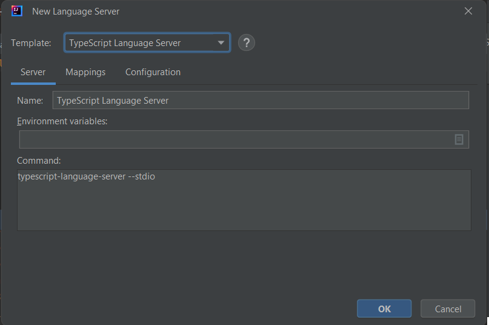

The main idea is to: 

 * install the language server and its requirements(ex : `Node.js` to 
execute a language server written in JavaScript/TypeScript), 
 * declare the command that starts the language server.
 * associate the language server with the proper files (identified by IntelliJ Language, File Type or file name pattern)

## New Language Server dialog

In order to create a new `User-defined language server`, you need to open the `New Language Server` dialog, either:

 * from the menu on the right of the LSP console:

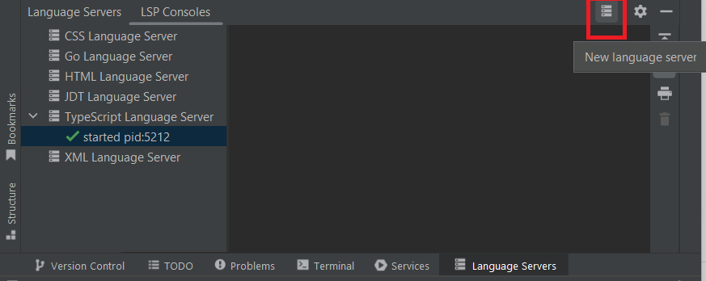

* or with the `[+]` on the top of the language server settings:

Once you clicked on either of them, the dialog will appear:

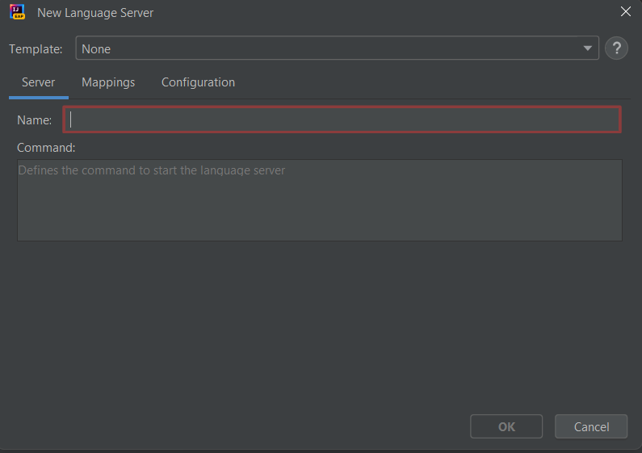

### Server tab

The `Server tab` requires the `server name` and `command` fields to be set.

Here is a sample with the [typescript-language-server](https://github.com/typescript-language-server/typescript-language-server):

#### Environment variables

The environment variables accessible by the process are populated with 
[EnvironmentUtil.getEnvironmentMap()](https://github.com/JetBrains/intellij-community/blob/3a527a2c9b56209c09852ba7bc89d80bc31e1c04/platform/util/src/com/intellij/util/EnvironmentUtil.java#L85) 
which retrieves system variables.

It is also possible to add custom environment variables via the `Environment variables` field:

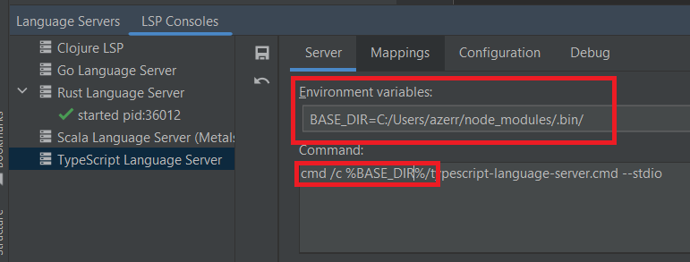

Depending on your OS, the environment variables may not be accessible. To make sure they are accessible, you can fill out the order fields:

* with `Windows OS`: `cmd /c command_to_start_your_ls`
* with `Linux`, `Mac OS`: `sh -c command_to_start_your_ls`

#### Macro syntax

You can use [built-in macros](https://www.jetbrains.com/help/idea/built-in-macros.html) in your command. You could, for instance, store the language server in your project (to share it with your team) 
and write a command that references it in a portable way to start it.

That command might look like this:

`$PROJECT_DIR$/path/to/your/start/command`

Here is an example with Scala Language Server's `metals.bat` stored at the root of the project:

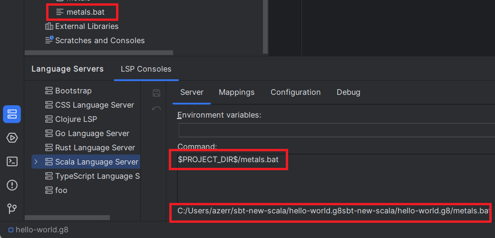

When commands contain macros, their resolved value is visible below the `Command` field.

### Mappings tab

The `Mappings tab` provides the capability to `associate the language server with the proper files` identified by: 

 * [IntelliJ  Language](https://plugins.jetbrains.com/docs/intellij/custom-language-support.html) 
 * [IntelliJ File type](https://www.jetbrains.com/help/idea/creating-and-registering-file-types.html) 
 * `File name pattern`

Here are mappings samples with the [typescript-language-server](https://github.com/typescript-language-server/typescript-language-server):

 * The existing `JavaScript` file type is used to associate the file to the language server: 

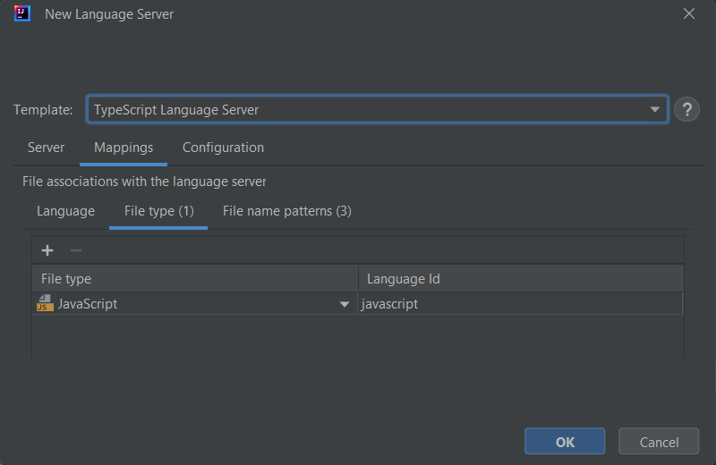

* Since IntelliJ (Community) doesn't provide file type by default `TypeScript`, `React` file name patterns are used:

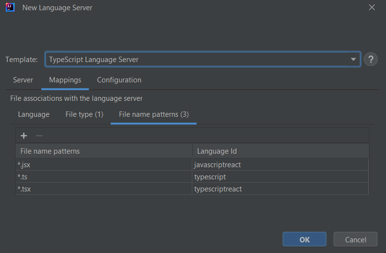

NOTE: it is better to use file name pattern instead of creating custom file type for TypeScript, since by default 
IntelliJ Community support `TypeScript syntax coloration` with `TextMate`. If you define a file type, you will
lose syntax coloration.

#### Language ID

When you declare mapping, you can fill the `Language ID` column which is used to declare the LSP [TextDocumentItem#languageId](https://microsoft.github.io/language-server-protocol/specifications/lsp/3.17/specification/#textDocumentItem)
to identify the document on the server side.

For instance the [vscode-css-languageservice](https://github.com/microsoft/vscode-css-languageservice) (used by the vscode CSS language server) expects the `languageId` to be `css` or `less`.
To do that, you can declare it with the `languageId` attribute:

### Configuration tab

The `Configuration tab` allows to configure the language server with the expected (generally JSON format) configuration. 

Here are configuration sample with the [typescript-language-server](https://github.com/typescript-language-server/typescript-language-server):

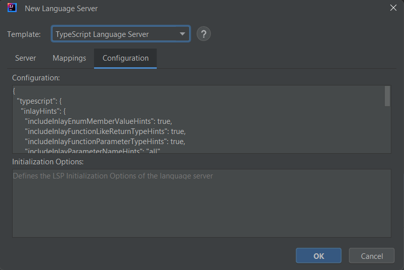

### Debug tab

The `Debug tab` is available when you have created the language server definition. It allows to customize the 
level Trace used in LSP console.

### Using template
Template can be used to quickly create user defined language server pre-filled 
with server name, command, mappings and potential configurations.

#### Default template
The `Template combo-box` provides some default language servers templates (located in templates directory classpath), 
pre-filled with server name, command, mappings and potential configuration.

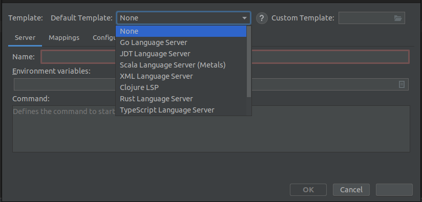

* [Clojure LSP](./user-defined-ls/clojure-lsp.md)
* [CSS Language Server](./user-defined-ls/vscode-css-language-server.md)
* [Erlang Language Server](./user-defined-ls/erlang-ls.md) 
* [Go Language Server](./user-defined-ls/gopls.md)
* [Julia Language Server](./user-defined-ls/julia.md) 
* [HTML Language Server](./user-defined-ls/vscode-html-language-server.md)
* [Rust Language Server](./user-defined-ls/rust-analyzer.md) 
* [Scala Language Server (Metals)](./user-defined-ls/metals.md)
* [SourceKit-LSP](./user-defined-ls/sourcekit-lsp.md) 
* [TypeScript Language Server](./user-defined-ls/typescript-language-server.md)
* [Vue Language Server](./user-defined-ls/vue-js-language-server.md)

If the template directory contains a `README.md` file, you can open the instructions by pressing the help icon.

#### Custom template

The `Import from custom template...` item from the `Template combo-box` can be used to select a directory from 
the file system to load a custom language server template, 
these templates can be pre-filled with server name, command, mappings and potential configuration.

The selected directory contents should match the [custom template structure](#custom-template-structure).
If the template directory contains a `README.md` file, you can open the instructions by pressing the help icon.

Custom templates can be created by [exporting templates](#exporting-templates).

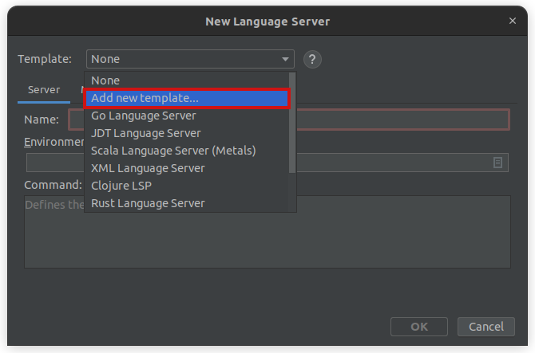

### Exporting templates

Users can export their own language servers to a zip file, where each language server is a separate directory. 
This can be done from the LSP console, by selecting one or more language servers and selecting the export option from the context menu.

These directories can then be used as a template for a new language server by [importing a custom template](#custom-template).

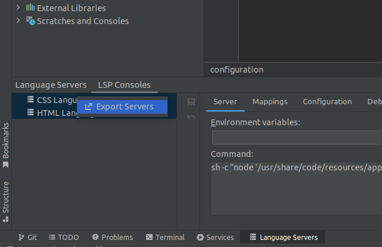

#### Custom template structure
By default, each directory contains the following files, but only `template.json` is required.
- `template.json`
- `settings.json`
- `initializationOptions.json`

A `README.md` file can be added manually to each of the language server directories to provide instructions 
for the corresponding language server.
