# User-defined language server

LSP4IJ provides the capability to consume any language server without developing
an IntelliJ plugin via a `User-defined language server`.

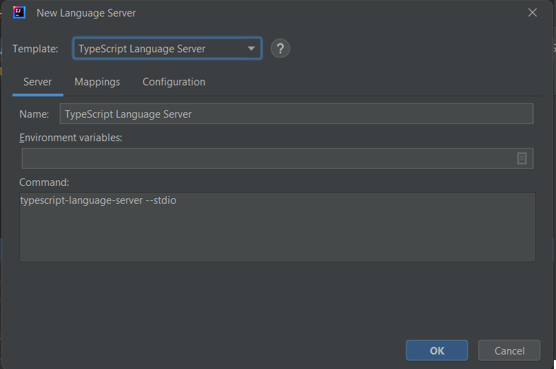

The main idea is to: 

 * install the language server and its requirements(ex : `Node.js` to 
execute a language server written in JavaScript/TypeScript), 
 * declare the command that starts the language server.
 * associate the language server with the proper files (identified by IntelliJ Language, File Type or file name pattern)

## New Language Server dialog

In order to create a new `User-defined language server`, you need to open the `New Language Server` dialog, either:

 * from the menu on the right of the LSP console:

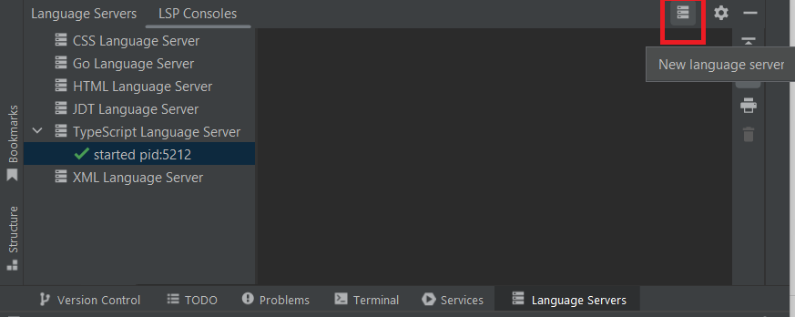

* or with the `[+]` on the top of the language server settings:

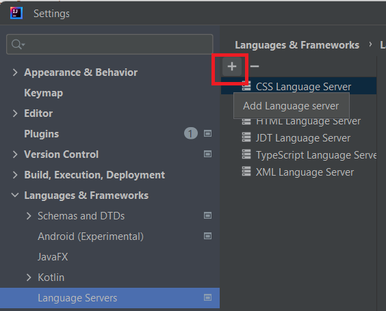

Once you clicked on either of them, the dialog will appear:

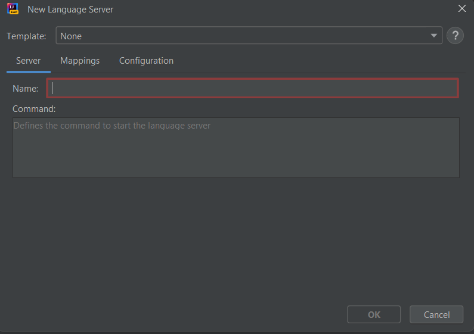

When you click the `OK` button, the language server will be created.

If the language server definition [declares an installer](UserDefinedLanguageServerTemplate.md#installer-descriptor)  
in the [Installer tab](#installer-tab), the installer will run once when the language server starts.

You can reinstall the server at any time (e.g. to fetch the latest version) using the `Reinstall` action:

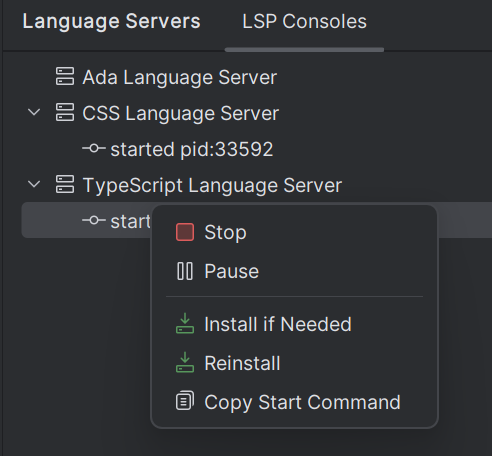

### Server tab

The `Server tab` requires the `server name` and `command` fields to be set.

Here is a sample with the [typescript-language-server](https://github.com/typescript-language-server/typescript-language-server):


#### Environment variables

The environment variables accessible by the process are populated with 
[EnvironmentUtil.getEnvironmentMap()](https://github.com/JetBrains/intellij-community/blob/3a527a2c9b56209c09852ba7bc89d80bc31e1c04/platform/util/src/com/intellij/util/EnvironmentUtil.java#L85) 
which retrieves system variables.

It is also possible to add custom environment variables via the `Environment variables` field:

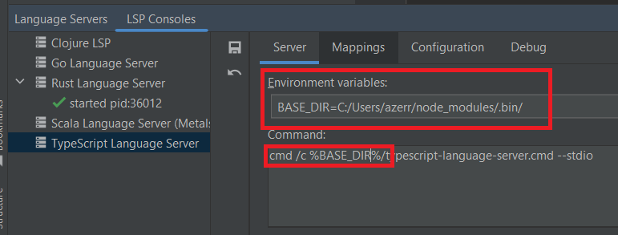

Depending on your OS, the environment variables may not be accessible. To make sure they are accessible, you can fill out the order fields:

* with `Windows OS`: `cmd /c command_to_start_your_ls`
* with `Linux`, `Mac OS`: `sh -c command_to_start_your_ls`

#### Macro syntax

You can use [built-in macros](https://www.jetbrains.com/help/idea/built-in-macros.html) in your command. You could, for instance, store the language server in your project (to share it with your team) 
and write a command that references it in a portable way to start it.

That command might look like this:

`$PROJECT_DIR$/path/to/your/start/command`

Here are some useful standard [built-in macros](https://www.jetbrains.com/help/idea/built-in-macros.html) that you can use:

 * `$WORKSPACE_DIR$`: The path to the workspace where the current project belongs. The workspace is the root of the open file hierarchy and can include multiple projects.
 * `$PROJECT_DIR$`: The root of the project where run.json is located. A project is typically a collection of files for developing and building an application such as a Maven or Node.js project.
 * `$USER_HOME$`: User home directory.

Here is an example with Scala Language Server's `metals.bat` stored at the root of the project:

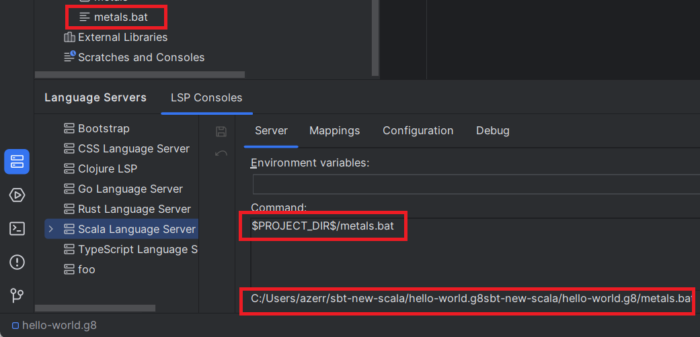

When commands contain macros, their resolved value is visible below the `Command` field.

### Mappings tab

The `Mappings tab` provides the capability to `associate the language server with the proper files` identified by: 

 * [IntelliJ  Language](https://plugins.jetbrains.com/docs/intellij/custom-language-support.html) 
 * [IntelliJ File type](https://www.jetbrains.com/help/idea/creating-and-registering-file-types.html) 
 * `File name pattern`

Here are mappings samples with the [typescript-language-server](https://github.com/typescript-language-server/typescript-language-server):

 * The existing `JavaScript` file type is used to associate the file to the language server: 

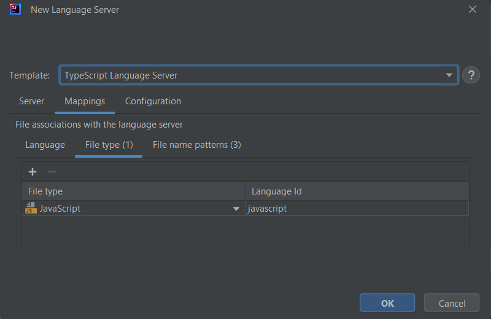

* Since IntelliJ (Community) doesn't provide file type by default `TypeScript`, `React` file name patterns are used:

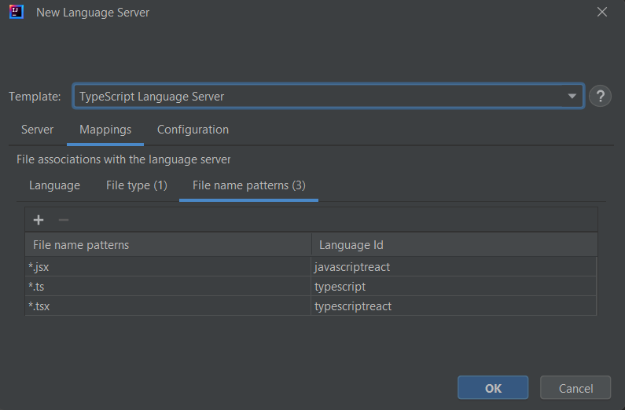

NOTE: it is better to use file name pattern instead of creating custom file type for TypeScript, since by default 
IntelliJ Community support `TypeScript syntax coloration` with `TextMate`. If you define a file type, you will
lose syntax coloration.

#### Language ID

When you declare mapping, you can fill the `Language ID` column which is used to declare the LSP [TextDocumentItem#languageId](https://microsoft.github.io/language-server-protocol/specifications/lsp/3.17/specification/#textDocumentItem)
to identify the document on the server side.

For instance the [vscode-css-languageservice](https://github.com/microsoft/vscode-css-languageservice) (used by the vscode CSS language server) expects the `languageId` to be `css` or `less`.
To do that, you can declare it with the `languageId` attribute:

### Configuration tab

The `Configuration tab` allows to configure the language server with the expected (generally JSON format) configuration. 

Here are configuration sample with the [typescript-language-server](https://github.com/typescript-language-server/typescript-language-server):

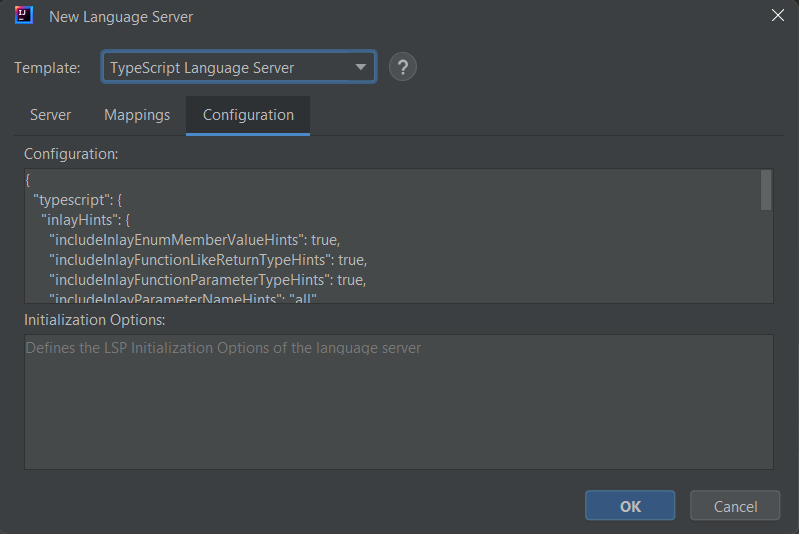

### Debug tab

The `Debug tab` is available when you have created the language server definition. It allows to customize the 
level Trace used in LSP console.

### Installer tab

The `Installer tab` provides the capability to declare with JSON, the language server installation
with task to execute like:

 * `exec` to execute a command (ex: `npm install typescript-language-server` to install the [typescript-language-server](https://github.com/typescript-language-server/typescript-language-server)).
 * `download` to download the language server from a given url according the OS.

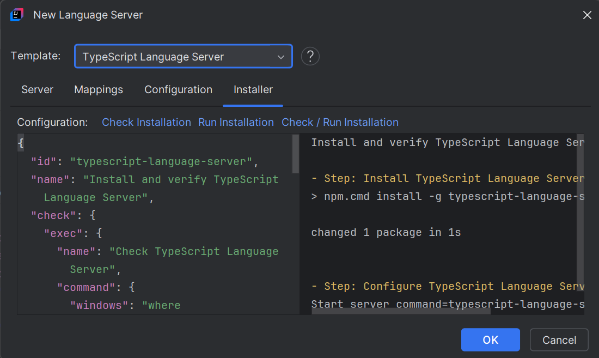

This installer content will be used when you will create the language server. See [here](UserDefinedLanguageServerTemplate.md#installer-descriptor)
to understand how to write this JSON installer descriptor.

### Workspace Folders tab

[Workspace folders](https://microsoft.github.io/language-server-protocol/specifications/lsp/3.17/specification/#workspaceFolder) define the scope of files that the language server will analyze. They can be sent to the language server:

 * At startup via the [initialize](https://microsoft.github.io/language-server-protocol/specifications/lsp/3.17/specification/#initialize) request
 * Dynamically via [workspace/didChangeWorkspaceFolders](https://microsoft.github.io/language-server-protocol/specifications/lsp/3.17/specification/#workspace_didChangeWorkspaceFolders) notifications

This tab allows you to configure and preview how workspace folders will be discovered and sent to your language server.

#### Configuration strategies

##### Root type

The `rootType` defines which IntelliJ project structure to use as workspace folders:

 * `PROJECT_BASE` (default): Uses [content roots](https://www.jetbrains.com/help/idea/content-roots.html#adding_content_root)
 * `SOURCE_ROOTS`: Uses [source roots](https://www.jetbrains.com/help/idea/content-roots.html#folder-categories)  
 * `NONE`: No workspace folders

```json
{
    "rootType": "SOURCE_ROOTS"
}
```

This configuration will populate `InitializeParams.workspaceFolders` when the language server starts:

```json
{
  "workspaceFolders": [
    {
      "name": "my-module",
      "uri": "file:///path/to/my-module"
    }
  ]
}
```

##### Marker-based discovery

If `rootType` strategies don't match your project structure, use markers to define workspace folders based on specific files. This is useful for:

- Mono-repos with multiple independent modules
- Python projects with `pyproject.toml` or `setup.py`
- Projects where workspace boundaries are defined by configuration files

```json
{
  "markers": [
    "pyproject.toml",
    "pom.xml",
    ".git"
  ]
}
```

When a file is opened, LSP4IJ walks up the directory tree to find the closest marker file and uses its directory as the workspace folder.

**Note:** Marker-based discovery always uses [lazy mode](#lazy-mode).

#### Lazy mode

By default (eager mode), all workspace folders are sent at startup via the `initialize` request. For large projects, this can cause the language server to load and analyze many files unnecessarily.

**Lazy mode** defers workspace folder discovery: folders are sent progressively via `workspace/didChangeWorkspaceFolders` notifications as you open files.

```json
{
    "rootType": "PROJECT_BASE",
    "lazy": true
}
```

**Example:** Consider a project with 2 [content roots](https://www.jetbrains.com/help/idea/content-roots.html#adding_content_root): `client` and `common`.

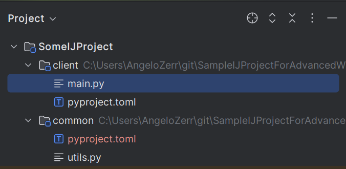

**Eager mode** (`lazy: false`):
- All folders sent at startup in the `initialize` request:
  ```json
  {
    "workspaceFolders": [
      { "uri": "file:///.../client", "name": "client" },
      { "uri": "file:///.../common", "name": "common" }
    ]
  }
  ```
- Language server loads **all** files from both `client` and `common`, even if you only open a file in `common`

You can see this behavior with the following configuration:

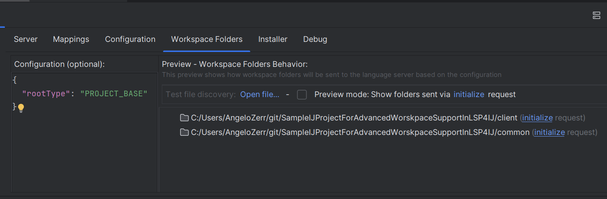

**Lazy mode** (`lazy: true`):
- Empty workspace folders at startup:
  ```json
  {
    "workspaceFolders": []
  }
  ```
- When you open a file from `common`, only that folder is sent via `workspace/didChangeWorkspaceFolders`:
  ```json
  {
    "event": {
      "added": [{ "uri": "file:///.../common", "name": "common" }],
      "removed": []
    }
  }
  ```

#### Testing your configuration

The **preview panel** on the right shows how workspace folders will be sent based on your configuration.

**Checkbox unchecked** - Shows all discovered workspace folders (discovery mode):

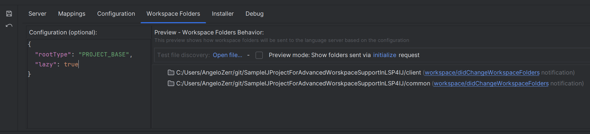

**Checkbox checked** - Shows only folders sent at initialization (empty in lazy mode):

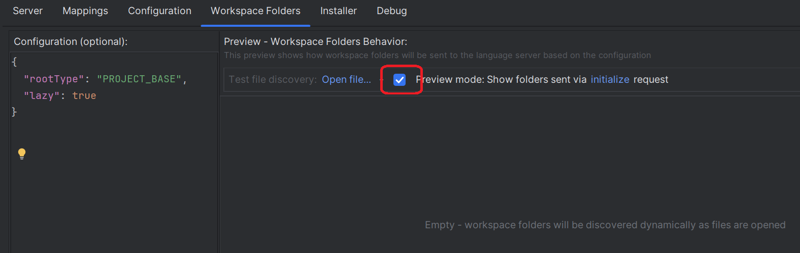

**Drag & drop or click "Open file..."** to simulate opening a file and see which workspace folder it belongs to:

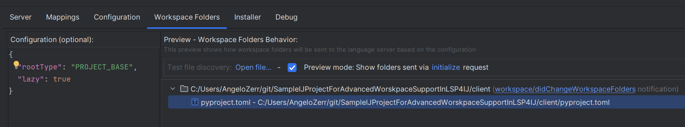

If a file is not included in any workspace folder, it will appear under a "(No root)" node:

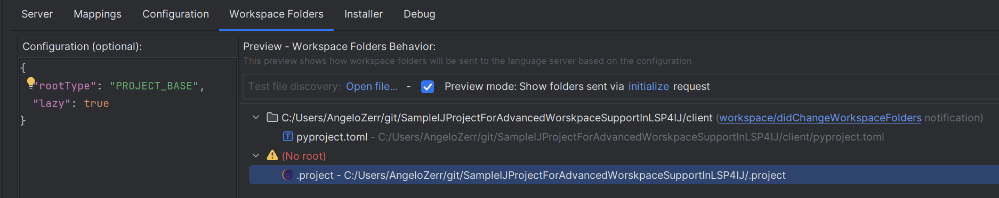

## Using template
Template can be used to quickly create user defined language server pre-filled 
with server name, command, mappings and potential configurations.

#### Default template
The `Template combo-box` provides some default language servers templates (located in templates directory classpath), 
pre-filled with server name, command, mappings and potential configuration.

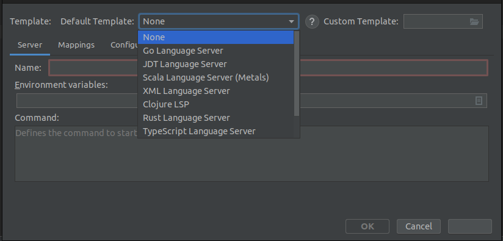

* [Ada Language Server](./user-defined-ls/ada_language_server.md)
* [Apache Camel Language Server](./user-defined-ls/camel-lsp-server.md)
* [Astro Language Server](./user-defined-ls/astro-ls.md)
* [CSS Language Server](./user-defined-ls/vscode-css-language-server.md)
* [Clangd](./user-defined-ls/clangd.md) 
* [Clojure LSP](./user-defined-ls/clojure-lsp.md)
* [Dart LSP](./user-defined-ls/dart-lsp.md) 
* [Docker Language Server](./user-defined-ls/docker-language-server.md)
* [EO LSP Server](./user-defined-ls/eo-lsp-server.md) 
* [Erlang Language Server](./user-defined-ls/erlang-ls.md)
* [ESLint Language Server](./user-defined-ls/vscode-eslint-language-server.md) 
* [Go Language Server](./user-defined-ls/gopls.md)
* [Harper Language Server](./user-defined-ls/harper-ls.md)
* [JQ Language Server](./user-defined-ls/jq-lsp.md)
* [Julia Language Server](./user-defined-ls/julia.md)
* [Perl Language Server](./user-defined-ls/perl-lsp.md)
* [Ruby LSP](./user-defined-ls/ruby-lsp.md)
* [Rust Language Server](./user-defined-ls/rust-analyzer.md) 
* [Scala Language Server (Metals)](./user-defined-ls/metals.md)
* [SourceKit-LSP](./user-defined-ls/sourcekit-lsp.md)
* [Stylelint-LSP](./user-defined-ls/stylelint-lsp.md)
* [Svelte Language Server](./user-defined-ls/svelte-language-server.md) 
* [Terraform Language Server](./user-defined-ls/terraform-ls.md)
* [TypeScript Language Server](./user-defined-ls/typescript-language-server.md)
* [Vue Language Server](./user-defined-ls/vue-js-language-server.md)
* [WGSL Analyzer](./user-defined-ls/wgsl-analyzer.md)

If the template directory contains a `README.md` file, you can open the instructions by pressing the help icon.

#### Custom template

The `Import from custom template...` item from the `Template combo-box` can be used to select a directory from 
the file system to load a custom language server template, 
these templates can be pre-filled with server name, command, mappings and potential configuration.

The selected directory contents should match the [custom template structure](#custom-template-structure).
If the template directory contains a `README.md` file, you can open the instructions by pressing the help icon.

Custom templates can be created by [exporting templates](#exporting-templates).

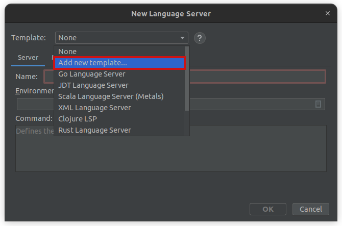

### Exporting templates

Users can export their own language servers to a zip file, where each language server is a separate directory. 
This can be done from the LSP console, by selecting one or more language servers and selecting the export option from the context menu.

These directories can then be used as a template for a new language server by [importing a custom template](#custom-template).

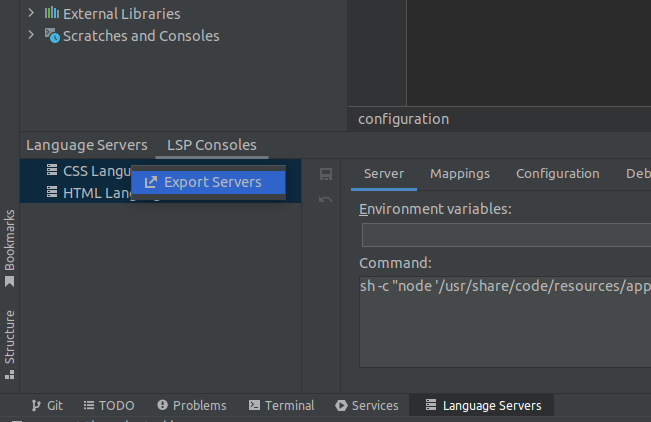

#### Custom template structure
By default, each directory contains the following files, but only `template.json` is required.
- `template.json`
- `settings.json`
- `initializationOptions.json`

A `README.md` file can be added manually to each of the language server directories to provide instructions 
for the corresponding language server.

See [here](./UserDefinedLanguageServerTemplate.md) for more information about those JSON structures.
