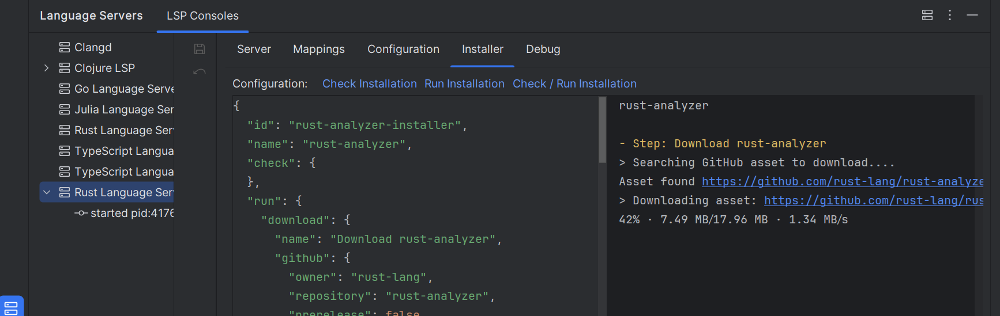

# User-defined language server template

LSP4IJ provides a [default user-defined language server template](./UserDefinedLanguageServer.md#default-template),
stored in the [templates folder](https://github.com/redhat-developer/lsp4ij/tree/main/src/main/resources/templates).

This section explains how to structure a user-defined template for your language server.

* [`template.json`](#template-descriptor): describes the language server and file types.
* `clientSettings.json`: contains the client capabilities and options.
* `initializationOptions.json`: custom options passed during initialization.
* [`installer.json`](#installer-descriptor): defines how to check, install, and configure the server.
* `settings.json`: user-defined settings for the server.
* `settings.schema.json`: JSON Schema for validating `settings.json`.

## How to Contribute a User-Defined Language Server Template

If you have [created a user-defined language server](./UserDefinedLanguageServer.md#new-language-server-dialog) 
and want to share it with others, you can contribute it to the official template repository used by LSP4IJ. Follow the steps below to submit your contribution.

### Steps to Contribute

1. **Edit the `template.json`**  
   After [exporting](./UserDefinedLanguageServer.md#exporting-templates) your language server, a folder will be generated containing `template.json`.
  - Add a unique `id` to identify your language server.
  - Adjust the `programArgs` section to support all relevant operating systems.
  - See the [template descriptor](#template-descriptor) section for more details.

2. **Submit a Pull Request**  
   Add your language server template folder in the [`/templates/lsp`](https://github.com/redhat-developer/lsp4ij/tree/main/src/main/resources/templates/lsp) directory.
  - Follow the structure of existing examples like [`/templates/lsp/typescript-language-server`](https://github.com/redhat-developer/lsp4ij/tree/main/src/main/resources/templates/lsp/typescript-language-server).

3. **Write the Documentation**  
   Provide documentation for your language server in the [`/docs/user-defined-ls`](https://github.com/redhat-developer/lsp4ij/tree/main/docs/user-defined-ls) folder.
  - Use existing docs as reference, for instance: [`/docs/user-defined-ls/typescript-language-server`](https://github.com/redhat-developer/lsp4ij/tree/main/docs/user-defined-ls/typescript-language-server.md).

4. **Reference it**  
   Add your language server in the [`Default template`](https://github.com/redhat-developer/lsp4ij/blob/main/docs/UserDefinedLanguageServer.md#default-template).

### ✅ Contribution Checklist

- [ ] `template.json` contains a unique `id` and correct `programArgs`
- [ ] Template is placed under `/templates/lsp/<your-language-server-name>`
- [ ] Documentation is placed under `/docs/user-defined-ls/<your-language-server-name>.md`
- [ ] Template is listed in the [Default template](https://github.com/redhat-developer/lsp4ij/blob/main/docs/UserDefinedLanguageServer.md#default-template)
- [ ] Pull Request includes only relevant files and follows the structure of existing examples
 
## Template descriptor

The template descriptor (`template.json`) is a JSON file used to define:

* the server ID and name
* the command to start the server
* the file type mappings

#### Example `template.json`

```json
{
  "id": "typescript-language-server",
  "name": "TypeScript Language Server",
  "programArgs": {
    "default": "sh -c \"typescript-language-server --stdio\"",
    "windows": "typescript-language-server.cmd --stdio"
  },
  "fileTypeMappings": [
    {
      "fileType": {
        "name": "JavaScript"
      },
      "languageId": "javascript"
    },
    {
      "fileType": {
        "name": "JavaScript-React",
        "patterns": ["*.jsx"]
      },
      "languageId": "javascriptreact"
    },
    {
      "fileType": {
        "name": "TypeScript",
        "patterns": ["*.ts"]
      },
      "languageId": "typescript"
    },
    {
      "fileType": {
        "name": "TypeScript-React",
        "patterns": ["*.tsx"]
      },
      "languageId": "typescriptreact"
    }
  ]
}
```

## Installer descriptor

The installer descriptor (`installer.json`) is a JSON file used to:

* `check` the current installation,
* `run` the installation of the LSP/DAP server,
* and optionally `configure` the start command once installation is complete.

It is used when:

* a user-defined language server must be installed (at creation time),
* or when the user decides to re-install it.

You can find a sample in the .

It should follow this structure:

```json5
{
  "id": "...",
  "name": "...",
  "check": {
    // Declare tasks to check the installation...
  },
  "run": {
    // Declare tasks to run the installation...
  }
}
```

`check` and `run` define starting [tasks](#task-descriptor), which can trigger other tasks using the `onFail` or `onSuccess` keys.

LSP4IJ provides built-in tasks:

* [exec](#task-exec) to execute a command (e.g., `npm install typescript-language-server`),
* [download](#task-download) to retrieve a server from a given URL,
* [configureServer](#task-configureServer) to set the launch command based on the downloaded files.

To define custom tasks, you can contribute to the extension point `com.redhat.devtools.lsp4ij.installerTaskFactory`.

### Task descriptor

Typical task structure:

```json5
{
  "id": "...",
  "name": "...",
  // custom keys depending on task type
  "onFail": {
    // Task to execute on failure
  },
  "onSuccess": {
    // Task to execute on success
  }
}
```

### Task exec

Example using `npm` to install [typescript-language-server](https://github.com/typescript-language-server/typescript-language-server):

```json
{
  "id": "typescript-language-server",
  "name": "TypeScript Language Server",
  "executeOnStartServer": false,
  "properties": {
    "workingDir" : "$USER_HOME$/.lsp4ij/typescript-language-server"
  },
  "check": {
    "exec": {
      "name": "Trying current command",
      "command": "${server.command}",
      "timeout": 2000
    }
  },
  "run": {
    "exec": {
      "name": "Install TypeScript Language Server",
      "workingDir": "${workingDir}",
      "ignoreStderr": true,
      "command": {
        "windows": "npm.cmd install typescript-language-server typescript --force",
        "default": "npm install typescript-language-server typescript --force"
      },
      "onSuccess": {
        "configureServer": {
          "name": "Configure TypeScript Language Server command",
          "command": {
            "windows": "${workingDir}/node_modules/.bin/typescript-language-server.cmd --stdio",
            "default": "${workingDir}/node_modules/.bin/typescript-language-server --stdio"
          },
          "update": true
        }
      }
    }
  }
}
```

### Task download

Structure of a `download` task:

```json5
{
  "download": {
    "id": "...",
    "name": "...",
    "url": "...",
    "output": {
      "dir": "...",
      "file": {
        "name": "...",
        "executable": true
      }
    },
    "onFail": {},
    "onSuccess": {}
  }
}
```

Example: downloading a JAR and configuring the start command

```json
{
  "id": "sdl-lsp",
  "name": "sdl-lsp",
  "check": {},
  "run": {
    "download": {
      "name": "Download sdl-lsp",
      "url": "https://oss.sonatype.org/.../sdl-lsp-1.0-20250503.111518-23-jar-with-dependencies.jar",
      "output": {
        "dir": "$USER_HOME$/.lsp4ij/lsp/sdl-lsp"
      },
      "onSuccess": {
        "configureServer": {
          "name": "Configure sdl-lsp server command",
          "command": "java -jar ${output.dir}/${output.file.name}",
          "update": true
        }
      }
    }
  }
}
```

> `configureServer.command` supports variable substitution with `${output.dir}` and `${output.file.name}`.
> These values are resolved from the `output` object of the preceding `download` task.

#### Unique URL:

```json
{
  "download": {
    "url": "<same URL for all OS>"
  }
}
```

#### OS-specific URLs:

```json
{
  "download": {
    "url": {
      "windows": "<windows URL>",
      "default": "<linux/mac URL>"
    }
  }
}
```

you can find a sample with [clangd installer](../src/main/resources/templates/lsp/clangd/installer.json)

#### OS and architecture-specific URLs:

```json
{
  "download": {
    "url": {
      "windows": {
        "x86_64": "<URL for win x86_64>",
        "x86": "<URL for win x86>"
      },
      "default": "<URL for linux/mac>"
    }
  }
}
```

#### GitHub asset download:

If DAP/LSP server can be downloaded from GitHub release like https://github.com/clojure-lsp/clojure-lsp/releases
you can use the `github` JSON object to download the proper asset: 

```json
{
  "download": {
    "github": {
      "owner": "clojure-lsp",
      "repository": "clojure-lsp",
      "prerelease": false,
      "asset": {
        "windows": "clojure-lsp-native-windows-amd64.zip",
        "unix": {
          "amd64": "clojure-lsp-native-linux-amd64.zip",
          "arm64": "clojure-lsp-native-linux-aarch64.zip"
        },
        "mac": {
          "aarch64": "clojure-lsp-native-macos-aarch64.zip",
          "amd64": "clojure-lsp-native-macos-amd64.zip"
        }
      }
    }
  }
}
```

When download will occur, it will request https://api.github.com/repos/${owner}/${repository}/releases URL. 
In the previous sample, URL requested will be https://api.github.com/repos/clojure-lsp/clojure-lsp/releases
It will take the first JSON asset which matches GitHub `asset.name` (by using the `download.github.asset` rule) 
and will return the `asset.browser_download_url`.

 * `owner` (required) the github owner.
 * `repository` (required) the github repository. 
 * `prerelease` (optional) can be used to select pre-release or not. By default, `prerelease` is set to false.   
 * `asset` (required) is used to select the proper file to download. You can use `*` if asset to download contains some timestamp for instance.

```json
{
      "asset": "sdl-lsp-*-jar-with-dependencies.jar"
 
}
```

If there is an asset per OS and with architecture, you can write:

```json
{
  "asset": {
    "windows": "clojure-lsp-native-windows-amd64.zip",
    "unix": {
      "amd64": "clojure-lsp-native-linux-amd64.zip",
      "arm64": "clojure-lsp-native-linux-aarch64.zip"
    },
    "mac": {
      "aarch64": "clojure-lsp-native-macos-aarch64.zip",
      "amd64": "clojure-lsp-native-macos-amd64.zip"
    }
  }
}
```

Samples:

* [clangd installer](../src/main/resources/templates/lsp/clangd/installer.json)
* [clojure-lsp installer](../src/main/resources/templates/lsp/clojure-lsp/installer.json)
* [rust-analyzer installer](../src/main/resources/templates/lsp/rust-analyzer/installer.json)

#### Maven artifact download

If the DAP/LSP server is published on [Maven Central](https://search.maven.org), you can use the `maven` object in your installer JSON to download the corresponding artifact:

```json
{
  "download": {
    "name": "Download Camel Language Server",
    "maven": {
      "groupId": "com.github.camel-tooling",
      "artifactId": "camel-lsp-server"
    }
  }
}
```

When the download occurs:

1. A request is made to the following Maven Central API endpoint to find the latest artifact:
   ```
   https://search.maven.org/solrsearch/select?q=g:%22com.github.camel-tooling%22%20AND%20a:%22camel-lsp-server%22&rows=20&wt=json
   ```
2. The first result from the response is used to determine the latest available version.
3. The download URL is then computed as:
   ```
   https://repo1.maven.org/maven2/{groupId with slashes}/{artifactId}/{version}/{artifactId}-{version}.jar
   ```

For example, if the groupId is `com.github.camel-tooling` and the artifactId is `camel-lsp-server`, the computed download URL might be:
```
https://repo1.maven.org/maven2/com/github/camel-tooling/camel-lsp-server/1.5.0/camel-lsp-server-1.5.0.jar
```

**Fields:**

- `groupId` (required): Maven group ID.
- `artifactId` (required): Maven artifact ID.

**Sample:**

- [Camel Language Server installer](../src/main/resources/templates/lsp/camel-lsp-server/installer.json)

##### Output customization

You can customize the output directory and executable name:

```json5
{
  "output": {
    "dir": "$USER_HOME$/.lsp4ij/lsp/rust-analyzer",
    "file": {
      "name": {
        "windows": "rust-analyzer.exe",
        "unix": "rust-analyzer-aarch64-unknown-linux-gnu",
        "mac": "rust-analyzer-aarch64-apple-darwin"
      },
      "executable": true
    }
  }
}
```

* `dir`: base folder where the downloaded file will be saved or extracted.
  The value is available as `${output.dir}` for use in other tasks.
* `file.name`: name of the executable file (registered as `${output.file.name}`).

#### Task configureServer

Used to set the server launch command:

```json5
{
  "configureServer": {
    "name": "Configure sdl-lsp server command",
    "command": "java -jar ${output.dir}/${output.file.name}",
    "update": true
  }
}
```
