# User guide

## LSP console

Although not directly useful to users in most cases, the Language Server console view is extremely valuable 
when we need to troubleshoot issues with the language servers.

The state of the servers is visible, stop and restart is available with a right-click, and you can enable different levels of tracing:

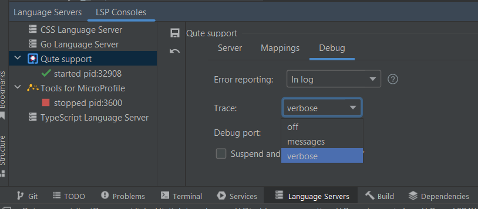

The communication details between the IDE and the language servers are seen in the "LSP consoles" pane. 
In verbose mode, the messages can be expanded for more details:

If the language server logs messages via [window/logMessage](https://microsoft.github.io/language-server-protocol/specifications/lsp/3.17/specification/#window_logMessage), you can see them in the `Logs` tab:

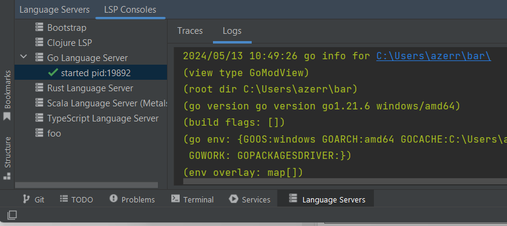 

When a language server is started, several actions are available, like stopping the language server or copying the command starting the language server :

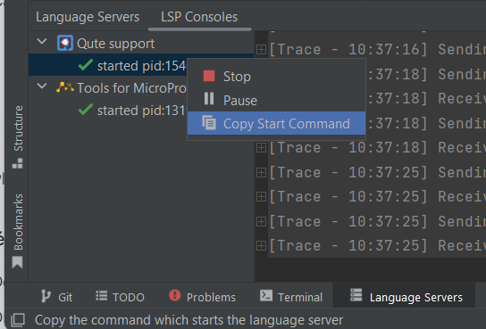

## Settings

### Language Servers preferences

The preference page under `Preferences | Languages & Frameworks | Language Servers` allows power users 
to configure mappings, language servers debugging and tracing:

The `Mappings` tab shows the file associations with the language server:

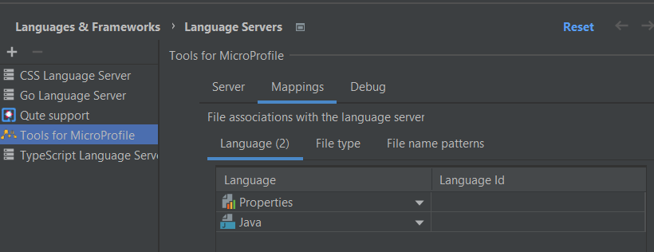

The `Debug` tab allows to configure language servers debugging and tracing:

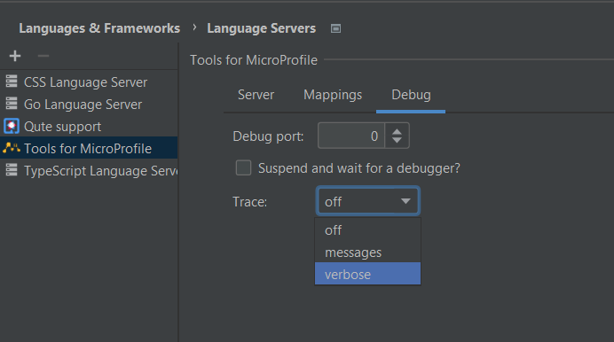

### LSP CodeLens

The standard preference page under `Preferences | Inlay Hints` allows to configure `LSP Codelens`:

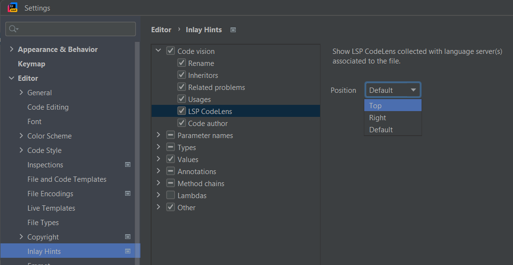

You can configure LSP CodeLens on the `Top`:

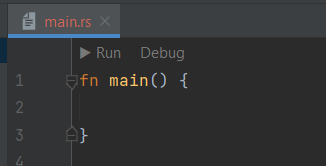

or configure LSP CodeLens on the `Right`:

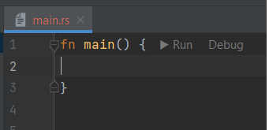

## Actions

### Formatting

The LSP formatting support can be done with the standard `Reformat Code` and `Reformat File` actions.

### Find Usages

The following LSP features are integrated with the standard `Find Usages` menu (provided they're supported by the underlying language server): 

* [Declarations](https://microsoft.github.io/language-server-protocol/specifications/lsp/3.17/specification/#textDocument_declaration)
* [Definitions](https://microsoft.github.io/language-server-protocol/specifications/lsp/3.17/specification/#textDocument_definition)
* [Type Definitions](https://microsoft.github.io/language-server-protocol/specifications/lsp/3.17/specification/#textDocument_typeDefinition)
* [References](https://microsoft.github.io/language-server-protocol/specifications/lsp/3.17/specification/#textDocument_references)
* [Implementations](https://microsoft.github.io/language-server-protocol/specifications/lsp/3.17/specification/#textDocument_implementation)

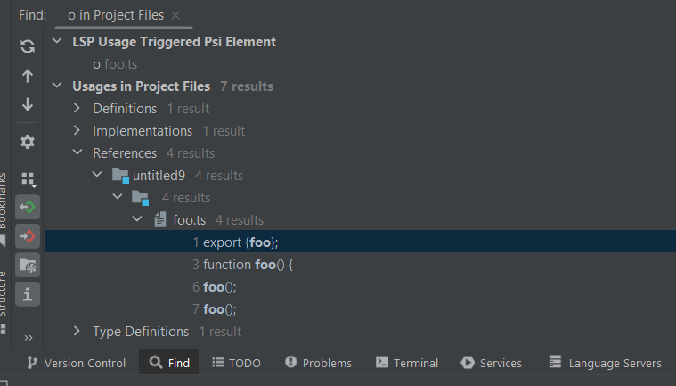

### Refactoring

#### On file operation

If the language server can support [workspace/willRenameFiles](https://microsoft.github.io/language-server-protocol/specifications/lsp/3.17/specification/#workspace_willRenameFiles), when a file is
renamed inside IntelliJ IDEA, LSP4IJ can consume it and applies the `WorkspaceEdit`
to apply some refactoring.

## Semantic Tokens support

LSP4IJ provides **experimental**  support for [LSP Semantic Tokens](https://microsoft.github.io/language-server-protocol/specifications/lsp/3.17/specification/#textDocument_semanticTokens).

### Language Server coloration

LSP4IJ provides default colors for semantic tokens, configurable in `Editor / Color Scheme / Language Server`:

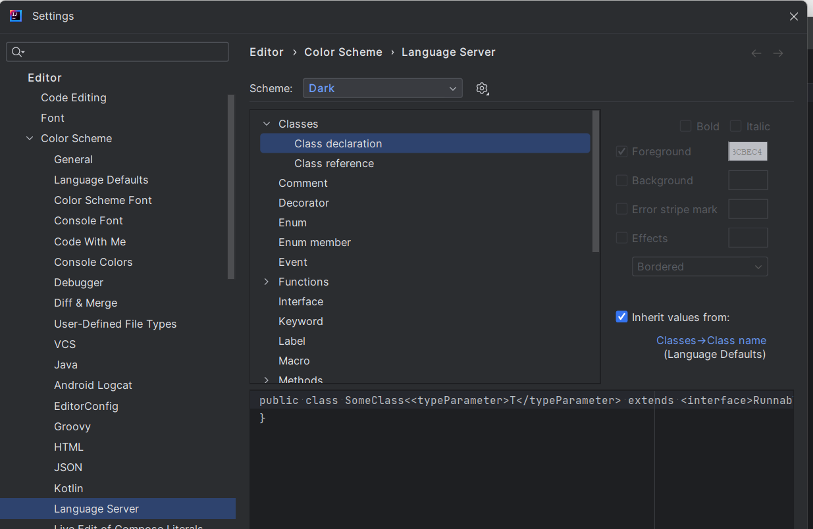

You can see the mapping between token types/modifiers and IntelliJ's TextAttributeKey on the color settings page (e.g., Class declaration)
in [DefaultSemanticTokensColorsProvider](./LSPSupport.md#DefaultSemanticTokensColorsProvider) section.

### Semantic Tokens Inspector

The `Semantic Tokens Inspector` allows you to understand semantic coloring via LSP semantic tokens support. You can open the inspector
with the menu `View / Tool Window / Semantic Tokens Inspector`:

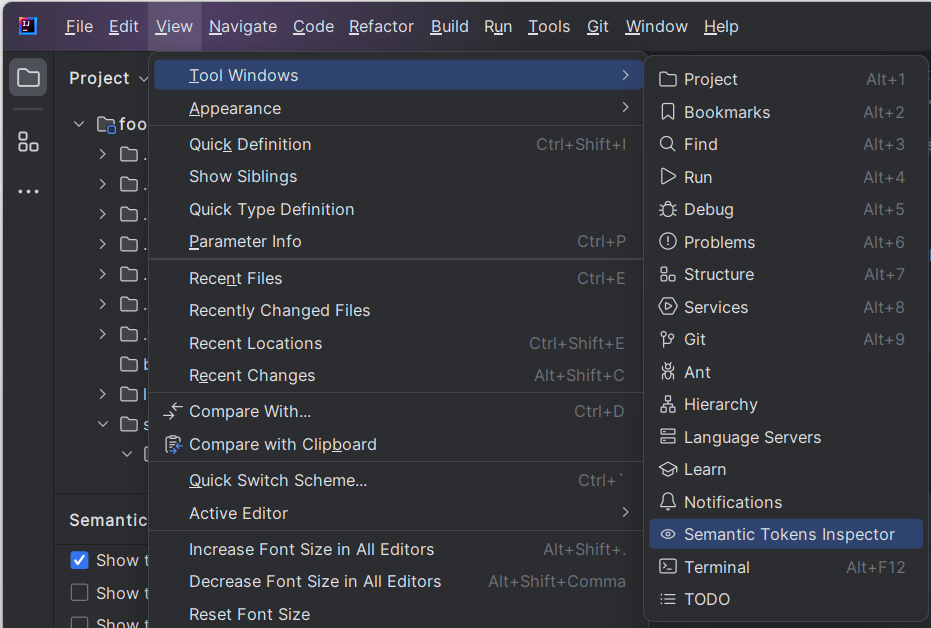

Once the inspector is open, it tracks all calls to semantic tokens. 
If a file must be colored via semantic tokens, it appears in a tab of the inspector 
and must display information on the TextAttributeKeys to use and the token types / modifiers decoded
that you can select in the left panel via the checkboxes:

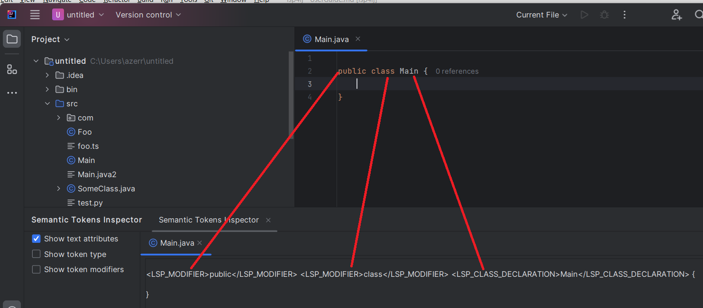

## Inspections

You can click on `Inspect Code...` hyperlink available on the `Project Errors` from the `Problems` view to 
show all LSP diagnostics errors of your project in the `Language Servers` local inspection tool:

 - from opened files.
 - from closed files, if your language server support it. 

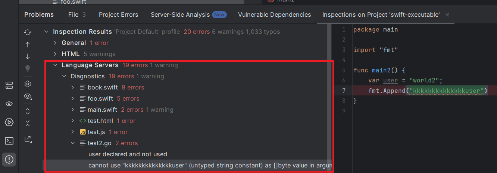

## Troubleshooting

If the `Semantic Tokens` doesn't show the expected result, please check that:

 * show in the [LSP console](#lsp-console) that your language server reports 
LSP request `textDocument/semanticTokens/full`
 * uses the [Semantic Tokens Inspector](#semantic-tokens-inspector) to understand more how the 
file content is tokenized. Problem could come if LSP4IJ doesn't support some token types / modifiers.