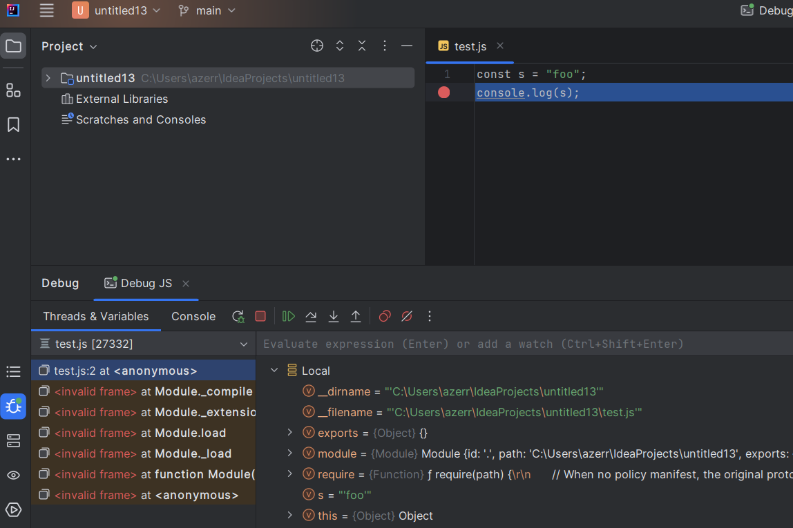
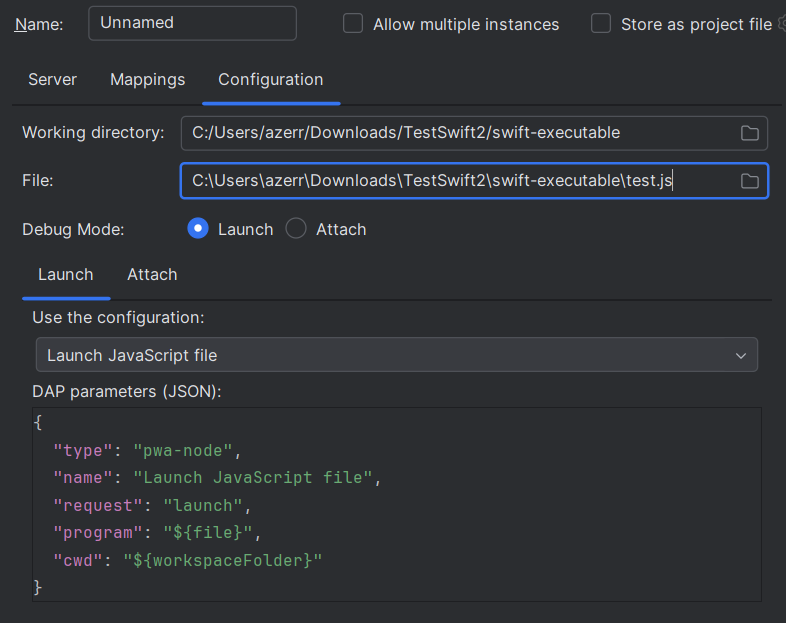

# Debug Adapter Protocol

LSP4IJ provides [Debug Adapter Protocol](https://microsoft.github.io/debug-adapter-protocol/) support. 
You can read [the DAP Support overview](./DAPSupport.md), describing which DAP features are implemented, and how.

The DAP support is available with the `Debug Adapter Protocol` run/debug configuration type:

After configuring the [DAP configuration type](#dap-configuration-type), you can debug your file.  
Here is an example with `JavaScript debugging`, which uses the [VSCode JS Debug DAP server](./user-defined-dap/vscode-js-debug.md):

## DAP Configuration Type:

To configure debugging with DAP, you need to fill in:

- The `Configuration` tab to specify the working directory and the file you want to run/debug:

  

- The `Mappings` tab to specify the files which can be debugged to allow adding/removing breakpoints:

- The `Server` tab to specify the DAP server:
 
  

## Evaluate expression

Evaluate expression is available by consuming the [Evaluate request](https://microsoft.github.io/debug-adapter-protocol//specification.html#Requests_Evaluate) 

### Completion

If debug adapter [supports the `completions` request](https://microsoft.github.io/debug-adapter-protocol//specification.html#Types_Capabilities),
completion should be available in the expression editor by consuming the
[Completion request](https://microsoft.github.io/debug-adapter-protocol//specification.html#Requests_Completions):

## Set value

If debug adapter [supports setting a variable to a value](https://microsoft.github.io/debug-adapter-protocol//specification.html#Types_Capabilities),
the `Set Value...` contextual menu should be available: 

You should edit the variable:

the edit apply will consume the
[SetVariable request](https://microsoft.github.io/debug-adapter-protocol//specification.html#Requests_SetVariable):

# Contextual Menu

Click on right button open existing / new DAP run configuration:

## Templates

LSP4IJ provides DAP templates that allow to initialize a given DAP server very quickly:

- [Go Delve DAP server](./user-defined-dap/go-delve.md) which allows you to debug `Go` files.
- [Swift DAP Server](./user-defined-dap/swift-lldb.md) which allows you to debug `Swift` files.
- [VSCode JS Debug DAP Server](./user-defined-dap/vscode-js-debug.md) which allows you to debug `JavaScript/TypeScript` files.