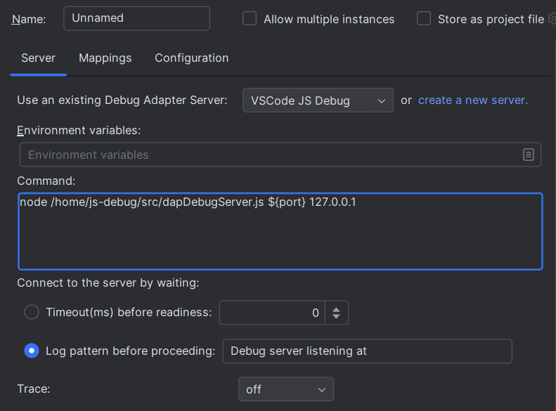

# Debug Adapter Protocol

LSP4IJ provides [Debug Adapter Protocol](https://microsoft.github.io/debug-adapter-protocol/) support
with the `Debug Adapter Protocol` run/debug configuration type:

After configuring the [DAP configuration type](#dap-configuration-type), you can debug your file.  
Here is an example with `JavaScript debugging`, which uses the [VSCode JS Debug DAP server](./user-defined-dap/vscode-js-debug.md):

## DAP Configuration Type:

To configure debugging with DAP, you need to fill in:

- The `Program` tab to specify the working directory and the file you want to execute and debug:

  

- The `Debug Adapter Protocol` tab to specify the DAP server:

  

## Templates

- [VSCode JS Debug DAP Server](./user-defined-dap/vscode-js-debug.md)
