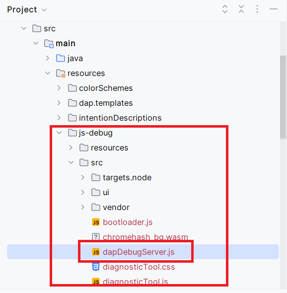
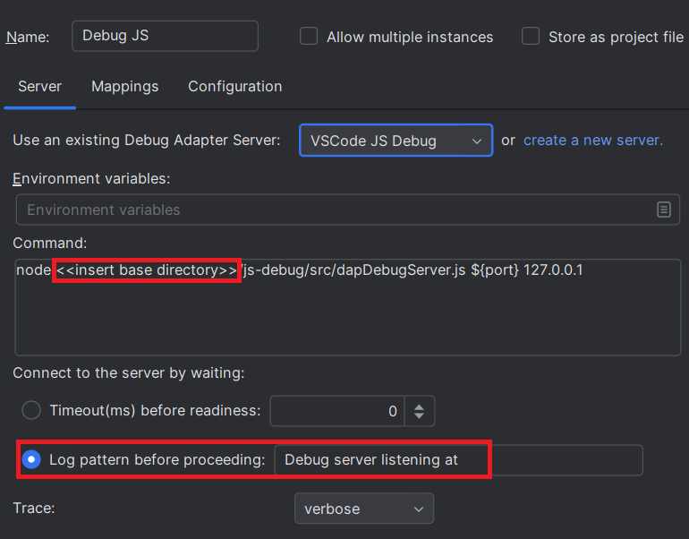
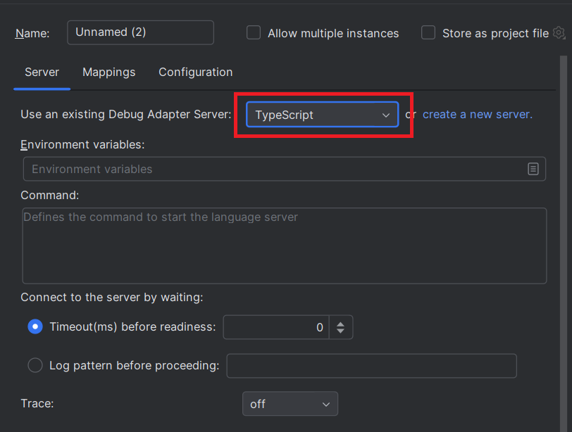

# Developer Guide

DAP support provides a [generic DAP configuration interface](./UserGuide.md) that allows to configure any DAP server. 
The fact that it is generic can confuse the user with all the possible configurations.

To improve the user experience, it is possible to register a custom DAP server via the
`com.redhat.devtools.lsp4ij.debugAdapterServer` extension point which allows for example:

* to [embed the DAP server in its plugin](#embed-the-dap-server) to avoid the user to download it, to configure its environment.
* to [customize the DAP server startup](#customize-the-dap-server-startup) to avoid the user to configure it.
* to `customize the Run/Debug configuration interface` to simplify and provide a user interface adapted to the language.
* to `manage its own type of breakpoints` to avoid being polluted by the breakpoints of other DAP servers.

# TypeScript DAP server

In this example we will explain how to register [VSCode JS Debug DAP server](./user-defined-dap/vscode-js-debug.md) 
with the `com.redhat.devtools.lsp4ij.debugAdapterServer` extension point.

## Embed the DAP server

Here we will embed the [VSCode JS Debug DAP server](./user-defined-dap/vscode-js-debug.md) in the plugin `my.plugin.id`.
You will need to download the `js-debug-dap-v*.tar.gz` asset from the [VSCode JS Debug releases](https://github.com/microsoft/vscode-js-debug/releases), unzip it 
and copy/paste the `js-debug` folder in your `src/main/resources` folder:



## Customize the DAP server startup

Configuring manually [VSCode JS Debug DAP server](./user-defined-dap/vscode-js-debug.md) can be boring:

 * you need to download `js-debug-dap-v*.tar.gz`, unzip it, and update the `<<insert base directory>>`
to use the proper path of the DAP server.
 * the UI configuration is little complex.



In this step we will register the DAP server with the `com.redhat.devtools.lsp4ij.debugAdapterServer` extension point.

### DebugAdapterDescriptor

Create the `TypeScriptDebugAdapterDescriptor` class like this:

```java
package my.dap.server;

import com.intellij.execution.ExecutionException;
import com.intellij.execution.configurations.GeneralCommandLine;
import com.intellij.execution.configurations.RunConfigurationOptions;
import com.intellij.execution.process.ProcessHandler;
import com.intellij.execution.runners.ExecutionEnvironment;
import com.intellij.openapi.fileTypes.FileType;
import com.redhat.devtools.lsp4ij.dap.client.LaunchUtils;
import com.redhat.devtools.lsp4ij.dap.configurations.options.FileOptionConfigurable;
import com.redhat.devtools.lsp4ij.dap.configurations.options.WorkingDirectoryConfigurable;
import com.redhat.devtools.lsp4ij.dap.definitions.DebugAdapterServerDefinition;
import com.redhat.devtools.lsp4ij.dap.descriptors.DebugAdapterDescriptor;
import com.redhat.devtools.lsp4ij.dap.descriptors.ServerReadyConfig;
import org.jetbrains.annotations.NotNull;
import org.jetbrains.annotations.Nullable;

import java.nio.file.Path;
import java.util.Map;

import static com.redhat.devtools.lsp4ij.dap.descriptors.DebugAdapterDescriptorFactory.getDebugAdapterServerPath;

public class TypeScriptDebugAdapterDescriptor extends DebugAdapterDescriptor {

    private static final String PLUGIN_ID = "my.plugin.id";

    private final static Path dapServerPath;

    static {
        dapServerPath = getDebugAdapterServerPath(PLUGIN_ID, "js-debug/src/dapDebugServer.js");
    }

    public TypeScriptDebugAdapterDescriptor(@NotNull RunConfigurationOptions options,
                                            @NotNull ExecutionEnvironment environment,
                                            @Nullable DebugAdapterServerDefinition serverDefinition) {
        super(options, environment, serverDefinition);
    }

    @Override
    public ProcessHandler startServer() throws ExecutionException {
        String command = "node " + dapServerPath.toString() + " ${port} 127.0.0.1";
        GeneralCommandLine commandLine = createStartServerCommandLine(command);
        return startServer(commandLine);
    }

    @Override
    public @NotNull Map<String, Object> getDapParameters() {
        // language=JSON
        String launchJson = """                
                {
                  "type": "pwa-node",
                  "name": "Launch TypeScript file",
                  "request": "launch",
                  "program": "${file}",
                  "cwd": "${workspaceFolder}",
                  "outFiles": [
                    "${workspaceFolder}/**/*.(m|c|)js",
                    "!**/node_modules/**"
                  ],
                  "sourceMaps": true,
                  "__workspaceFolder": "${workspaceFolder}"
                }
                """;
        String file = ((FileOptionConfigurable) options).getFile();
        String workspaceFolder = ((WorkingDirectoryConfigurable) options).getWorkingDirectory();
        LaunchUtils.LaunchContext context = new LaunchUtils.LaunchContext(file, workspaceFolder);
        return LaunchUtils.getDapParameters(launchJson, context);
    }

    @Override
    public @NotNull ServerReadyConfig getServerReadyConfig(@NotNull DebugMode debugMode) {
        return new ServerReadyConfig("Debug server listening at ");
    }

    @Override
    public @Nullable FileType getFileType() {
        return null;
    }
}
```

### DebugAdapterDescriptorFactory

Create the `TypeScriptDebugAdapterDescriptorFactory` class like this:

```java
package my.dap.server;

import com.intellij.execution.runners.ExecutionEnvironment;
import com.redhat.devtools.lsp4ij.dap.configurations.DAPRunConfigurationOptions;
import com.redhat.devtools.lsp4ij.dap.descriptors.DebugAdapterDescriptor;
import com.redhat.devtools.lsp4ij.dap.descriptors.DebugAdapterDescriptorFactory;
import org.jetbrains.annotations.NotNull;

public class TypeScriptDebugAdapterDescriptorFactory extends DebugAdapterDescriptorFactory {

    @Override
    public DebugAdapterDescriptor createDebugAdapterDescriptor(@NotNull DAPRunConfigurationOptions options, 
                                                               @NotNull ExecutionEnvironment environment) {
        return new TypeScriptDebugAdapterDescriptor(options, environment, getServerDefinition());
    }
}
```

### debugAdapterServer extension point

Register the `TypeScriptDebugAdapterDescriptorFactory` class with the `debugAdapterServer` extension point like this:

```xml
<extensions defaultExtensionNs="com.redhat.devtools.lsp4ij">
    <debugAdapterServer
        id="typescript"
        name="TypeScript"
        factoryClass="my.dap.server.TypeScriptDebugAdapterDescriptorFactory" />
</extensions>
```

### Test your debugAdapterServer

At this step, you can test your `TypeScriptDebugAdapterDescriptorFactory` with the generic Debug Adapter Protocol runconfiguration.
You should see TypeScript in the existing server,



Select it, select the TypeScript file that you wish to run in the Configuration tab and run the configuration.
It should start your DAP server and execute the TypeScript file.

