# Buildx Debugging for Dockerfiles

To debug [Dockerfiles](https://docs.docker.com/build/concepts/dockerfile/), you can use the DAP implementation provided by [Buildx](https://github.com/docker/buildx).

## Requirements

You will need Buildx v0.28.0. You can get Buildx by [installing Docker Desktop](https://docs.docker.com/install/) or by [installing Buildx manually](https://github.com/docker/buildx?tab=readme-ov-file#manual-download).

1. Run `docker buildx version` to check your Buildx version.
2. Run `BUILDX_EXPERIMENTAL=1 docker buildx dap` to check that the `dap` subcommand is available in your Buildx installation.

## Setup

1. Create a Debug Adapter Protocol launch configuration.

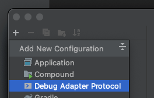

2. Click on the 'Create a new server' hyperlink.

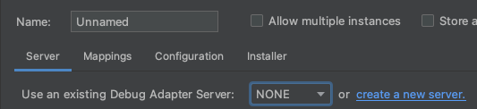

3. Click 'Choose template...' and select the 'Docker: Dockerfile Build Debugging' template.

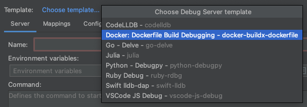

4. In 'Environment variables:', enter in `BUILDX_EXPERIMENTAL=1`.

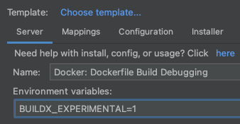

5. Click the 'OK' button to save the server configuration.
6. Now go to the 'Configuration' tab and find select a Dockerfile in the 'File:' field.

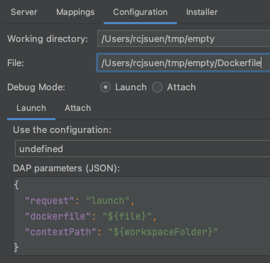

7. Click the 'OK' button to save the launch configuration.
8. Open your Dockerfile and place a breakpoint.
9. Launch your configuration in debug mode to pause the Dockerfile build!

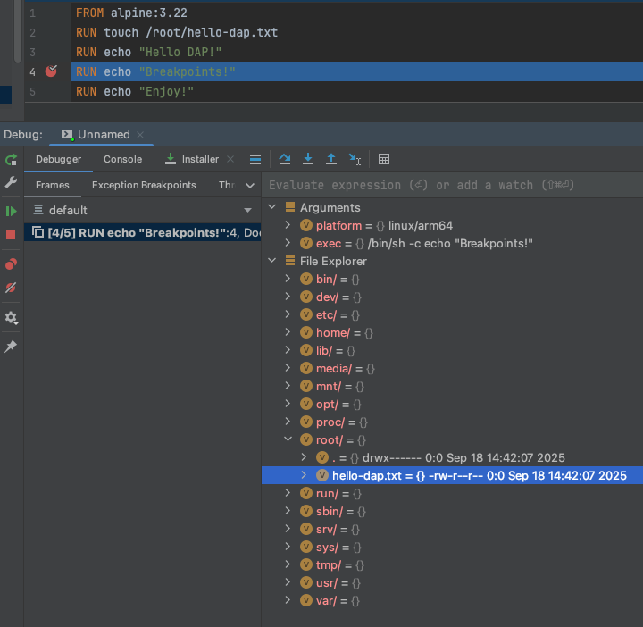

## Configuration

If you would like to make further configurations to how the build is launched, you can refer to [this document](https://github.com/docker/buildx/blob/77315f947ea4f800639bbd0132ff3012780ed6fc/docs/reference/buildx_dap_build.md#examples) to modify the DAP JSON parameters that are passed.

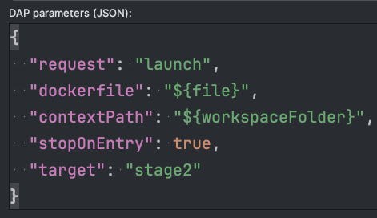

## Features

### View the environment of the image being built

While your build is in a suspended state, you can review variables, the working directory, and the files and folders of the image.

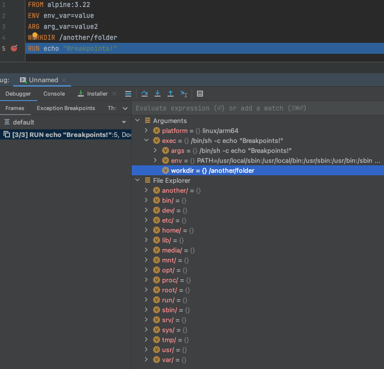

### Open a shell inside the image

Evaluate the `exec` expression and Buildx will open a terminal for you to type commands into the image directly.

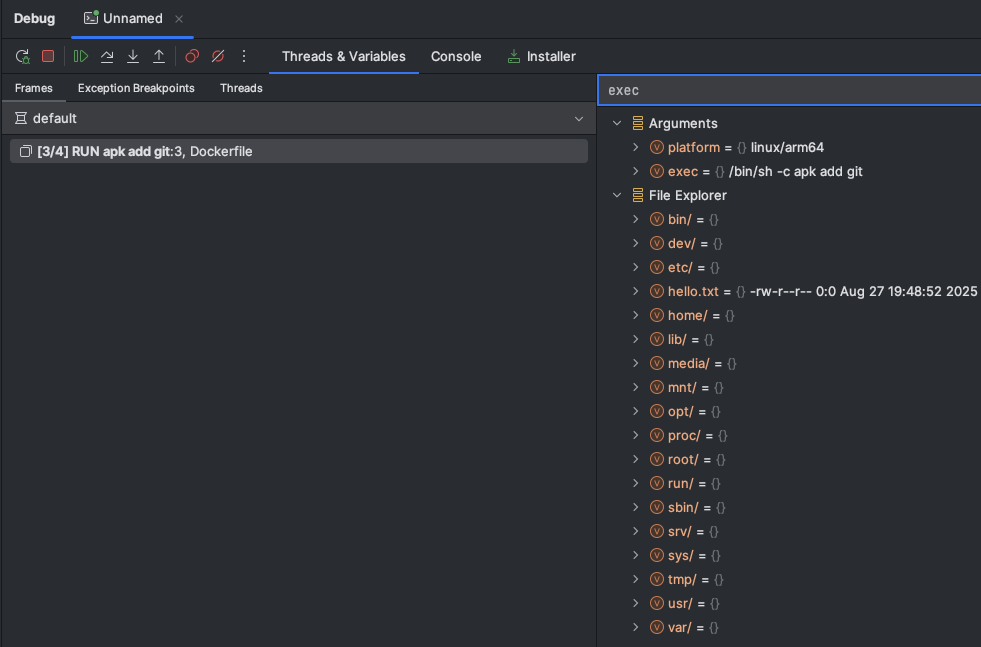

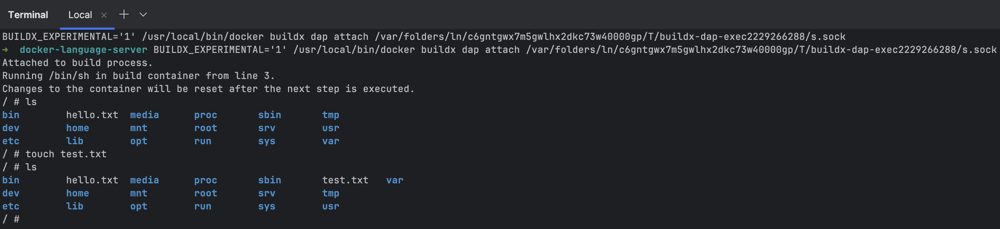

Please note however that any changes you make will be wiped when you advance the debugger.

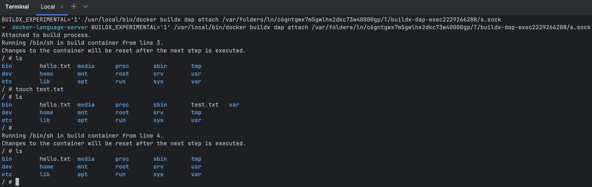
