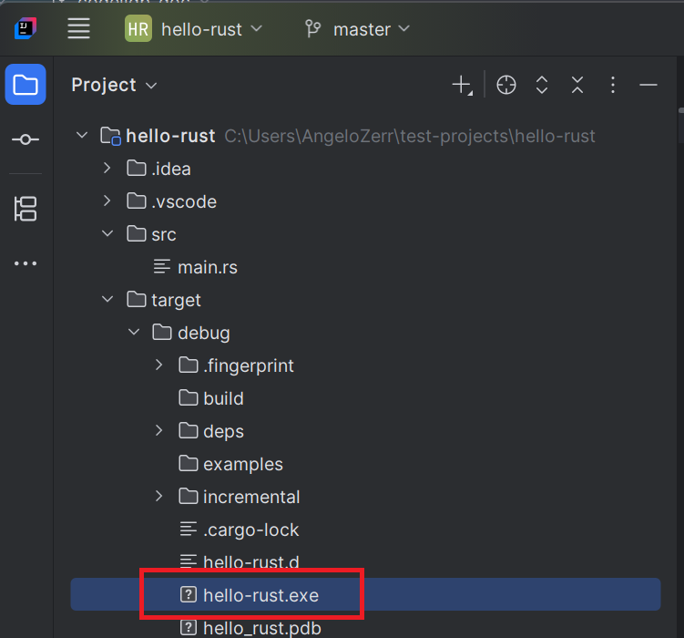
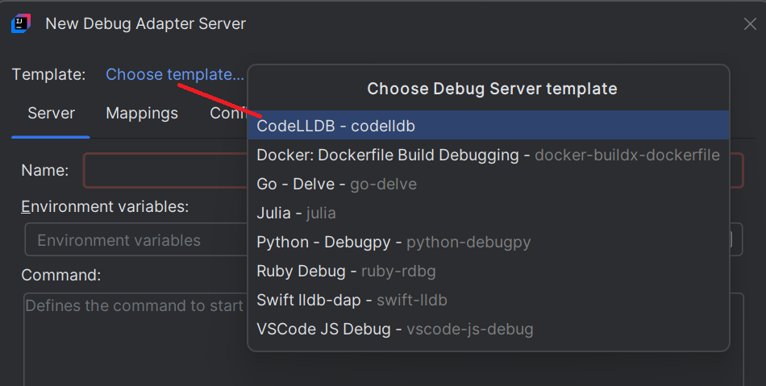
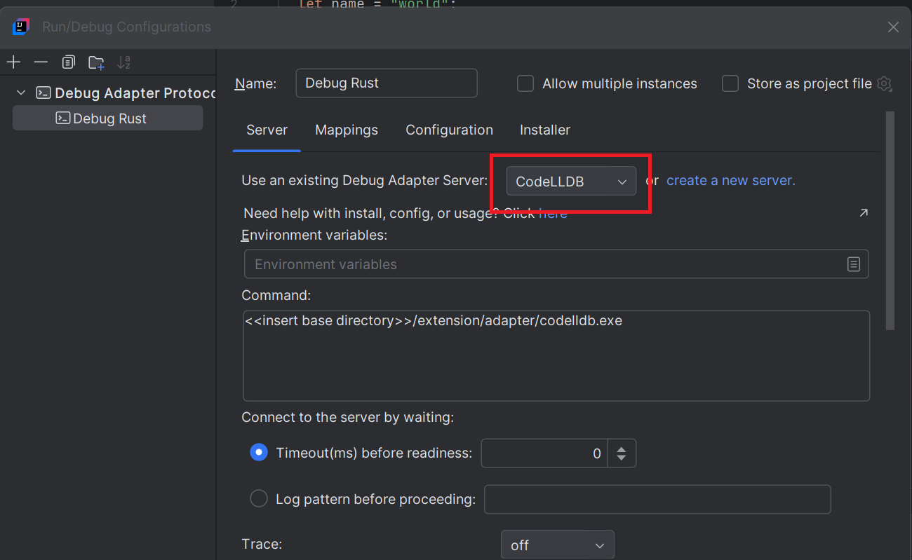
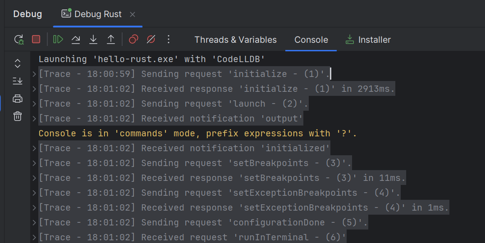
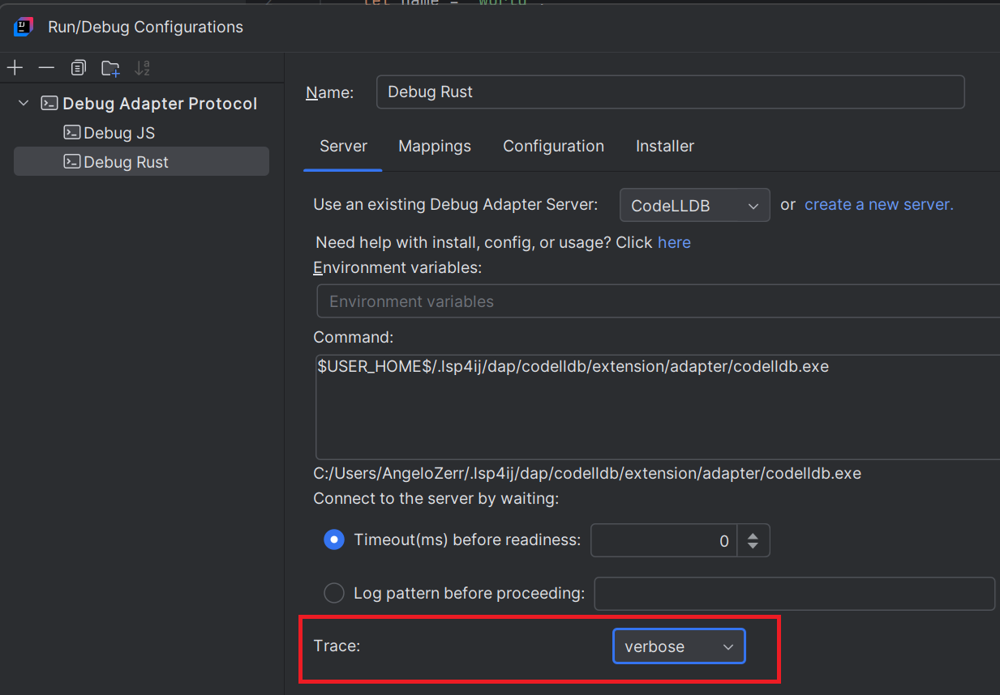
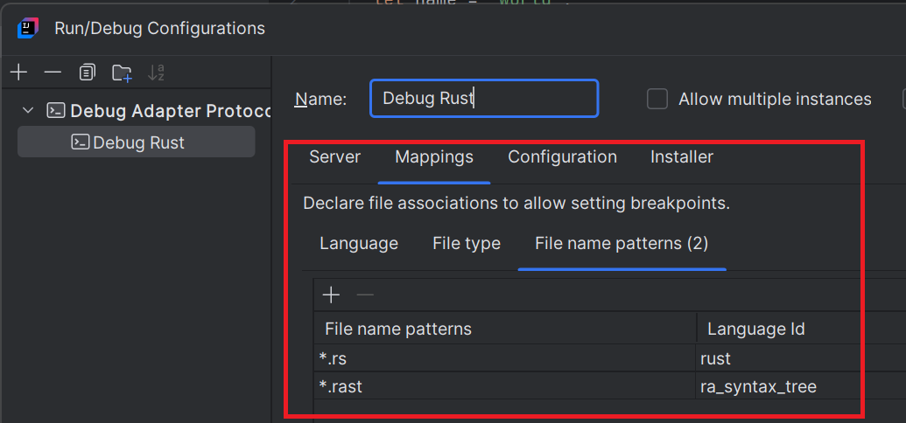
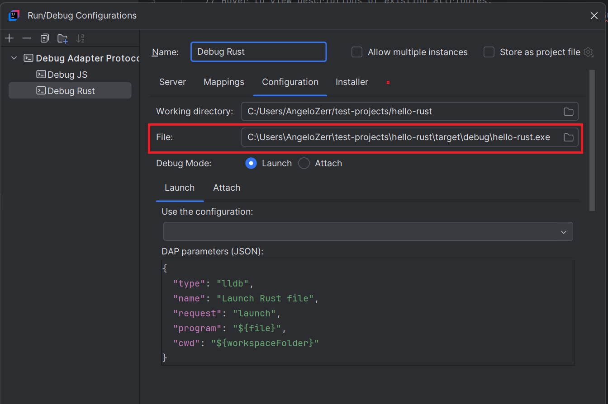
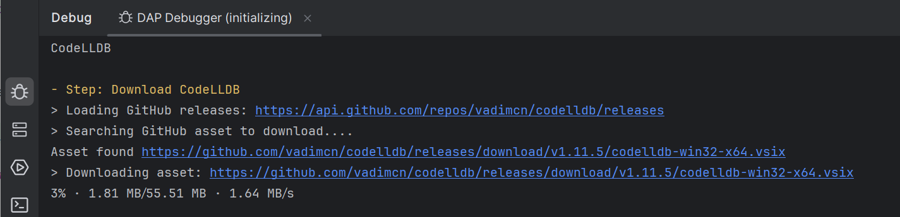
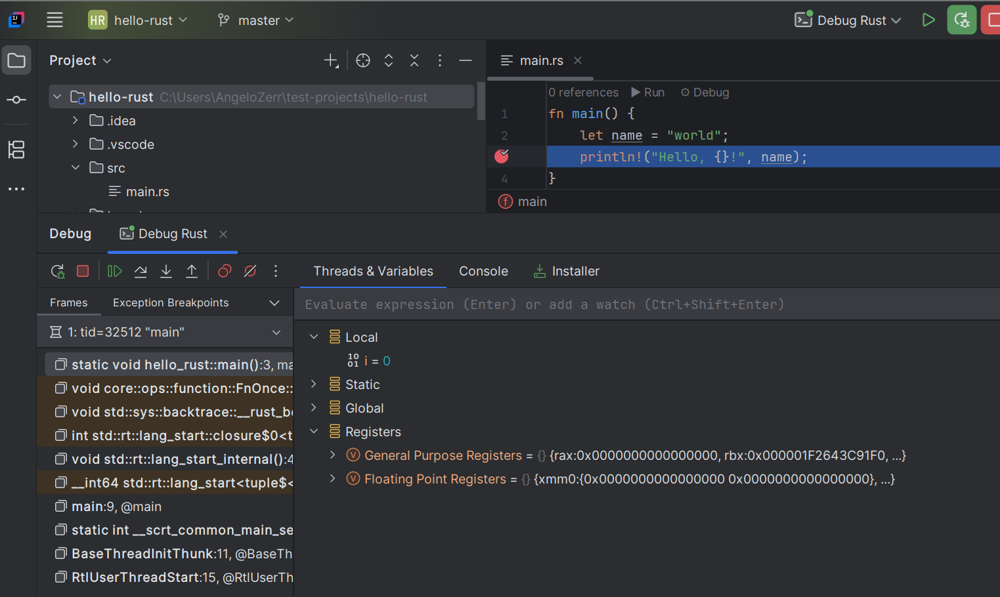
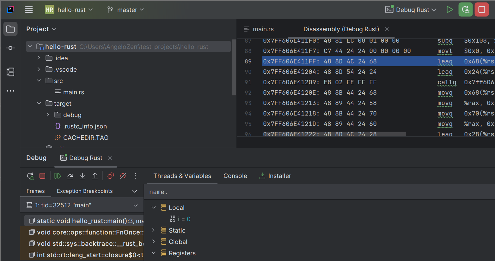

# CodeLLDB

To debug a [Rust application](#rust-application) or [C++ application](#c-application), you can use the [CodeLLDB](https://github.com/vadimcn/codelldb) DAP server.

# Rust Application

Let's debug the following `main.rs` Rust file:

```rust
fn main() {
  let name = "world";
  println!("Hello, {}!", name);
}
```


You will need to install [cargo](https://doc.rust-lang.org/cargo/getting-started/installation.html), which is used to create a Rust application with `cargo init` and to build an executable with `cargo build`.  
The executable is required for debugging.

## Initialize Rust Application

```shell
cargo init
```

This command generates a Rust application with a `src/main.rs` file. Update this file with the following content:

```rust
fn main() {
  let name = "world";
  println!("Hello, {}!", name);
}
```

To debug the Rust application, you first need to build the executable that will be used by the debugger.
In the project directory, run:

```shell
cargo build
```

This will generate an executable in the `target/debug` folder.



## Configure DAP server

1. Create a DAP Run/Debug configuration:

   

2. In the `Server` tab, click on `create a new server`:

   

3. A new dialog will open to create a DAP server. Select the `CodeLLDB` template:

   

4. After clicking the `OK` button, the new server will be selected and the configuration automatically pre-filled:



5. Enable DAP server traces

If you wish to show DAP request/response traces when you will debug:



you need to select `Trace` with `verbose`.



## Configure file mappings

To allows settings breakpoints to Rust files, you need configure mappings in the `Mappings` tab.
As you have selected `CodeLLDB` server, it will automatically populate the file mappings like this:



## Configure the executable to run/debug

Since you selected the `CodeLLDB` server, the `Launch` configuration will be automatically populated like this:

1. `Launch` as `Debug mode` should be selected.
2. The DAP parameters of the launch should look like this:

```json
{
  "type": "lldb",
  "name": "Launch Rust file",
  "request": "launch",
  "program": "${file}",
  "cwd": "${workspaceFolder}"
}
```

You also need to `select the executable` in the `File` field:



## Set Breakpoint

After applying the run configuration, set breakpoints in files that match the file mappings.
For example, set a breakpoint in the `main.rs` file:


## Debugging

You can start the run configuration in either Run or Debug mode. 

The first time you run it, [CodeLLDB](https://github.com/vadimcn/codelldb), 
the DAP server, will be downloaded and installed:



If you encounter an error during installation, go to the `Installer` tab, update the 
[Installer Descriptor](https://github.com/redhat-developer/lsp4ij/blob/main/docs/UserDefinedLanguageServerTemplate.md#installer-descriptor)
, and run `Run Installation` again:


Once started, you should see DAP traces in the console:


You will also see `Threads` and `Variables`:



You can [open the Disassembly view](../UserGuide.md#disassemble)
to debug step-by-step instructions at the assembly level:



## Language Support

If you need language support for Rust (completion, validation, etc.), you can [configure the Rust Language Server](../../user-defined-ls/rust-analyzer.md).


# C++ Application

TODO

## Language Support

If you need language support for C++ files (completion, validation, etc.), you can [configure the Clangd Language Server](../../user-defined-ls/clangd.md).

