# CodeLLDB

To debug a [Rust application](#rust-application) or [C++ application](#c-application), you can use the [CodeLLDB](https://github.com/vadimcn/codelldb) DAP server.

# Rust Application

Let's debug the following `main.rs` Rust file:

```rust
fn main() {
  let name = "world";
  println!("Hello, {}!", name);
}
```

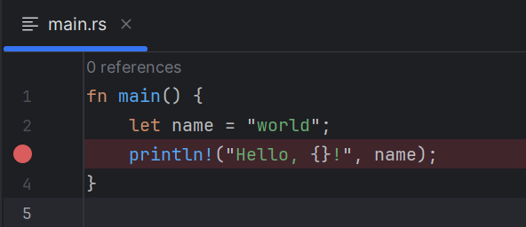

You will need to install [cargo](https://doc.rust-lang.org/cargo/getting-started/installation.html), which is used to create a Rust application with `cargo init` and to build an executable with `cargo build`.  
The executable is required for debugging.

## Initialize Rust Application

```shell
cargo init
```

This command generates a Rust application with a `src/main.rs` file. Update this file with the following content:

```rust
fn main() {
  let name = "world";
  println!("Hello, {}!", name);
}
```

To debug the Rust application, you first need to build the executable that will be used by the debugger.
In the project directory, run:

```shell
cargo build
```

This will generate an executable in the `target/debug` folder.

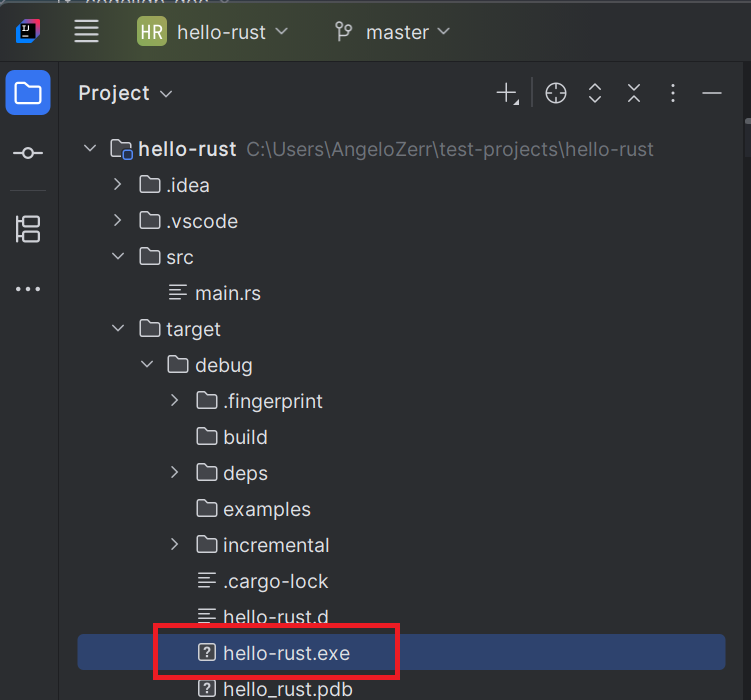

## Configure DAP server

1. Create a DAP Run/Debug configuration:

   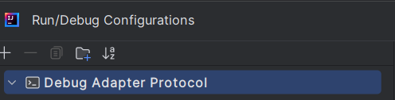

2. In the `Server` tab, click on `create a new server`:

   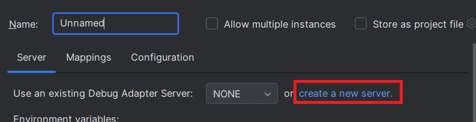

3. A new dialog will open to create a DAP server. Select the `CodeLLDB` template:

   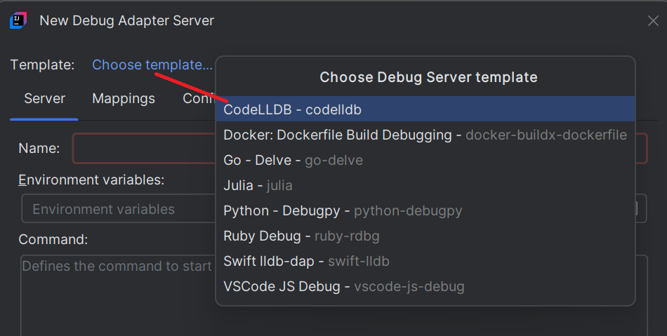

4. After clicking the `OK` button, the new server will be selected and the configuration automatically pre-filled:

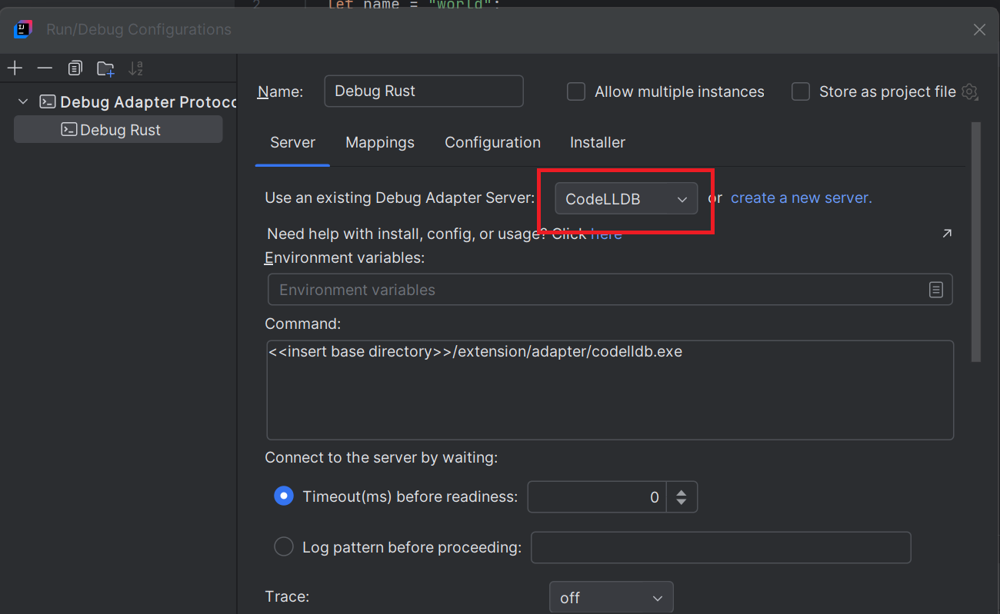

5. Enable DAP server traces

If you wish to show DAP request/response traces when you will debug:

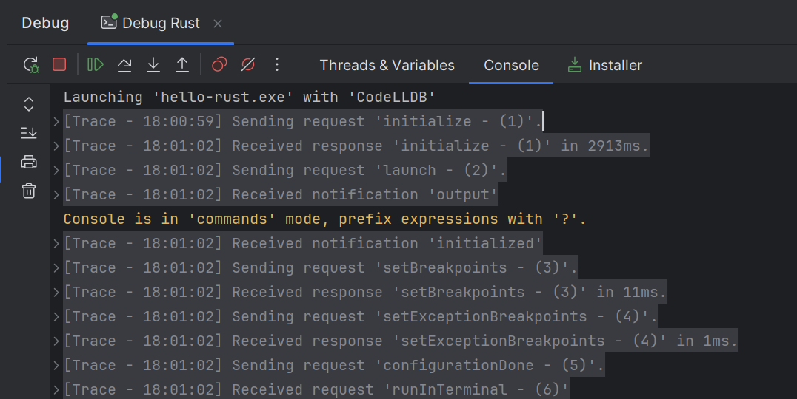

you need to select `Trace` with `verbose`.

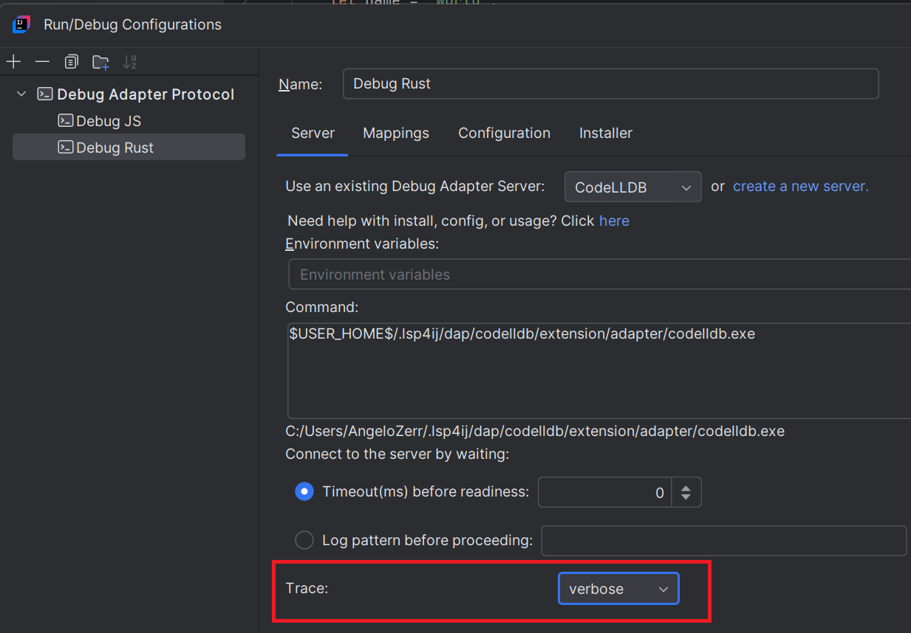

## Configure file mappings

To allows settings breakpoints to Python files, you need configure mappings in the `Mappings` tab.
As you have selected `CodeLLDB` server, it will automatically populate the file mappings like this:

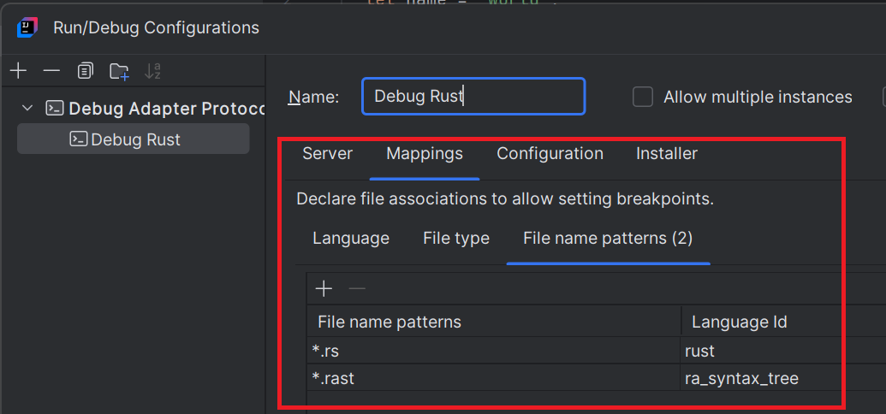

## Configure the executable to run/debug

As you have selected `CodeLLDB` server, it will automatically populate the `Launch` configuration like this:

1. `Launch` as `Debug mode` should be selected.
2. The DAP parameters of the launch should look like this:

```json
{
  "type": "lldb",
  "name": "Launch Rust file",
  "request": "launch",
  "program": "${file}",
  "cwd": "${workspaceFolder}"
}
```

You need to select the executable in the file field:

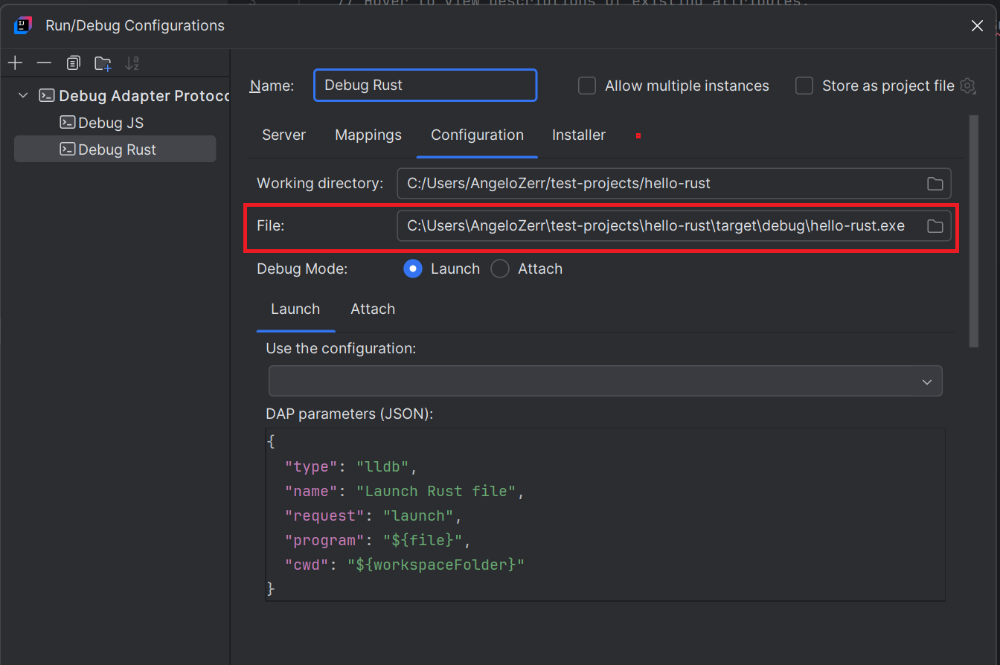

## Set Breakpoint

After applying the run configuration, you should set a breakpoint to files which matches file mappings.
Set a breakpoint in the `main.rs` file:


## Debugging

You can start the run configuration in either Run or Debug mode. 

First time, [CodeLLDB](https://github.com/vadimcn/codelldb)  the DAP server will be downloaded and installed:

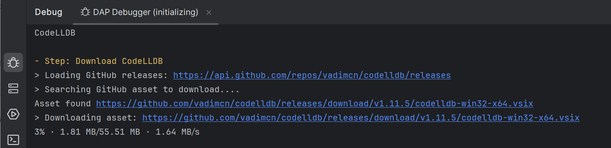

If you have some error while installation, you can go to the `Installer`, update [Installer Descriptor](https://github.com/redhat-developer/lsp4ij/blob/main/docs/UserDefinedLanguageServerTemplate.md#installer-descriptor) and run again `Run Installation`: 

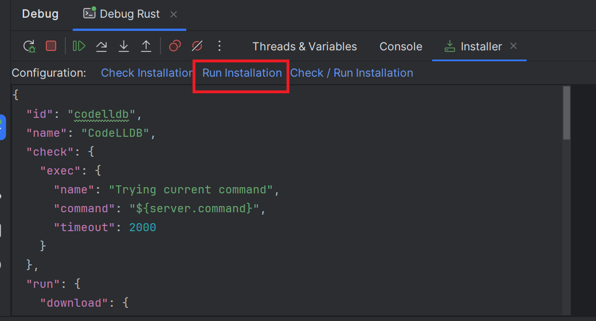

Once started, you should see DAP traces in the console:


You will also see `Threads` and `Variables`:

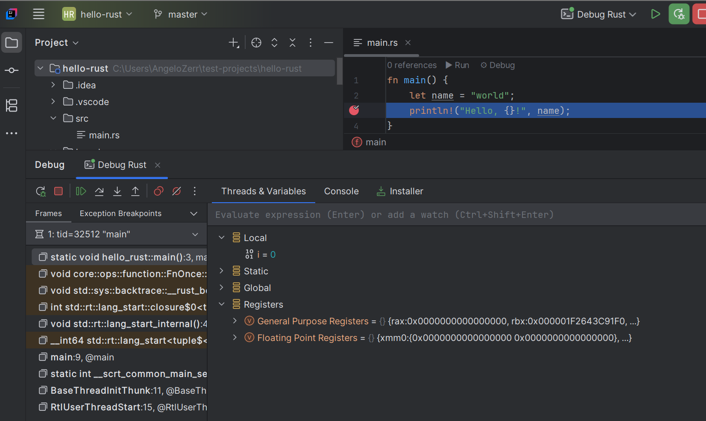

You can [open Disassembly](../UserGuide.md#disassemble) and debug step by step instructions in the Diasembly view:

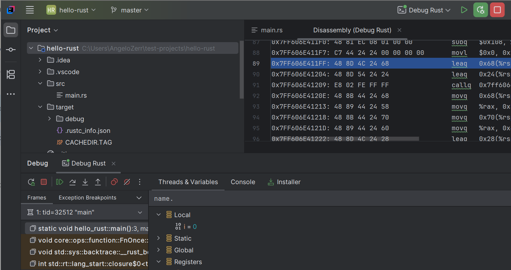

# C++ Application

TODO

