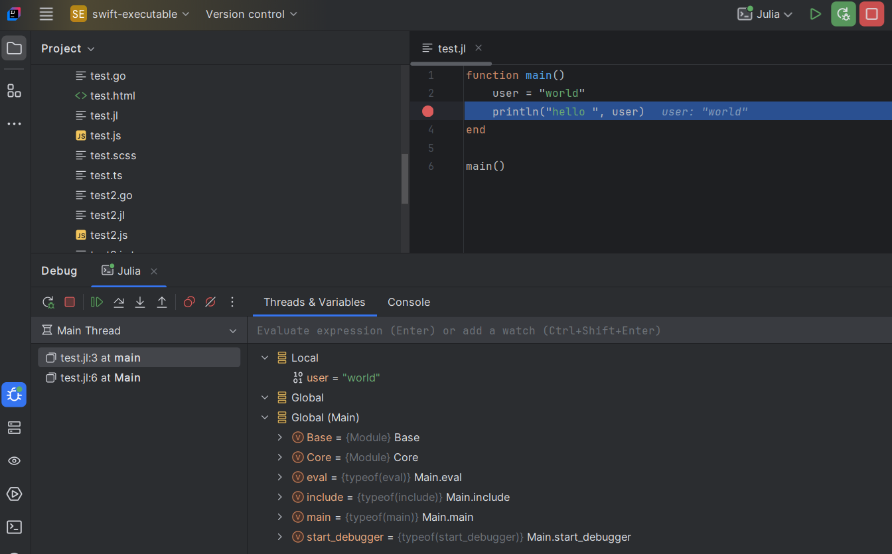

# Julia DAP server

To debug [Julia](https://julialang.org/) files, you can use the [Julia](https://github.com/julia-vscode/DebugAdapter.jl) DAP server.

Let’s debugging the following `test.julia` file:

```julia
function main()
    user = "world"
    println("hello ", user)
end

main()
```


## Configure DAP server

1. [install Julia](https://julialang.org/downloads/). After that open a terminal and type `julia`:
   

2. switch to Julia’s REPL by typing `]` to install the DAP server with the command `add DebugAdapter`
   

3. here we create a Julia DAP server started with socket. Create a `server.jl` in your project like this:

```julia
using Pkg
Pkg.instantiate()

using Sockets
using DebugAdapter
using Logging

function start_debugger()
try
server_port = parse(Int, ARGS[1])
server = Sockets.listen(server_port)
println("Listening on port $server_port")

        conn = Sockets.accept(server)
        println("Client connected")

        debugsession = DebugAdapter.DebugSession(conn)
        run(debugsession)

        close(conn)
    catch e
        println("Error: ", e)
    end
end
start_debugger()
```

4. Create a DAP Run/Debug configuration:

   

5. In the `Server` tab, click on `create a new server`:

   

6. It opens a new dialog to create DAP server, select `Julia` template:
   

7. After clicking on `OK` button, it will select the new server and pre-fill configurations:

 

This will automatically populate:

* the server `name`
* the `command` which starts the DAP server which should look like this:

```
julia $PROJECT_DIR$/server.jl ${port}
```

The `${port}` argument will be replaced with a free port when the run configuration starts.

The julia `$PROJECT_DIR$` which is an Intellij macro will be replaced with your project dir.

* the `Connect to the server by waiting` option is set to `Log pattern before processing` with:

 ```
 Listening on port ${port}
```

This means the DAP (Debug Adapter Protocol) client will connect to the DAP server when this trace appears in the console:

```
julia path/to/your/project/server.jl 52714
Listening on port 52714
```

8. Enable DAP server traces

If you wish to show DAP request/response traces when you will debug:


you need to select `Trace` with `verbose`.


## Configure file mappings

To allows settings breakpoints to Julia files, you need configure mappings in the `Mappings` tab.
As you have selected `Julia` server, it will automatically populate the file mappings like this:


## Configure the Julia file to run/debug

1. Fill in the `Configuration` tab:

- the `working directory` (usually the project's root directory)
- the path to the `test.jl` file.


2. Select `Launch` as `Debug mode`.
3. The DAP parameters of the launch should look like this:

```json
{
   "type": "julia",
   "name": "Launch Julia file",
   "request": "launch",
   "program": "${file}",
   "projectDir": "${workspaceFolder}",
   "exitAfterTaskReturns": false,
   "debugAutoInterpretAllModules": false,
   "stopOnEntry": false
}
```

When the run configuration starts:

- `${workspaceFolder}` will be replaced with the working directory you specified.
- `${file}` will be replaced with the full path to `test.jl`.

## Set Breakpoint

After applying the run configuration, you should set a breakpoint to files which matches file mappings.
Set a breakpoint in the `test.jl` file:


## Debugging

You can start the run configuration in either Run or Debug mode. Once started, you should see DAP traces in the console:


You will also see `Threads` and `Variables`:



## Language Support

If you need language support for Julia (completion, validation, etc) you can [configure the Julia Language Server](../../user-defined-ls/julia.md)

