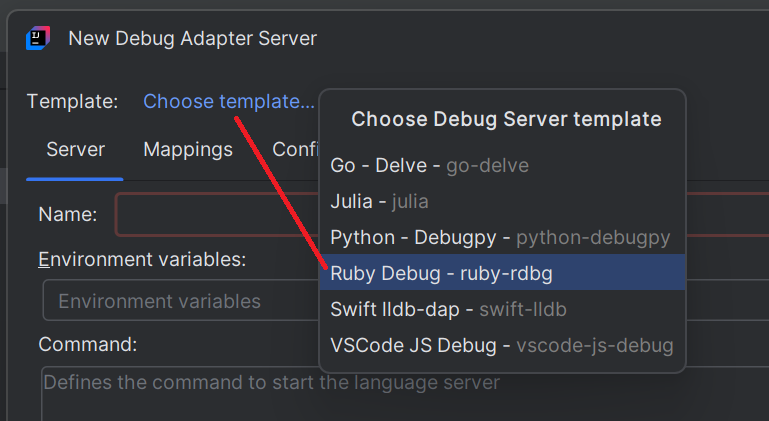
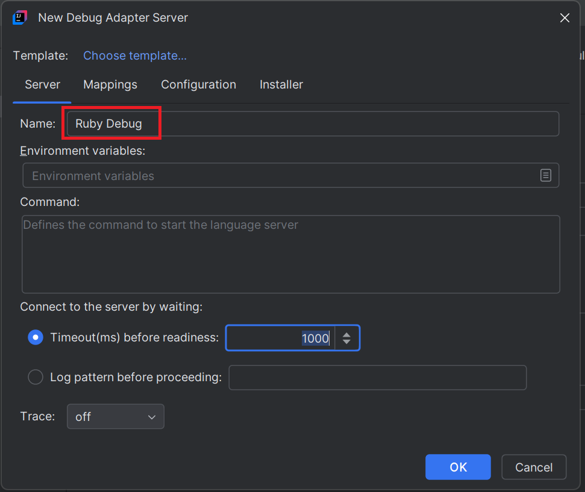

# Ruby (rdbg) DAP server

To debug [Ruby](https://www.ruby-lang.org/) files, you can use the [Ruby rdbg](https://github.com/ruby/debug) DAP server.

Let’s debugging the following `hello.rb` file:

```ruby
def main
  user = "hello world"
  puts user
end

if __FILE__ == $0
  main
end
```


## Configure DAP server

1. [install Ruby](https://www.ruby-lang.org/en/documentation/installation/). 
After that open a terminal and type `ruby -v` to check Ruby is installed correctly. 

2. Use `gem install debug` to install the required `debug gem`.

3. Create a test file named `hello.rb` with a simple Ruby script that includes a `main()` function printing `"hello world"`

```ruby
def main
  user = "hello world"
  puts user
end

if __FILE__ == $0
  main
end
```

4. Create a DAP Run/Debug configuration:

   

5. In the `Server` tab, click on `create a new server`:

   

6. It opens a new dialog to create DAP server, select `Python- Debugpy` template:
   

7. After clicking on `OK` button, it will select the new server and pre-fill configurations:



As [Ruby rdbg](https://github.com/ruby/debug) DAP server is consumed with [attach request](#configure-the-ruby-file-to-rundebug-with-attach),
the command is empty.

8. Enable DAP server traces

If you wish to show DAP request/response traces when you will debug:


you need to select `Trace` with `verbose`.


## Configure file mappings

To allows settings breakpoints to Python files, you need configure mappings in the `Mappings` tab.
As you have selected `Python- Debugpy` server, it will automatically populate the file mappings like this:


## Configure the Ruby file to run/debug with attach

As you have selected `Python- Debugpy` server, it will automatically populate the `Attach` configuration like this:


1. `Attach` as `Debug mode` should be selected.
2. The DAP parameters of the launch should look like this:

```json
{
   "name": "Attach with rdbg",
   "type": "rdbg",
   "request": "attach",
   "redirectOutput": true,
   "connect": {
      "host": "127.0.0.1",
      "port": 12345
   }
}
```

`Address input` is pre-filled with `$connect.host` and `Port input` is pre-filled with `$connect.port` which means that JSON configuration is used
to retrieve the address and the port. You can see on the right of the inputs the real value of the address and port:


If you don't want to use JSON configuration, you can fill directly the real value:


The pre-filled configuration uses `"redirectOutput": true` to show output (like print(....))
in the IntelliJ console. Read [Python debugging in VS Code](https://code.visualstudio.com/docs/python/debugging) for more information.

## Set Breakpoint

After applying the run configuration, you should set a breakpoint to files which matches file mappings.
Set a breakpoint in the `test.py` file:


## Start Ruby program in a Terminal

Open an `IntelliJ Terminal` (or other terminal), navigate to the directory containing your test file
and execute the following command to start the debug server:

```
rdbg --open --port 12345 hello.rb
```

This will make the script wait for a debugger to attach.


## Debugging

Before starting the configuration, check that your address and port are correct:


You can start the run configuration in either Run or Debug mode. Once started, you should see DAP traces in the console:


You will also see `Threads` and `Variables`:


As [Debugpy](https://github.com/microsoft/debugpy) can support completion, you should benefit it:

