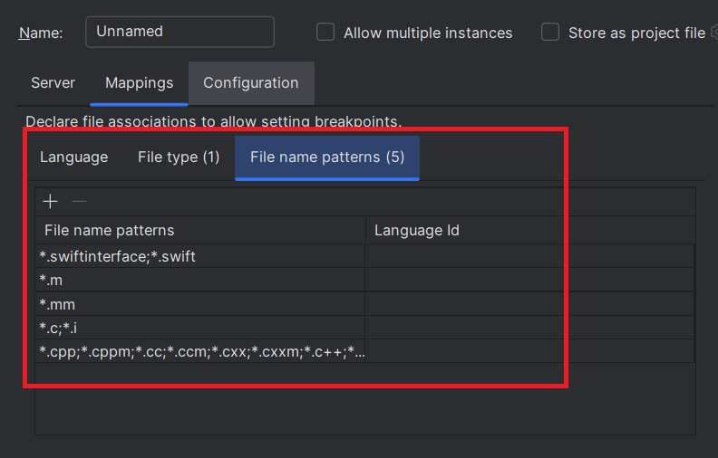

# Swift lldb

To debug `Swift` files, you can use the [lldb-dap](https://github.com/llvm/llvm-project/blob/main/lldb/tools/lldb-dap/README.md) DAP server.

Let’s debugging the following `Sources/main.swift` file:

```swift
// The Swift Programming Language
// https://docs.swift.org/swift-book

var user = "word";
print("Hello, " + user + "!")
```


## Configure DAP server

1. Install Swift. Please see the [Getting Started Guide on Swift.org](https://www.swift.org/getting-started/) for details on how to install Swift on your system.
This installation will install the [lldb-dap](https://github.com/llvm/llvm-project/blob/main/lldb/tools/lldb-dap/README.md) DAP server.

2. After the installation, you should have the `lldb-dap` command available (make sure to close and reopen your IDE to ensure the `lldb-dap` command is properly recognized).

If you open a terminal and run the following command:

```
lldb-dap -help
```

You should see some instructions how to start lldb-dap server.

3. Create a DAP Run/Debug configuration:

   

4. In the `Server` tab, select `Swift lldb`.

   

This will automatically populate:

* the server `name`
* the `command` which starts the DAP server which should look like this:

```
lldb-dap
```

This command will start the DAP server with `stdio` mode. You could starts the server in `socket` mode
with the following command:

```
lldb-dap -p ${port}
```

5. Enable DAP server traces

If you wish to show DAP request/response traces when you will debug:


you need to select `Trace` with `verbose`.


## Configure file mappings

To allows settings breakpoints to Swift files, you need configure mappings in the `Mappings` tab.
As you have selected `Swift lldb` server, it will automatically populate the file mappings like this:



## Configure the executable file to run/debug

To debug swift files, you will need to build an executable. You can do that with 

```
swift build
```

This command should generate an executable according your swift project settings:


1. Fill in the `Configuration` tab:

- the `working directory` (usually the project's root directory)
- the path to the executable file.


2. Select `Launch` as debugging type.
3. The DAP parameters of the launch should look like this:

```json
{
   "type": "swift-lldb",
   "request": "launch",
   "program": "${file}",
   "cwd": "${workspaceFolder}"
}
```

When the run configuration starts:

- `${workspaceFolder}` will be replaced with the working directory you specified.
- `${file}` will be replaced with the full path to your executable.

## Set Breakpoint

After applying the run configuration, you should set a breakpoint to files which matches file mappings.
Set a breakpoint in the `Sources/main.swift` file:


# Debugging

You can start the run configuration in either Run or Debug mode. Once started, you should see DAP traces in the console:

You will also see `Threads` and `Variables`:


