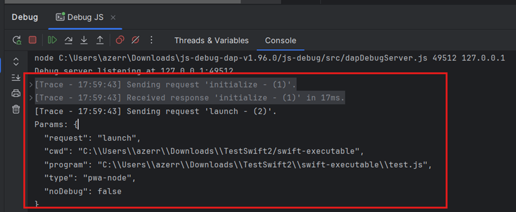

# VSCode JS Debug

To debug JavaScript or TypeScript files, you can use the [VSCode JS Debug](https://github.com/microsoft/vscode-js-debug) DAP server.

Let’s debugging the following `test.js` file:

```js
const s = "foo";
console.log(s);
```


## Configure DAP server

1. Download the `js-debug-dap-v*.tar.gz` asset from the [VSCode JS Debug releases](https://github.com/microsoft/vscode-js-debug/releases).  
   For example, download [js-debug-dap-v1.96.0.tar.gz](https://github.com/microsoft/vscode-js-debug/releases/download/v1.96.0/js-debug-dap-v1.96.0.tar.gz), which is the latest version at the time of writing.

2. Extract the archive into any folder (e.g., `/home/path/to/dap`). The extracted folder should contain the DAP server at `/js-debug/src/dapDebugServer.js`.

3. Create a DAP Run/Debug configuration:

   

4. In the `Server` tab, select `VSCode JS Debug`.

   

This will automatically populate: 

 * the server `name`
 * the `command` which starts the DAP server which should look like this:

```
node ${BASE_DIR}/js-debug/src/dapDebugServer.js ${port} 127.0.0.1
```

Replace `${BASE_DIR}` with the directory  (e.g., `/home/path/to/dap`) where you extracted the DAP server. For example:

```
node /home/path/to/dap/js-debug/src/dapDebugServer.js ${port} 127.0.0.1
```

The `${port}` argument will be replaced with a free port when the run configuration starts.

 * the `Connecting to the server` option is set to `after finding trace`, with:

 ```
 Debug server listening at
```

This means the DAP (Debug Adapter Protocol) client will connect to the DAP server when this trace appears in the console:

```
node /home/path/to/dap/js-debug-dap-v1.96.0/js-debug/src/dapDebugServer.js 56425 127.0.0.1
Debug server listening at 127.0.0.1:56425
```

5. Enable DAP server traces

If you wish to show DAP request/response traces when you will debug:



you need to select `Trace` with `verbose`.


## Configure file mappings

To allows settings breakpoints to JavaScript, TypeScript, etc files, you need configure mappings in the `Mappings` tab.
As you have selected `VSCode JS Debug` server, it will automatically populate the file mappings like this:


## Configure the JavaScript file to run/debug

1. Fill in the `Configuration` tab:

- the `working directory` (usually the project's root directory) 
- the path to the `test.js` file.


2. Select `Launch` as debugging type.
3. The DAP parameters of the launch should look like this:

```json
{
   "type": "pwa-node",
   "request": "launch",
   "program": "${file}",
   "cwd": "${workspaceFolder}"
}
```

When the run configuration starts:

- `${workspaceFolder}` will be replaced with the working directory you specified.
- `${file}` will be replaced with the full path to `test.js`.

## Set Breakpoint

After applying the run configuration, you should set a breakpoint to files which matches file mappings.
Set a breakpoint in the `test.js` file:


# Debugging

You can start the run configuration in either Run or Debug mode. Once started, you should see DAP traces in the console:


You will also see `Threads` and `Variables`:


## Configure the TypeScript file to run/debug

Let’s debugging the following `test.ts` file:

```ts
class Greeter {
  greeting: string;

  constructor(message: string) {
    this.greeting = message;
  }

  greet() {
    return "Hello, " + this.greeting;
  }
}

let greeter = new Greeter("world");
console.log(greeter.greet())
```


### Compile TypeScript

Create a `tsconfig.json` file like this:

```json
{
   "compilerOptions": {
      "target": "ES6",
      "module": "CommonJS",
      "outDir": "out",
      "sourceMap": true
   }
}
```

Execute `tsc` command to generate source maps in the `out` folder:

 * `test.js`
 * `test.js.map`

## Configure the TypeScript file to run/debug

Update the DAP parameters like this:

```json
{
   "type": "pwa-node",
   "request": "launch",
   "program": "${file}",
   "cwd": "${workspaceFolder}",
   "outFiles": [
      "${workspaceFolder}/**/*.(m|c|)js",
      "!**/node_modules/**"
   ],
   "sourceMaps": true,
   "__workspaceFolder": "${workspaceFolder}"
}
```

Update the path with the `test.ts` file. 


### Debugging

TypeScript debugging should be available:


