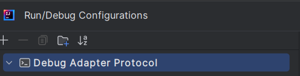

# VSCode JS Debug

To debug JavaScript or TypeScript files, you can use the [VSCode JS Debug](https://github.com/microsoft/vscode-js-debug) DAP server.

Example: debugging the `test.js` file:

```js
const s = "foo";
console.log(s);
```


## Create Run/Debug Configuration

1. Download the `js-debug-dap-v*.tar.gz` asset from the [VSCode JS Debug releases](https://github.com/microsoft/vscode-js-debug/releases).  
   For example, download [js-debug-dap-v1.96.0.tar.gz](https://github.com/microsoft/vscode-js-debug/releases/download/v1.96.0/js-debug-dap-v1.96.0.tar.gz), which is the latest version at the time of writing.

2. Extract the archive into any folder (e.g., `/home/path/to/dap`). The extracted folder should contain the DAP server at `/js-debug/src/dapDebugServer.js`.

3. Create a DAP Run/Debug configuration:

   

4. Fill in the `Program` tab to specify the `working directory` (usually the project's root directory) and the path to the `test.js` file.

5. In the `Debug Adapter Protocol` tab, select `VSCode JS Debug`. This will automatically populate the name, command, and parameters:

   

   The command should look like this:

```
node ${BASE_DIR}/js-debug/src/dapDebugServer.js ${port}
```

Replace `${BASE_DIR}` with the directory where you extracted the DAP server. For example:

```
node /home/path/to/dap/js-debug/src/dapDebugServer.js ${port}
```

## Some Explanation

- The `${port}` argument will be replaced with a free port when the run configuration starts.

- The DAP parameters should look like this:

```json
{
   "type": "pwa-node",
   "request": "launch",
   "program": "${program}",
   "cwd": "${cwd}"
}
```

When the run configuration starts:

- `${cwd}` will be replaced with the working directory you specified.
- `${program}` will be replaced with the full path to `test.js`.
 - The (wait for) trace `Debug server listening at` indicates when the DAP client can connect to the DAP server. This trace will appear in the console as follows:

```
node /home/path/to/dap/js-debug-dap-v1.96.0/js-debug/src/dapDebugServer.js 56425
Debug server listening at 127.0.0.1:56425
```

## Set Breakpoint

After applying the run configuration, you should set a breakpoint in the `test.js` file:


The file extension defined in the program field allows setting breakpoints in `.js` files.

# Debugging

You can start the run configuration in either Run or Debug mode. Once started, you should see DAP traces in the console:


You will also see Threads and Variables:


