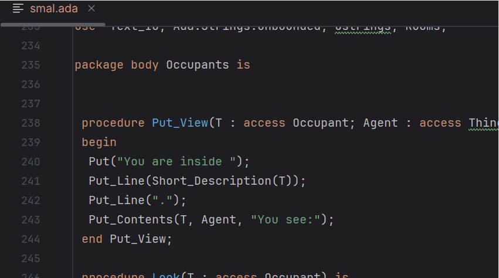
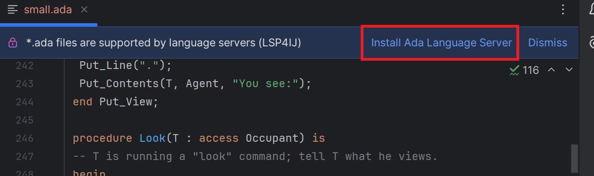
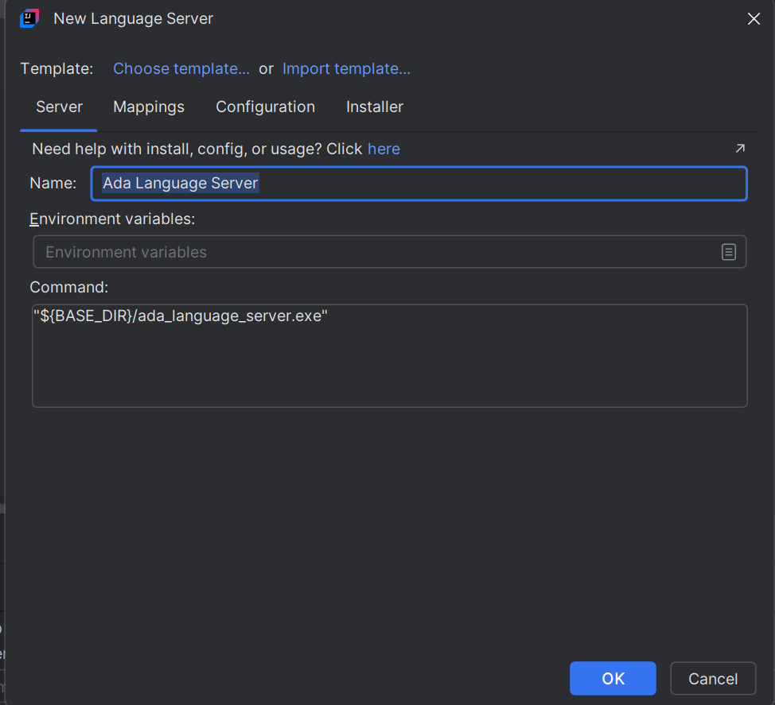
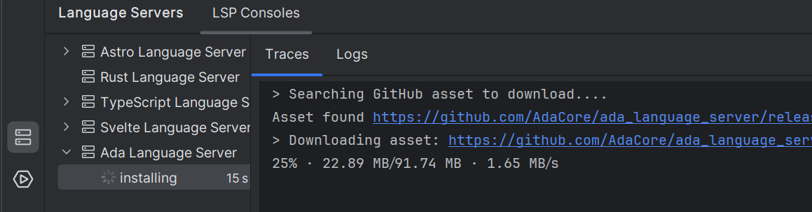
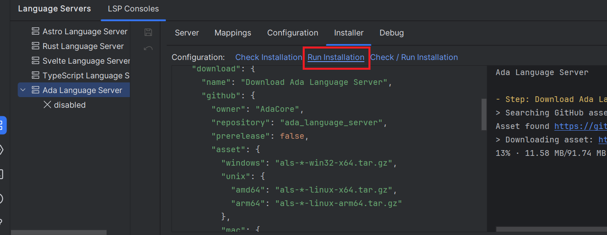

# Ada Language Server

To enable [Ada](https://ada-lang.io/) language support in your IDE, you can integrate the [Ada Language Server](https://github.com/AdaCore/ada_language_server) by following these steps:



---

## Step 1: Install the Language Server

1. Open an `.adb` file in your project.
2. Click on **Install Ada Language Server**:

   

3. This will open the [New Language Server Dialog](../UserDefinedLanguageServer.md#new-language-server-dialog) with `Ada Language Server` pre-selected:

   

4. Click **OK**. This will create the `Ada Language Server` definition and start the installation:

   

5. Once the installation completes, the server should start automatically and provide Ada language support (autocomplete, diagnostics, etc.).

### Troubleshooting Installation

If the installation fails, you can customize the installation settings in the **Installer** tab,  
then click on the **Run Installation** hyperlink to reinstall the server:

   

See [Installer descriptor](../UserDefinedLanguageServerTemplate.md#installer-descriptor) for more information.

---

## Step 2: Install TextMate Bundle

Since IntelliJ does not provide native Ada TextMate support, and the language server does not handle syntax highlighting, you need to set up a TextMate bundle manually.

* Clone the Ada language tools repository:

  ```bash
  git clone https://github.com/AdaCore/ada_language_server.git

* Open TextMate Bundles settings


* Click the `+` button and select the folder [ada_language_server/integration/vscode/ada](https://github.com/AdaCore/ada_language_server/tree/master/integration/vscode/ada) folder.
  This folder contains the package.json and the TextMate grammar.

Once done, IntelliJ will apply syntax highlighting, bracket matching, and other basic editor features for .adb files.

