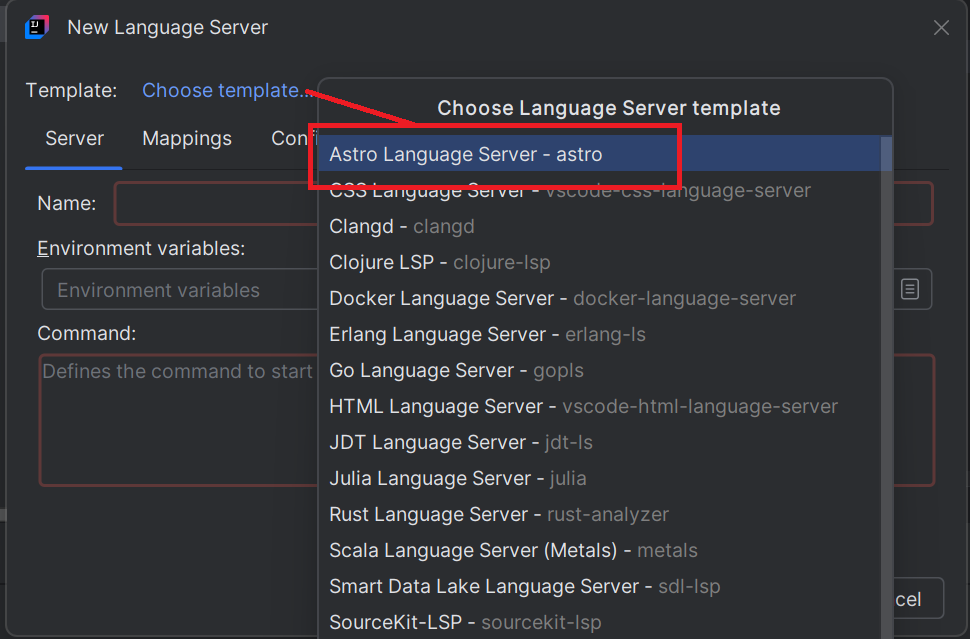

# Astro Language Server

To enable [Astro](https://astro.build/) language support in your IDE, you can integrate [Astro Language Server](https://www.npmjs.com/package/@astrojs/language-server) by following these steps:

## Install the language server

1. **Open the New Language Server Dialog**. This can usually be found under the IDE settings related to Language Server Protocol (LSP). For more information, refer to the [New Language Server Dialog documentation](../UserDefinedLanguageServer.md#new-language-server-dialog).

2. **Select Astro LanguageServer as the template** from the available options. 
This will populate the command field with a default command. When an astro file will be opened it should install the astro-ls and astro support shoudl be available.

   

## Install TextMate

You need to clone https://github.com/withastro/language-tools/tree/main/packages/vscode 

Remove this [snippets section](https://github.com/withastro/language-tools/blob/main/packages/vscode/package.json#L45-L49) from the package.json JSON otherwise IntelliJ will fail to import textmate. 

and reference this folder
(which contains the [package.json](https://github.com/withastro/language-tools/tree/main/packages/vscode/package.json))
to benefit from syntax coloration and language configuration (matching brackets, etc).
