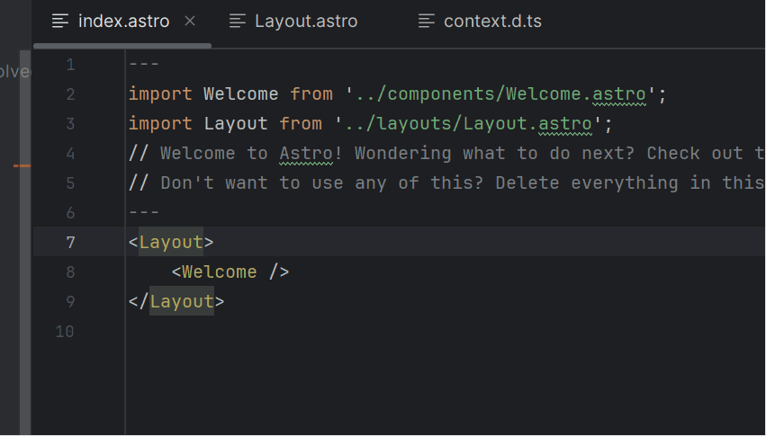
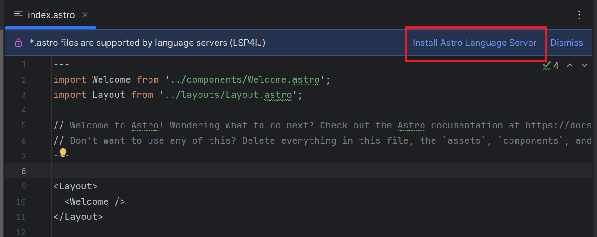
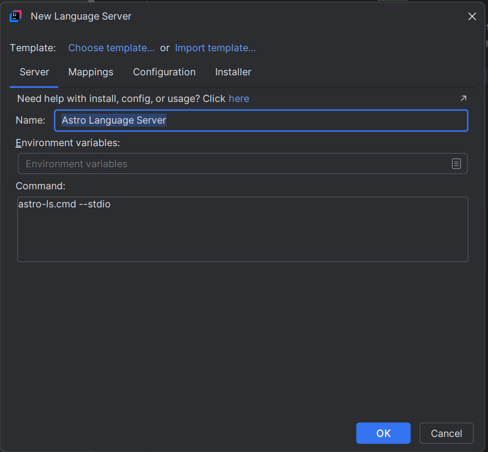
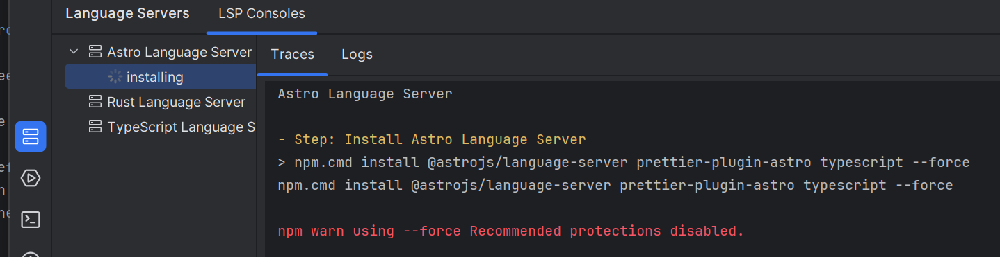
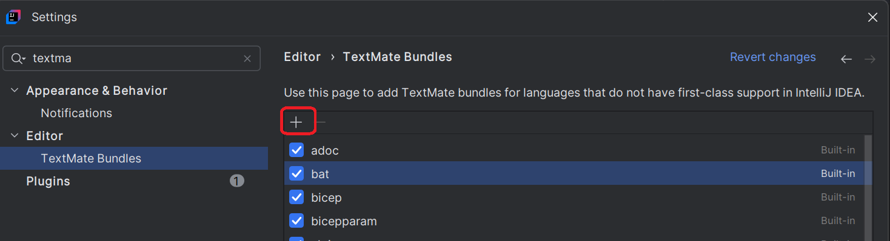

# Astro Language Server

To enable [Astro](https://astro.build/) language support in your IDE, you can integrate the [Astro Language Server](https://www.npmjs.com/package/@astrojs/language-server) by following these steps:



---

## Step 1: Install the Language Server

1. Open an `.astro` file in your project.
2. Click on **Install Astro Language Server**:

   

3. This will open the [New Language Server Dialog](../UserDefinedLanguageServer.md#new-language-server-dialog) with `Astro Language Server` pre-selected:

   

4. Click **OK**. This will create the `Astro Language Server` definition and start the installation:

   

5. Once the installation completes, the server should start automatically and provide Astro language support (autocomplete, diagnostics, etc.).

---

## Step 2: Install TextMate Bundle

Since IntelliJ does not provide native Astro TextMate support, and the language server does not handle syntax highlighting, you need to set up a TextMate bundle manually.

* Clone the Astro language tools repository:

  ```bash
  git clone https://github.com/withastro/language-tools.git

* Remove this [snippets section](https://github.com/withastro/language-tools/blob/main/packages/vscode/package.json#L45-L49) from the package.json
  Otherwise, IntelliJ will fail to import the TextMate bundle.

* Open TextMate Bundles settings



* Click the `+` button and select the folder [language-tools/packages/vscode](https://github.com/withastro/language-tools/tree/main/packages/vscode) folder.
  This folder contains the modified package.json and the TextMate grammar.

Once done, IntelliJ will apply syntax highlighting, bracket matching, and other basic editor features for .astro files.