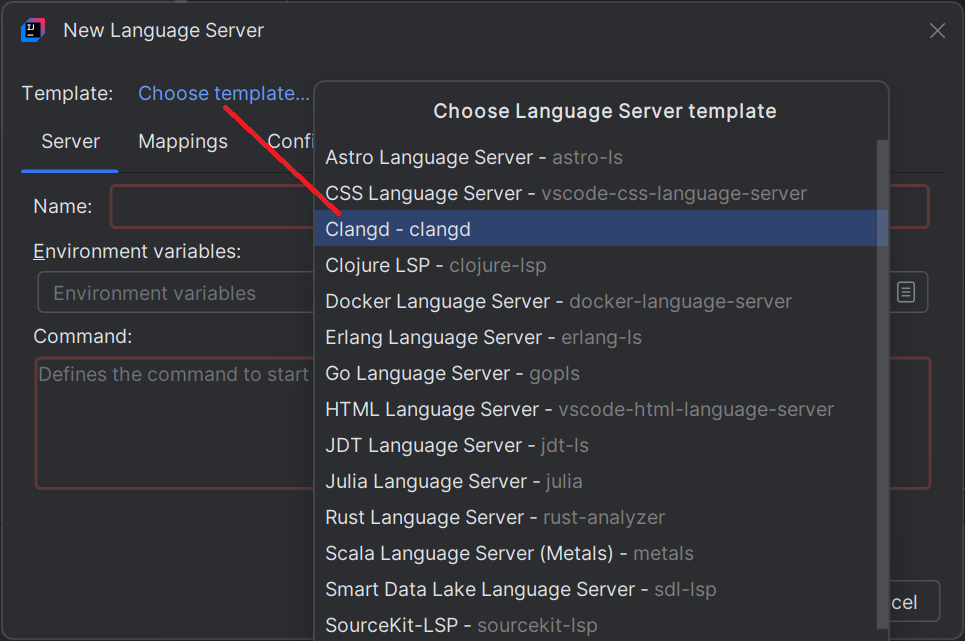

# Clangd

## Install the language server

1. **Open the New Language Server Dialog**. This can usually be found under the IDE settings related to Language Server Protocol (LSP). For more information, refer to the [New Language Server Dialog documentation](../UserDefinedLanguageServer.md#new-language-server-dialog).

2. **Select `Clangd` as the template** from the available options.
   This will populate the command field with a default command. When an *.c, *.h (etc) file will be opened it should install the Clangd language server
and *.c, *.h support should be available.

   

## Setting "build" options

Often need to specify e.g. `-I` for your build and you therefore must tell `clangd` about it.
To do this:

????
