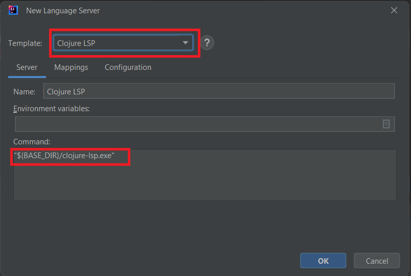
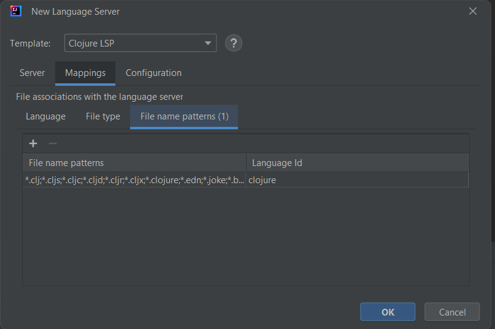
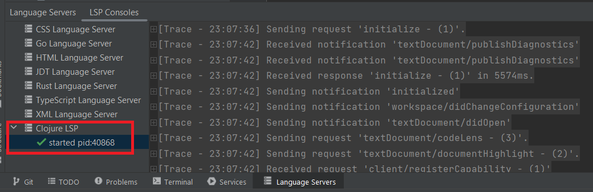

To enable Clojure language support in your IDE, you can integrate [Clojure LSP](https://clojure-lsp.io/) by following these steps:

1. **Download the appropriate release for your operating system** from the [Clojure LSP releases page](https://github.com/clojure-lsp/clojure-lsp/releases).

2. **Extract the downloaded asset**. For example, on Windows, the extracted files will include `clojure-lsp.exe`.

3. **Open the New Language Server Dialog**. This can usually be found under the IDE settings related to Language Server Protocol (LSP). For more information, refer to the [New Language Server Dialog documentation](../UserDefinedLanguageServer.md#new-language-server-dialog).

4. **Select Clojure LSP as the template** from the available options. This will populate the command field with a default command. You need to adjust this command to point to the location of the extracted Clojure LSP asset.

   

5. **Adjust the command** in the template to reference the location of the extracted Clojure LSP executable.

6. **Optional**: You may also customize the mappings section according to your preferences.

   

7. **Click OK** to apply the changes. You should now have Clojure language support enabled in your IDE, with the Clojure LSP integrated.

   