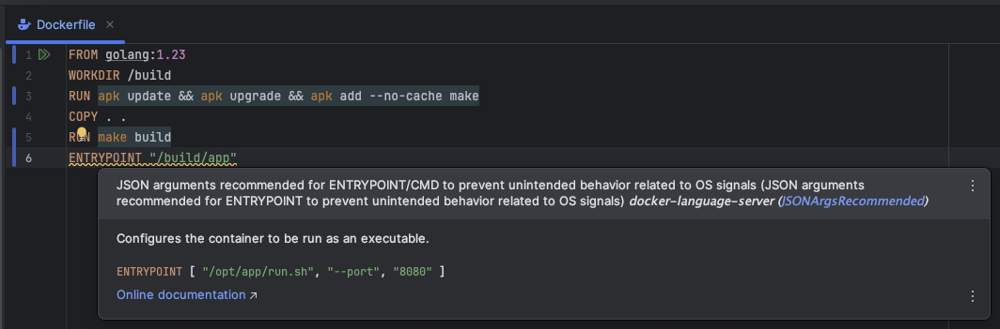
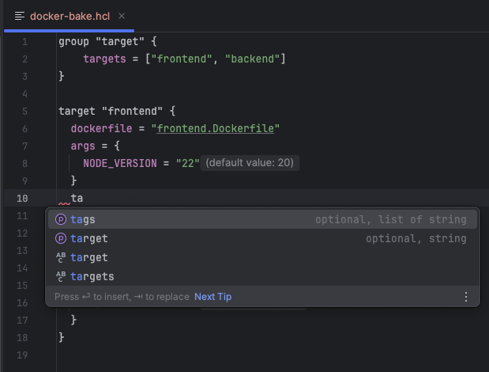
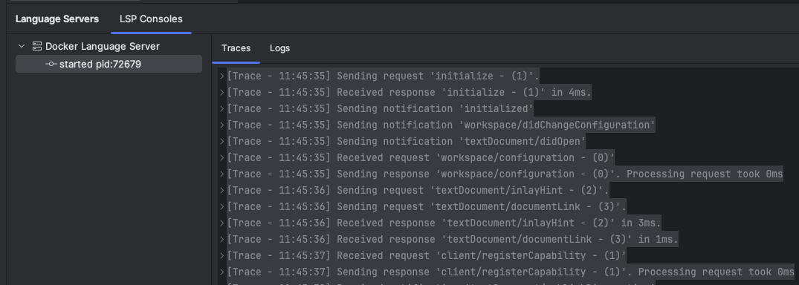

# Docker Language Server

To get language support for files from the Docker ecosystem (Dockerfiles, Compose files, and Bake files), you can integrate the [Docker Language Server](https://github.com/docker/docker-language-server) into your JetBrains IDE by following the steps below.

## Install the Language Server

1. Download a language server binary from [GitHub](https://github.com/docker/docker-language-server/releases).

2. Place the binary somewhere that is within your `PATH` variable lookup.

3. Rename it from `docker-language-server-$OS-$ARCH-v$VERSION` to simply `docker-language-server`.

## Configuring your JetBrains IDE

1. **Open the New Language Server Dialog**. This can usually be found under the IDE settings related to Language Server Protocol (LSP). For more information, refer to the [New Language Server Dialog documentation](../UserDefinedLanguageServer.md#new-language-server-dialog).

2. Select **Docker Language Server** as the template from the available options.

3. **Optional**: You may also customize the Mappings section according to your preferences.

4. **Optional**: You may also customize the Configuration section according to your preferences.

5. **Click OK** to apply the changes. You should now have language support for Dockerfiles, Compose files, and Bake files enabled in your IDE:

