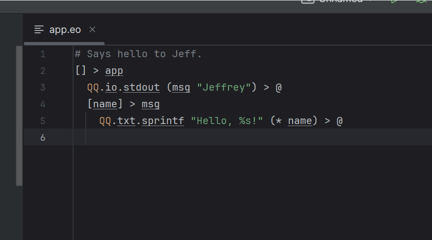
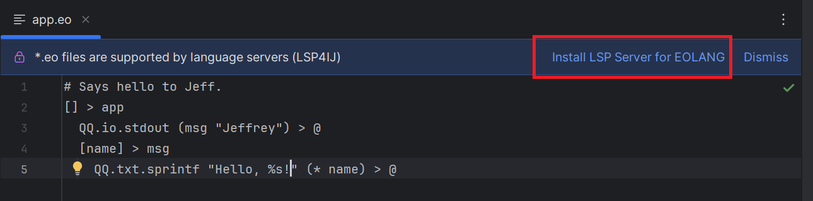
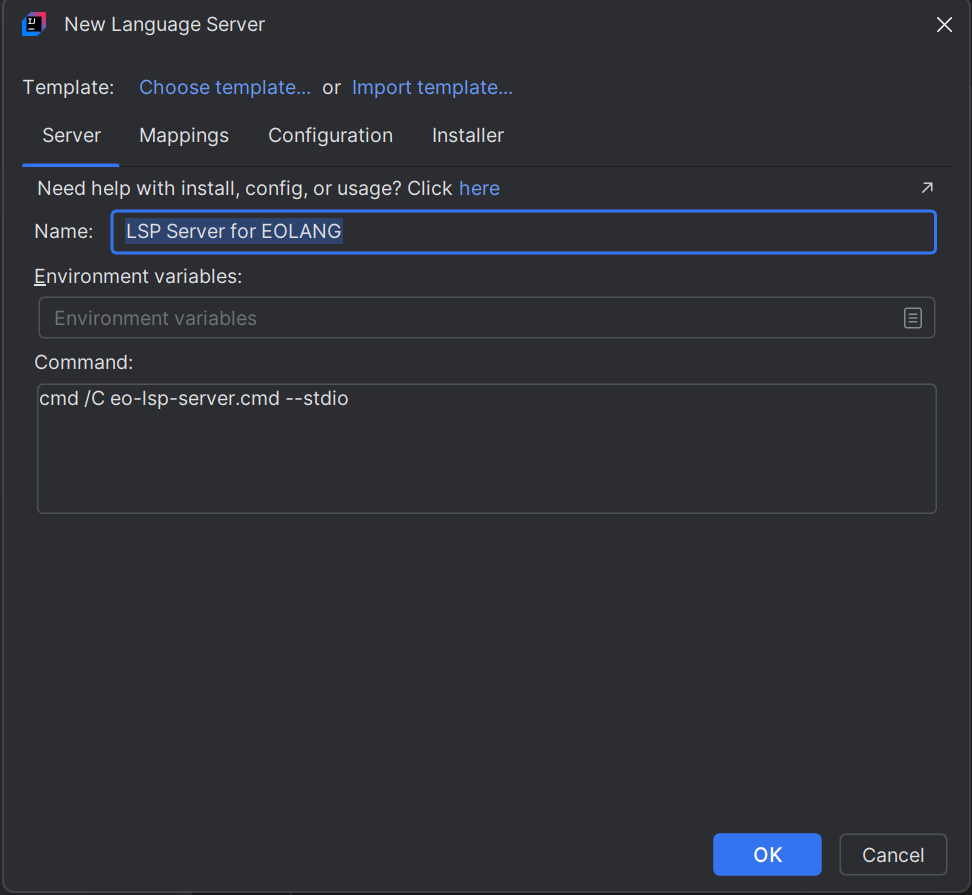
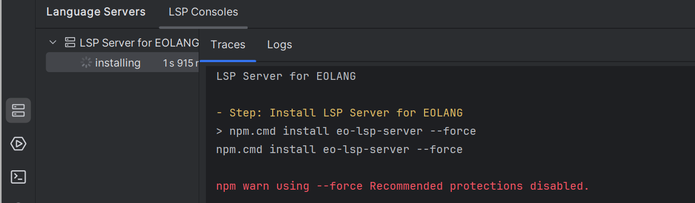
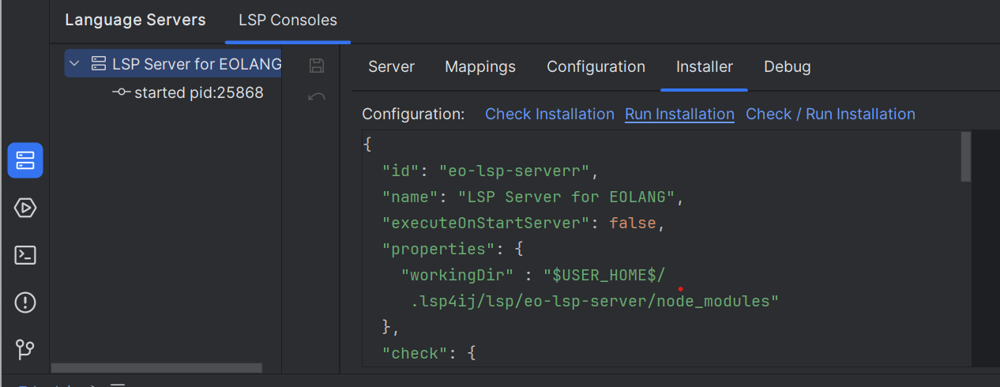
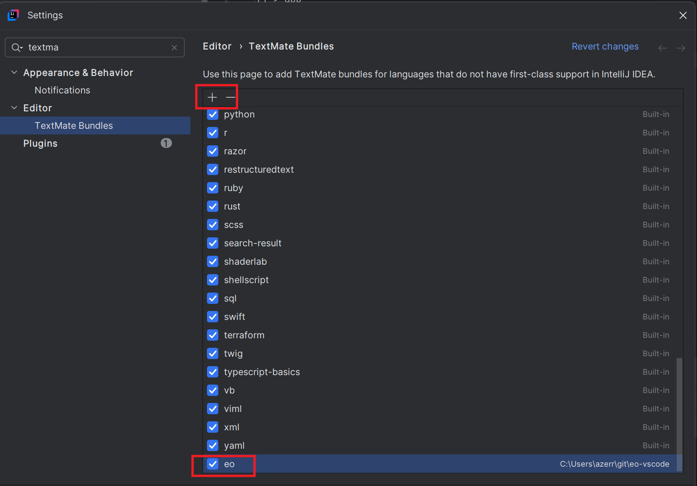

# EO Language Server

To enable [EO](https://www.eolang.org/) language support in your IDE, you can integrate the [EO LSP Server](https://github.com/objectionary/eo-lsp-server) by following these steps:



---

## Step 1: Install the Language Server

1. Open an `.eo` file in your project.
2. Click on **Install LSP Server for EOLANG**:

   

3. This will open the [New Language Server Dialog](../UserDefinedLanguageServer.md#new-language-server-dialog) with `LSP Server for EOLANG` pre-selected:

   

4. Click **OK**. This will create the `LSP Server for EOLANG` definition and start the installation:

   

5. Once the installation completes, the server should start automatically and provide EO language support (diagnostics and semantic tokens.).

### Troubleshooting Installation

If the installation fails, you can customize the installation settings in the **Installer** tab,  
then click on the **Run Installation** hyperlink to reinstall the server:



See [Installer descriptor](../UserDefinedLanguageServerTemplate.md#installer-descriptor) for more information.

---

## Step 2: Install TextMate Bundle

Even if [EO LSP Server](https://github.com/objectionary/eo-lsp-server) can support LSP semantic tokens, You can also set up the EO TextMate bundle manually.

* Clone the [eo-vscode](https://github.com/objectionary/eo-vscode) repository:

  ```bash
  git clone https://github.com/objectionary/eo-vscode.git

* Open TextMate Bundles settings



* Click the `+` button and select the folder [eo-vscode](https://github.com/objectionary/eo-vscode) folder.
  This folder contains the modified package.json and the TextMate grammar.

Once done, IntelliJ will apply syntax highlighting, bracket matching, and other basic editor features for .eo files.