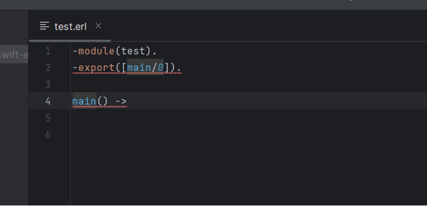
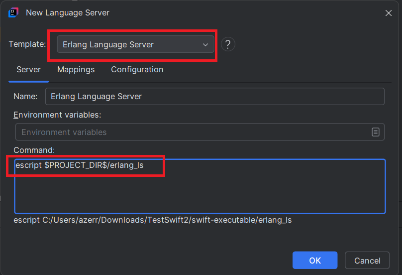
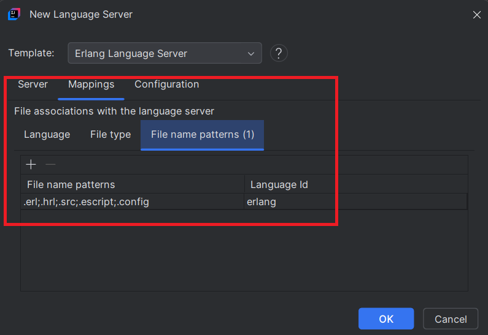
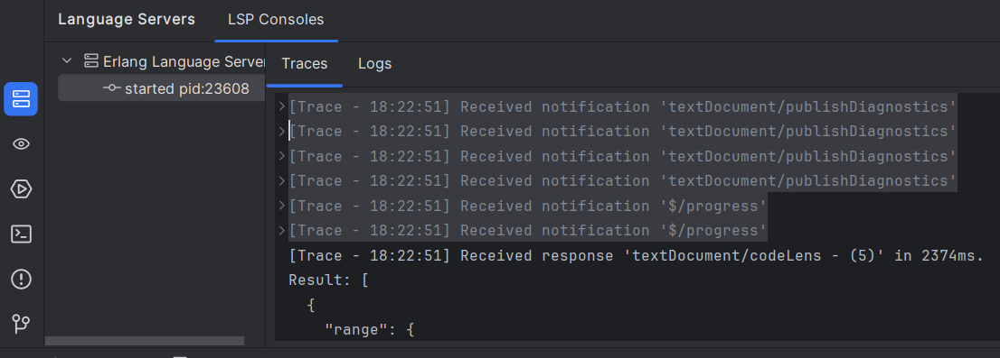
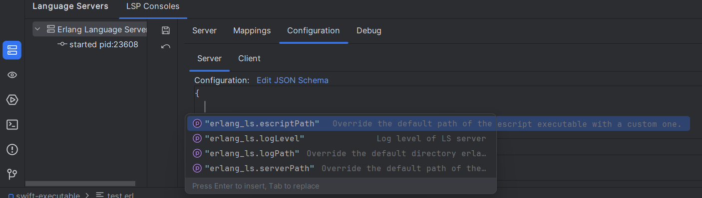

# Erlang Language Server

To enable [Erlang](https://www.erlang.org/) language support in your IDE, you can integrate [Erlang Language Server](https://github.com/erlang-ls/erlang_ls) by following these steps:



## Install the language server

1. [Download Erlang/OTP](https://www.erlang.org/downloads).

2. [Download Erlang LS](https://github.com/erlang-ls/erlang_ls/releases) according your OS. 
Unzip the downloaded file which should contain the `erlang_ls` (escript) file which is the language server
and copy/paste to your IntelliJ project base dir.

To start it, you will need to use the following command:

```
escript erlang_ls
```

3. **Open the New Language Server Dialog**. This can usually be found under the IDE settings related to Language Server Protocol (LSP). For more information, refer to the [New Language Server Dialog documentation](../UserDefinedLanguageServer.md#new-language-server-dialog).

4. **Select Erlang Language Server as the template** from the available options.
   
   

6. **Optional**: You may also customize the mappings section according to your preferences.

   

7. **Click OK** to apply the changes. You should now have [Erlang](https://www.erlang.org/) language support enabled in your IDE:

   

You could also configure server (you should have completion which will help you to configure server):

