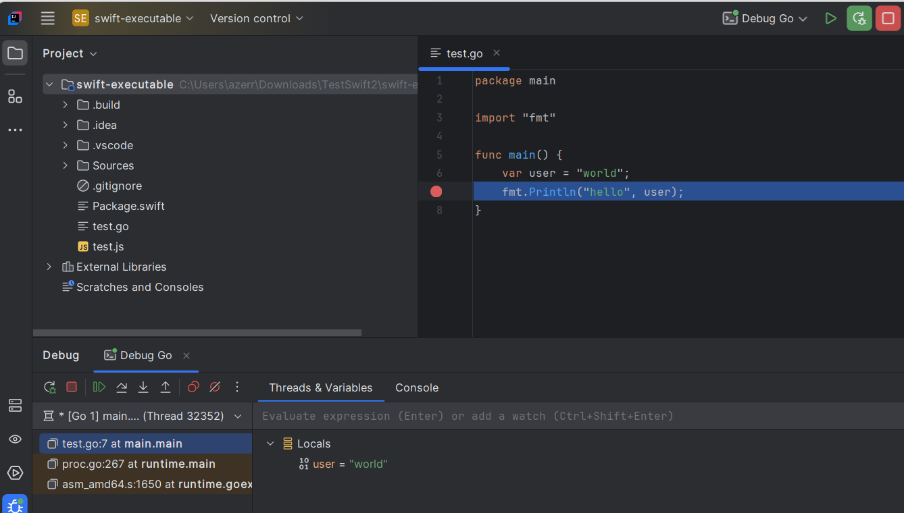

# Go Language Server

You can use the [Go language server](https://pkg.go.dev/golang.org/x/tools/gopls) to benefit from `Go` support:

## Install the language server

1. **Install Go Language Server**, by following these instructions:

* [Download and install Go](https://go.dev/doc/install)
* [Read the "Installation" section](https://pkg.go.dev/golang.org/x/tools/gopls#section-readme) to install the Go language server **gopls**, basically, open a terminal and execute the following command:

   **go install golang.org/x/tools/gopls@latest**

   As the command will add **go** in your OS PATH, you will have to close and reopen your IDE to update this PATH.

2. **Open the New Language Server Dialog**. This can usually be found under the IDE settings related to Language Server Protocol (LSP). For more information, refer to the [New Language Server Dialog documentation](../UserDefinedLanguageServer.md#new-language-server-dialog).

3. **Select Go Language Server as the template** from the available options.
   This will populate the command field with a default command:

   * `gopls -mode=stdio` for Windows OS.
   * `sh -c gopls -mode=stdio` for other OS.

   

5. **Optional**: You may also customize the mappings section:

   

   or configuration section according to your preferences.

   

6. **Click OK** to apply the changes. You should now have Go language support enabled in your IDE, with the [Go language server](https://pkg.go.dev/golang.org/x/tools/gopls) integrated, 
   and you should see the language server in the [LSP console](../UserGuide.md#lsp-console):

   

## Syntax coloration

The demo uses the [Go TextMate grammar](https://github.com/golang/vscode-go/tree/master/extension/syntaxes) 
that you can configure in IntelliJ via the `Editor / TextMate Bundles` settings.

You need to clone https://github.com/golang/vscode-go/tree/master/extension and reference this folder 
(which contains the [package.json](https://github.com/golang/vscode-go/blob/540e146da867f42298ccdac782e4e163fec16b0d/extension/package.json#L172))
to benefit from syntax coloration and language configuration (matching brackets, etc).

## Debugging

If you need to Run/Debug Go program, you can [configure the Go DAP server](../dap/user-defined-dap/go-delve.md).

