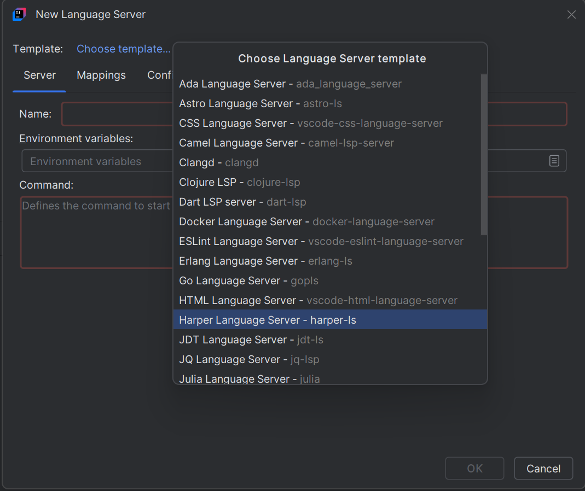
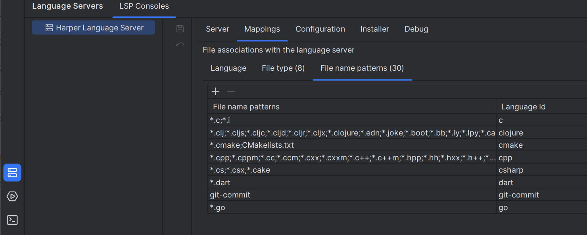
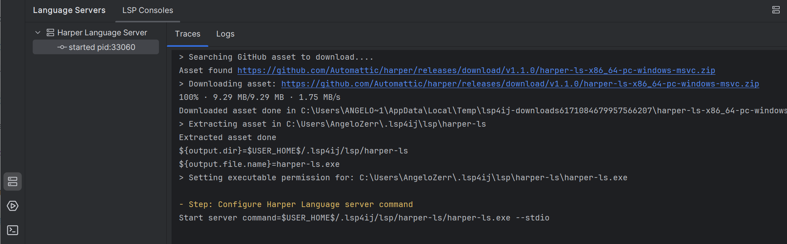
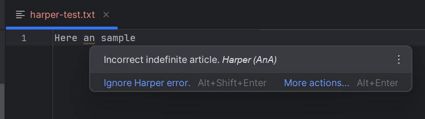
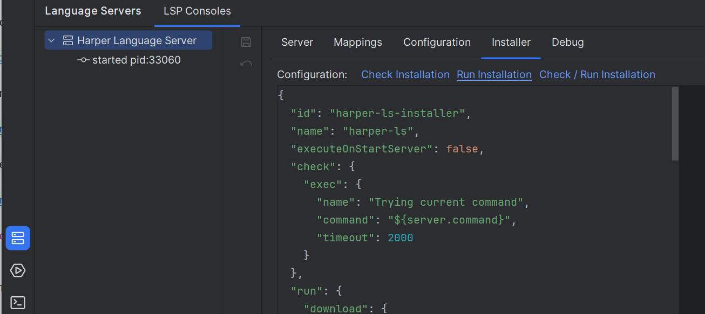

# Harper Language Server

[Harper](https://github.com/Automattic/harper) is an English grammar checker designed to be _just right._
To enable [Harper](https://github.com/Automattic/harper) language support in your IDE, 
you can integrate the [Harper Language Server](https://writewithharper.com/docs/integrations/language-server) by following these steps:

---

## Install the Language Server

1. Open the [New Language Server Dialog](../UserDefinedLanguageServer.md#new-language-server-dialog) and select `Harper Language Server`:

   

2. Click **OK**. This will create the `Harper Language Server` definition with predefined file mappings (that you can update):

   

3. Open a file (ex: a text file) which belongs to the file mapping. It will start the installation

   

4. Once the installation completes, the server should start automatically and provide Harper language support (diagnostics and code actions).

   

### Troubleshooting Installation

If the installation fails, you can customize the installation settings in the **Installer** tab,  
then click on the **Run Installation** hyperlink to reinstall the server:

See [Installer descriptor](../UserDefinedLanguageServerTemplate.md#installer-descriptor) for more information.

---