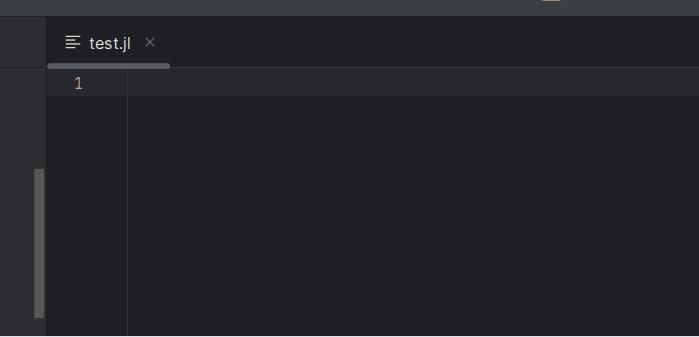
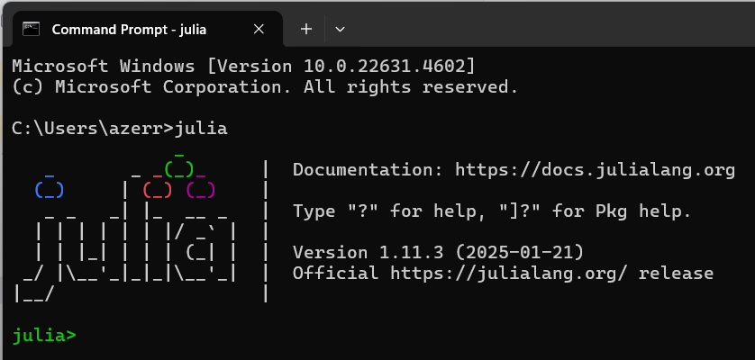
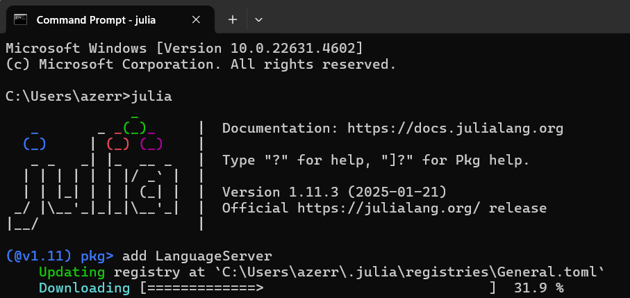
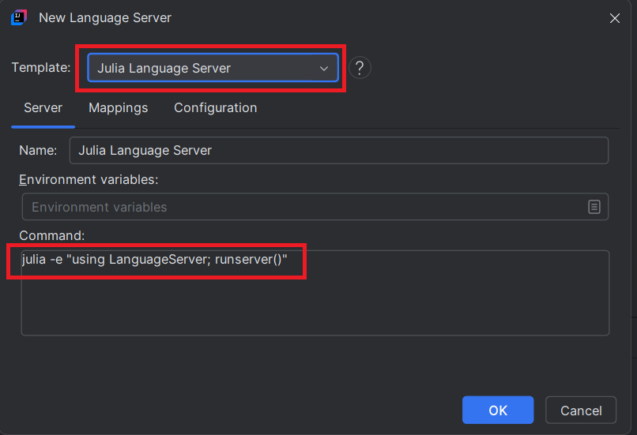
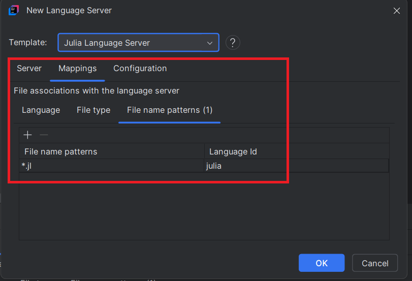
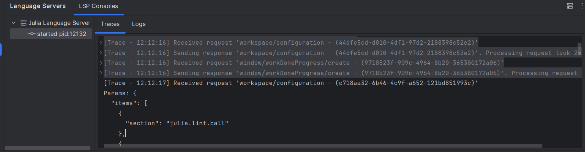
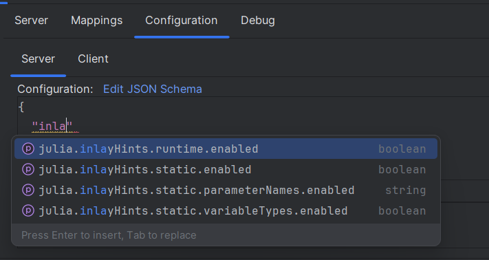
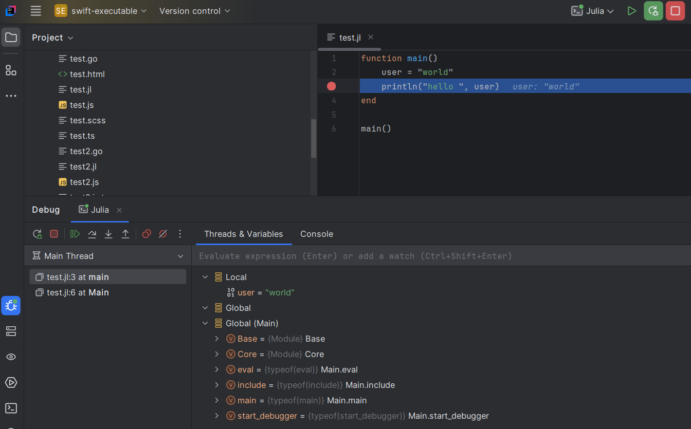

# Julia Language Server

To enable [Julia](https://julialang.org/) language support in your IDE, you can integrate [Julia Language Server](https://github.com/julia-vscode/LanguageServer.jl) by following these steps:

## Install the language server

1. [install Julia](https://julialang.org/downloads/). After that open a terminal and type `julia`:
   

2. switch to Julia’s REPL by typing `]` to install the DAP server with the command `add LanguageServer`
   

3. **Open the New Language Server Dialog**. This can usually be found under the IDE settings related to Language Server Protocol (LSP). For more information, refer to the [New Language Server Dialog documentation](../UserDefinedLanguageServer.md#new-language-server-dialog).

4. **Select Julia Language Server as the template** from the available options.
   
   

6. **Optional**: You may also customize the mappings section according to your preferences.

   

7. **Click OK** to apply the changes. You should now have [Julia](https://julialang.org/) language support enabled in your IDE:

   

You could also configure server (you should have completion which will help you to configure server):

## Debugging

If you need to Run/Debug Julia program, you can [configure the Julia DAP server](../dap/user-defined-dap/julia.md).

