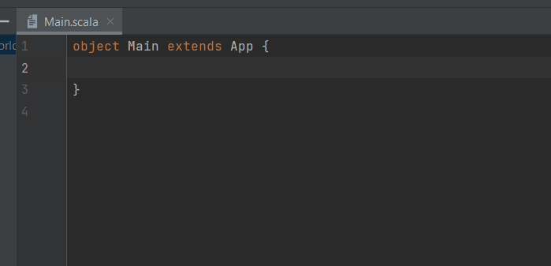
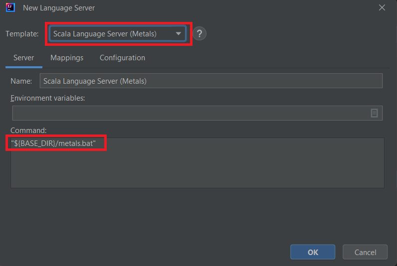
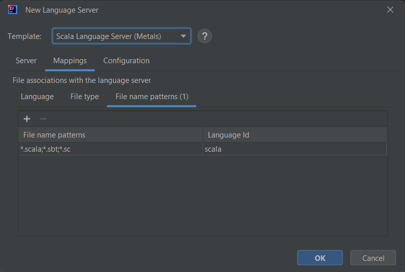
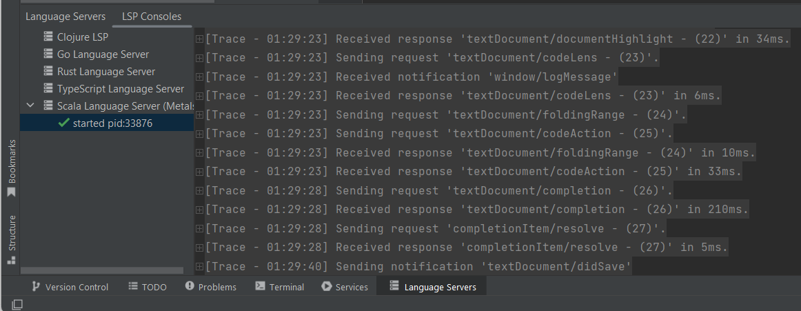

To enable Scala language support in your IDE, you can integrate [Scala Language Server (Metals)](https://scalameta.org/metals/) by following these steps:

1. Install [Coursier](https://github.com/coursier/coursier) and read [How to start Metals?](https://scalameta.org/metals/docs/integrations/new-editor#starting-the-server).

2. Once [Coursier](https://github.com/coursier/coursier) is installed, open a terminal and execute `coursier bootstrap org.scalameta:metals_2.13:1.2.2 -o metals -f`
   which will generate **${BASE_DIR}/metals** and **${BASE_DIR}/metals.bat** (according your OS).

3. **Open the New Language Server Dialog**. This can usually be found under the IDE settings related to Language Server Protocol (LSP). For more information, refer to the [New Language Server Dialog documentation](../UserDefinedLanguageServer.md#new-language-server-dialog).

4. **Select Scala Language Server (Metals) as the template** from the available options.
   This will populate the command field with a default command. You need to adjust this command to point to the location of the extracted generated **${BASE_DIR}/metals.bat** file.
   
   

5. **Adjust the command** in the template to reference the location of the generated metals file.

6. **Optional**: You may also customize the mappings section according to your preferences.

   

7. **Click OK** to apply the changes. You should now have Scala language support enabled in your IDE, with the Metals integrated.

   