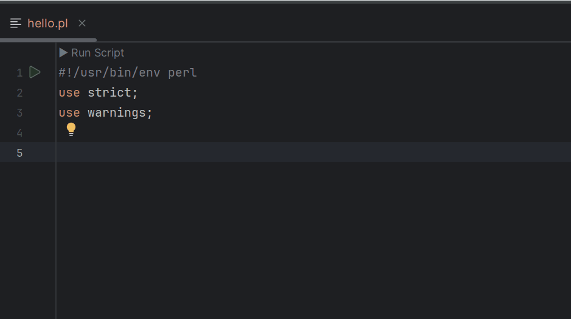
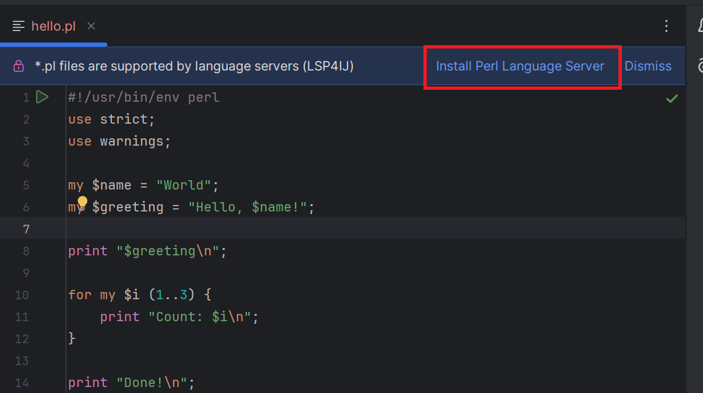
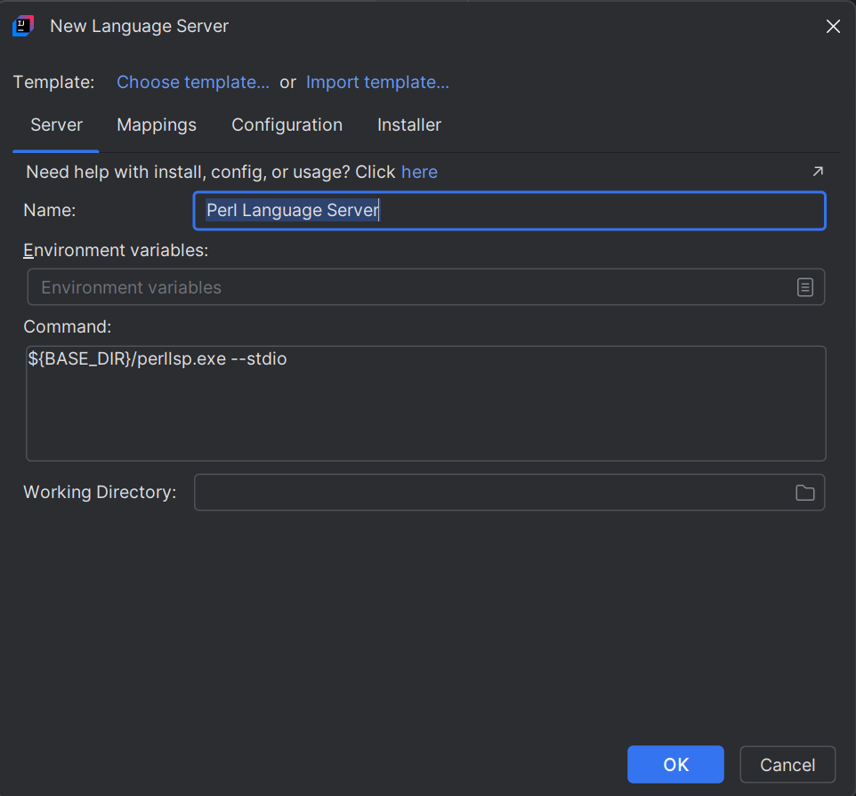
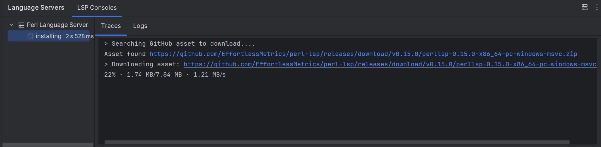
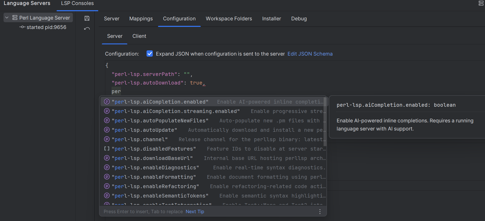
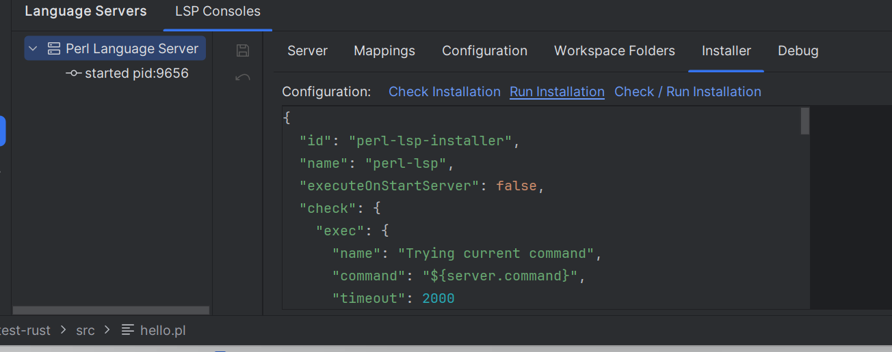

# Perl Language Server

To enable [Perl](https://www.perl.org/) language support in your IDE, you can integrate the [Rust Perl Language Server](https://github.com/EffortlessMetrics/perl-lsp) by following these steps:

---

## Step 1: Install the Language Server

1. Open an `.pl` file in your project.
2. Click on **Install Perl Language Server**:

   

3. This will open the [New Language Server Dialog](../UserDefinedLanguageServer.md#new-language-server-dialog) with `Perl Language Server` pre-selected:

   

4. Click **OK**. This will create the `Perl Language Server` definition and start the installation:

   

5. Once the installation completes, the server should start automatically and provide [Perl](https://www.perl.org/) language support (autocomplete, diagnostics, etc.).

## Step 2: Configure the server

You can also configure the server with the same settings as VSCode:

### Troubleshooting Installation

If the installation fails, you can customize the installation settings in the **Installer** tab,  
then click on the **Run Installation** hyperlink to reinstall the server:

See [Installer descriptor](../UserDefinedLanguageServerTemplate.md#installer-descriptor) for more information.