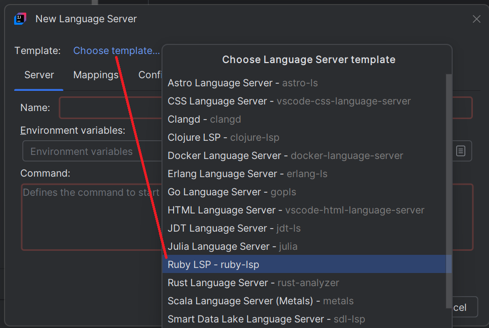

# Ruby LSP

## Install the language server

1. **Open the New Language Server Dialog**. This can usually be found under the IDE settings related to Language Server Protocol (LSP). For more information, refer to the [New Language Server Dialog documentation](../UserDefinedLanguageServer.md#new-language-server-dialog).

2. **Select `Ruby LSP` as the template** from the available options.
   This will populate the command field with a default command. When a ruby file will be opened it should install the ruby-lsp and Ruby support 
should be available.

   
