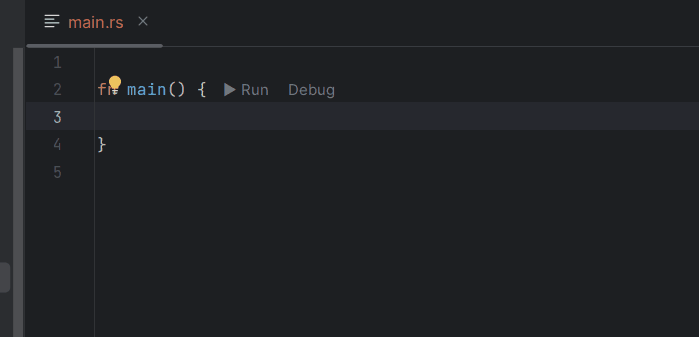
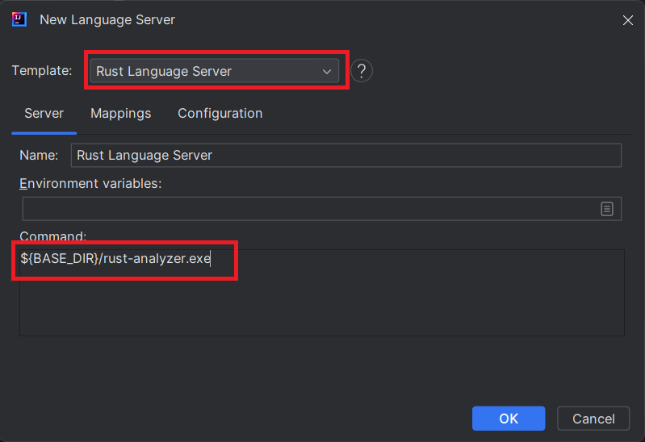
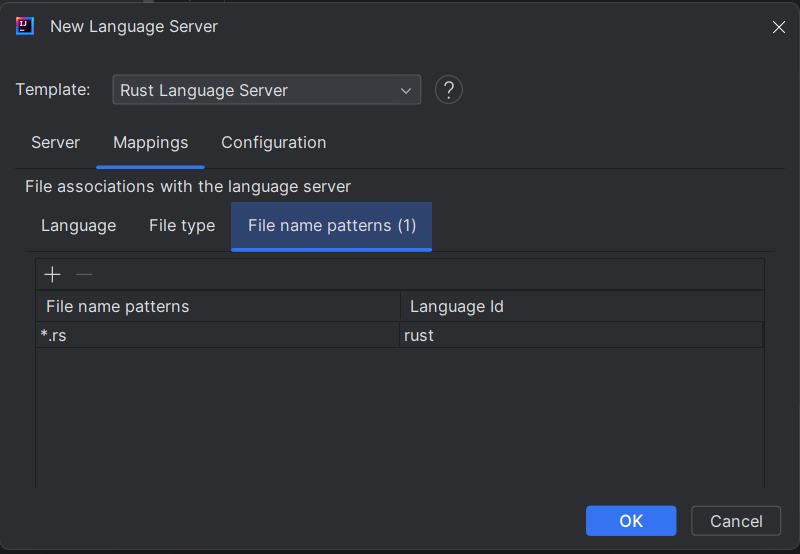
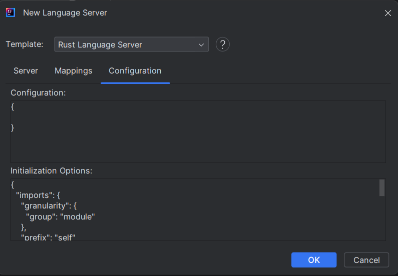
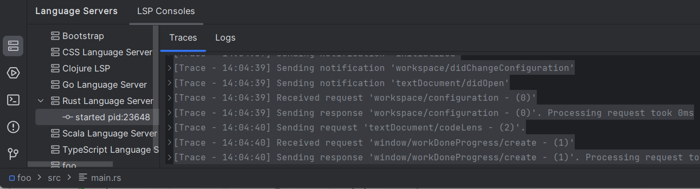
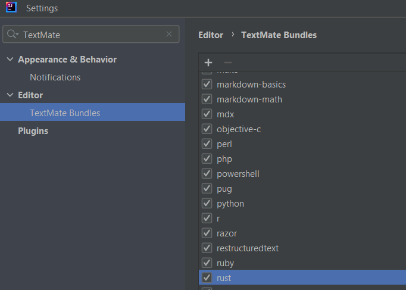

# Rust Language Server

You can use [Rust Analyzer](https://rust-analyzer.github.io/) to benefit from `Rust` support:

## Install the language server

1. **Install Rust Language Server**, by following these instructions:

* [Download the rust-analyzer language server binary](https://rust-analyzer.github.io/manual.html#rust-analyzer-language-server-binary)

2. **Open the New Language Server Dialog**. This can usually be found under the IDE settings related to Language Server Protocol (LSP). For more information, refer to the [New Language Server Dialog documentation](../UserDefinedLanguageServer.md#new-language-server-dialog).

3. **Select Rust Language Server as the template** from the available options.
   This will populate the command field with a default command:

    * `${BASE_DIR}/rust-analyzer.exe` for Windows OS.
    * `sh -c ${BASE_DIR}/rust-analyzer` for other OS.

   

You need to adjust this command to point to the location of the extracted Rust Analyzer LSP asset.

5. **Optional**: You may also customize the mappings section:

   

   or configuration section according to your preferences.

   

6. **Click OK** to apply the changes. You should now have Rust language support enabled in your IDE, with the [Rust language server](https://pkg.Rust.dev/Rustlang.org/x/tools/Rustpls) integrated,
   and you should see the language server in the [LSP console](../UserGuide.md#lsp-console):

   
 
## Syntax coloration

Today LSP4IJ doesn't support `textDocument/semanticTokens` ([please vote at issue 238](https://github.com/redhat-developer/lsp4ij/issues/238)), the demo
uses the [Rust TextMate grammar](https://github.com/microsoft/vscode/blob/main/extensions/rust/syntaxes/rust.tmLanguage.json)
that you can configure in IntelliJ via the `Editor / TextMate Bundles` settings.

You need to clone https://github.com/microsoft/vscode and reference this folder
(which contains the [package.json](https://github.com/microsoft/vscode/tree/main/extensions/rust))
to benefit from syntax coloration and language configuration (matching brackets, etc).