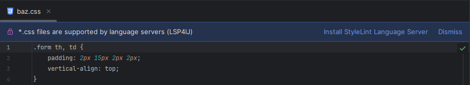
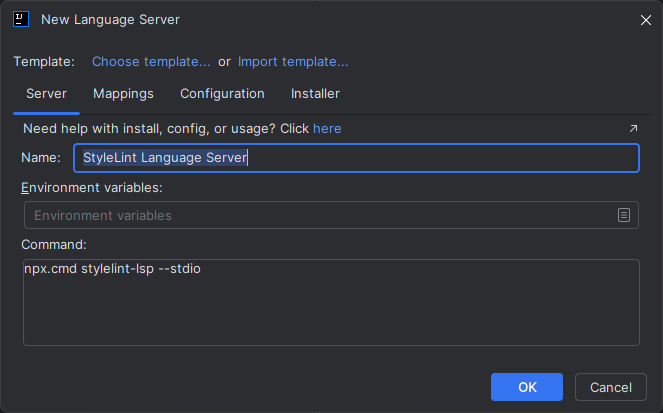
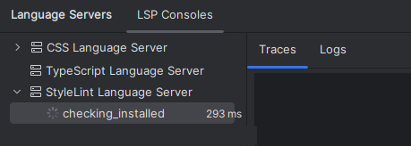
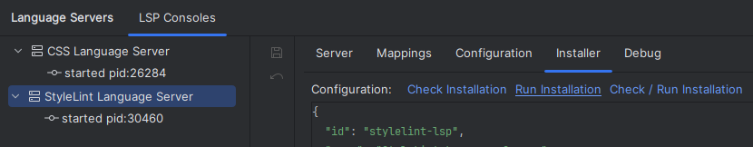

# Stylelint Language Server

To enable [Stylelint](https://stylelint.io/) language support in your IDE, you can integrate the [Stylelint-LSP](https://github.com/bmatcuk/stylelint-lsp) by following these steps:

## Step 1: Install the Language Server

1. Open a `.css` file in your project.
2. Click on **Install Stylelint Language Server**:

   

3. This will open the [New Language Server Dialog](../UserDefinedLanguageServer.md#new-language-server-dialog) with `Stylelint Language Server` pre-selected:

   

4. Click **OK**. This will create the `Stylelint Language Server` definition and start the installation:

   

5. Once the installation completes, the server should start automatically and provide Stylelint language diagnostics directly within the IDE.

## Step 2: Configure Stylelint

* If necessary, execute `npm install stylelint` in your project root.
* Create a [configuration file](https://stylelint.io/user-guide/configure).

### Troubleshooting Installation

If the installation fails, you can customize the installation settings in the **Installer** tab,  
then click on the **Run Installation** hyperlink to reinstall the server:

See [Installer descriptor](../UserDefinedLanguageServerTemplate.md#installer-descriptor) for more information.
