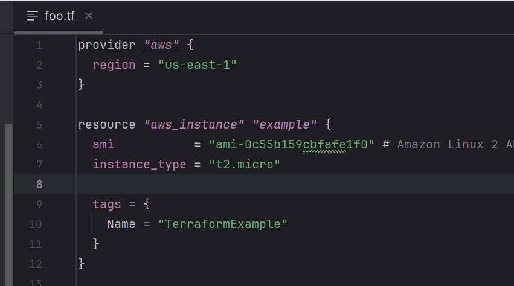
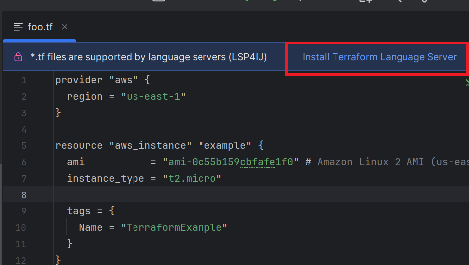
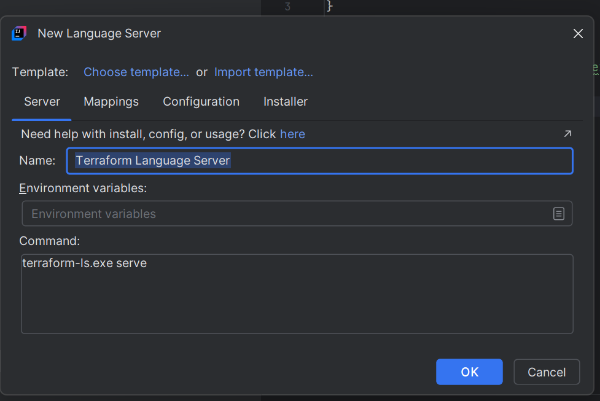
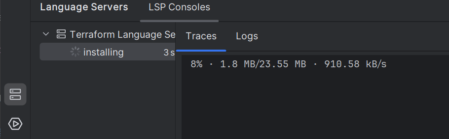
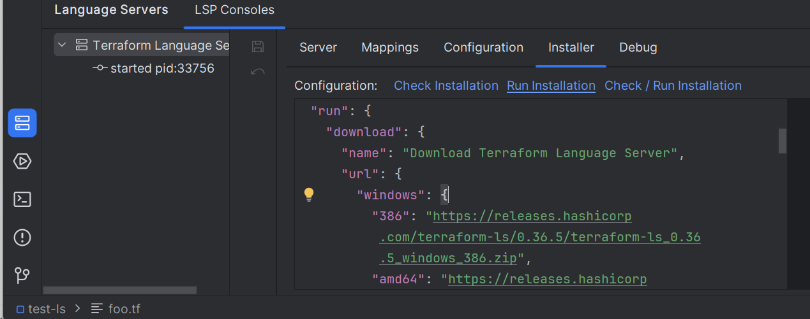

# Terraform Language Server

To enable [Terraform](https://www.terraform.io/) language support in your IDE, you can integrate the [Terraform Language Server](https://github.com/hashicorp/terraform-ls) by following these steps:

---

## Install the Language Server

1. Open an `.tf` file in your project.
2. Click on **Install Terraform Language Server**:

   

3. This will open the [New Language Server Dialog](../UserDefinedLanguageServer.md#new-language-server-dialog) with `Terraform Language Server` pre-selected:

   

4. Click **OK**. This will create the `Terraform Language Server` definition and start the installation:

   

5. Once the installation completes, the server should start automatically and provide Terraform language support (autocomplete, diagnostics, etc.).

### Troubleshooting Installation

If the installation fails or if you need to download other version of the language server, you can customize the installation settings in the **Installer** tab,  
then click on the **Run Installation** hyperlink to reinstall the server:

See [Installer descriptor](../UserDefinedLanguageServerTemplate.md#installer-descriptor) for more information.

---