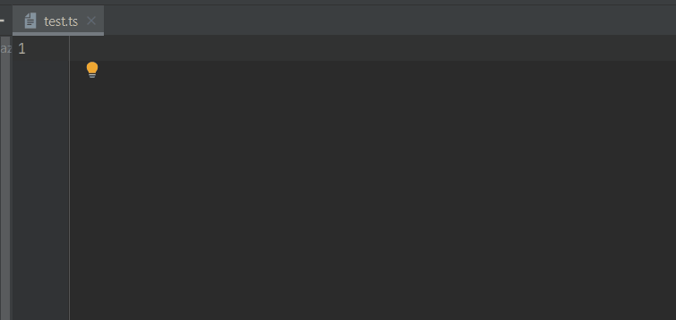
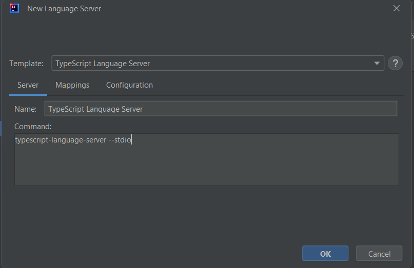

# TypeScript Language Server

You can use the [TypeScript language server](https://github.com/typescript-language-server/typescript-language-server) to benefit with `TypeScript`, `React` and `JavaScript` support:

You can use it by following these instructions:
* [Install Node.js](https://nodejs.org/en/download)
* [Read the "Installing" section](https://github.com/typescript-language-server/typescript-language-server?tab=readme-ov-file#installing), basically, open a terminal and execute the following command:

**npm install -g typescript-language-server typescript**

It will install:

* [TypeScript language server](https://github.com/typescript-language-server/typescript-language-server). This project
  delegates the LSP operations (completion, diagnostics, etc) to the **tsserver** from [TypeScript](https://github.com/microsoft/TypeScript)
  which doesn't support LSP.
* [TypeScript](https://github.com/microsoft/TypeScript) which hosts the **tsserver**.
* As the command will add **typescript-language-server** in your OS PATH, you will have to close and reopen your IntelliJ to update this PATH. 

After that you can create the TypeScript Language Server with the [language server template](../UserDefinedLanguageServer.md#using-template):

