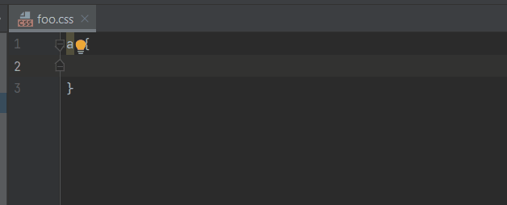
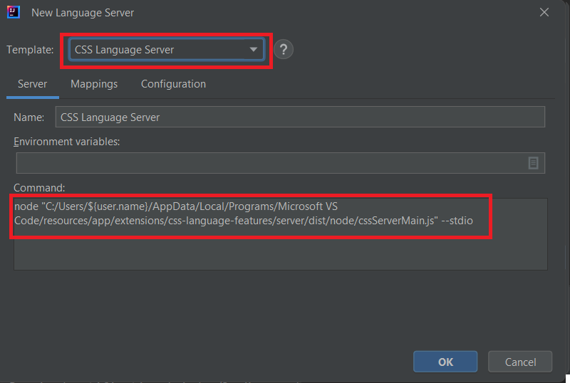

# CSS Language Server

You can leverage the [Visual Studio Code CSS Language Server](https://github.com/microsoft/vscode-css-languageservice) to enhance your development experience with support for `CSS`, `LESS`, and `SCSS`.

You can use it by following these instructions:
* [Install Node.js](https://nodejs.org/en/download)
* [Download and install Visual Studio Code](https://code.visualstudio.com/download)

Once Visual Studio Code is installed, it will store the CSS language server in:
> **${BASE_DIR}/resources/app/extensions/css-language-features/server/dist/node/cssServerMain.js**

After that you can create the CSS Language Server with the [language server template](../UserDefinedLanguageServer.md#using-template):

[LSP4IJ](https://github.com/redhat-developer/lsp4ij) tries to generate the proper **cssServerMain.js** file path according to your OS, but you may have to adjust it
in the command text field.