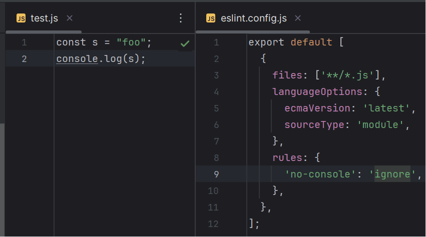
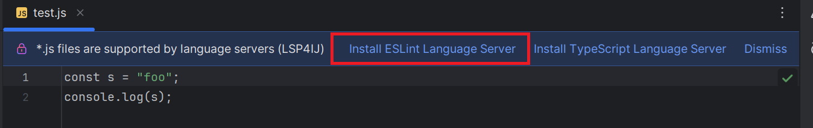
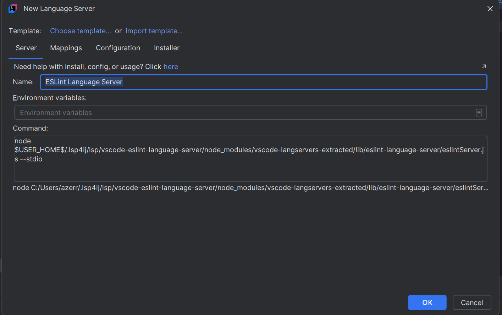
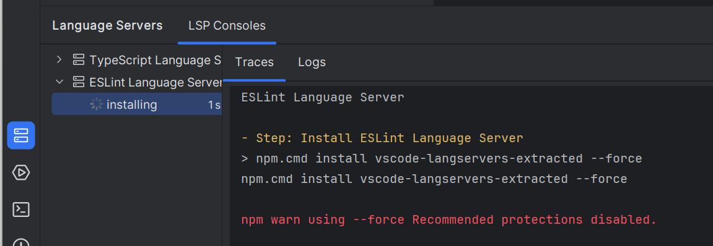
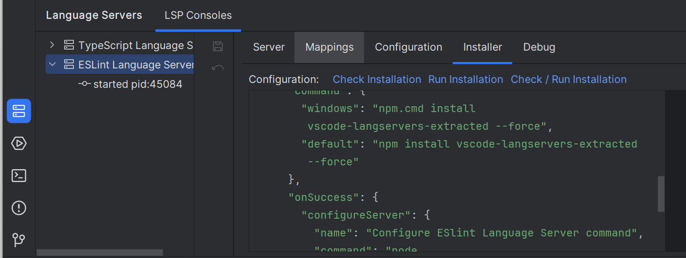

# ESLint Language Server

To enable [ESLint](https://eslint.org/) language support in your IDE, you can integrate the [ESLint Language Server](https://github.com/microsoft/vscode-eslint/tree/main/server) by following these steps:



---

## Step 1: Install the Language Server

1. Open an `.js` file in your project.
2. Click on **Install ESLint Language Server**:

   

3. This will open the [New Language Server Dialog](../UserDefinedLanguageServer.md#new-language-server-dialog) with `Ada Language Server` pre-selected:

   

4. Click **OK**. This will create the `Ada Language Server` definition and start the installation:

   

5. Once the installation completes, the server should start automatically and provide Ada language support (autocomplete, diagnostics, etc.).

## Step 2: Configure ESLint

* Execute `npm install eslint` in your project root
* Create an `eslint-config.js` file on your root project like this:

 ```js
 export default [
  {
    files: ['**/*.js'],
    languageOptions: {
      ecmaVersion: 'latest',
      sourceType: 'module',
    },
    rules: {
      'no-console': 'error',
    },
  },
];
```

* Create a `test.js` file like this:

```js 
const s = "foo";
console.log(s);
 ```

You should see an eslint error on console.

### Troubleshooting Installation

If the installation fails, you can customize the installation settings in the **Installer** tab,  
then click on the **Run Installation** hyperlink to reinstall the server:



See [Installer descriptor](../UserDefinedLanguageServerTemplate.md#installer-descriptor) for more information.

