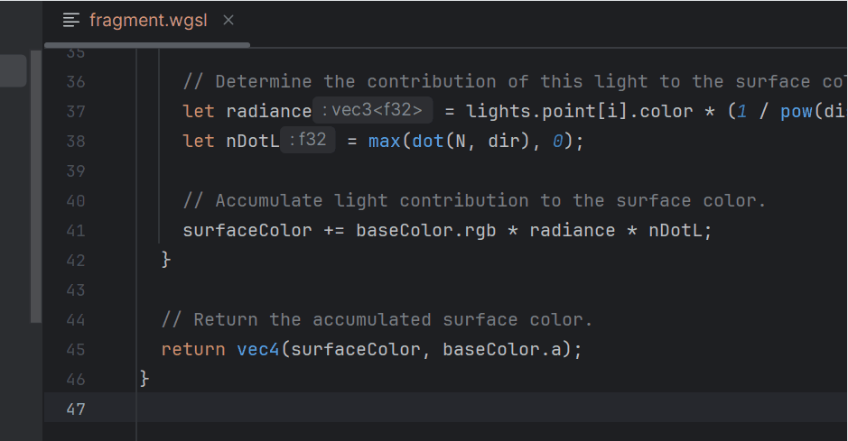
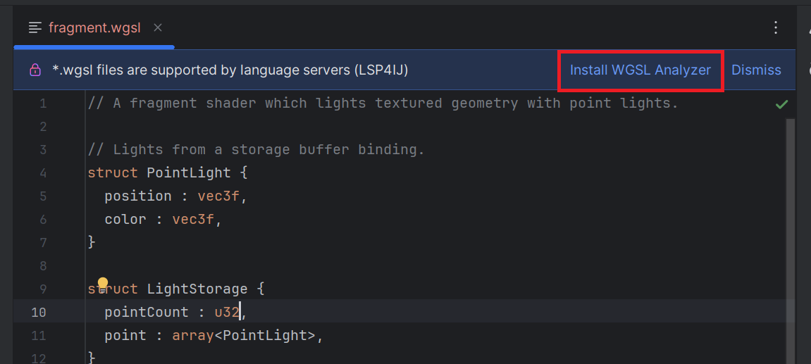
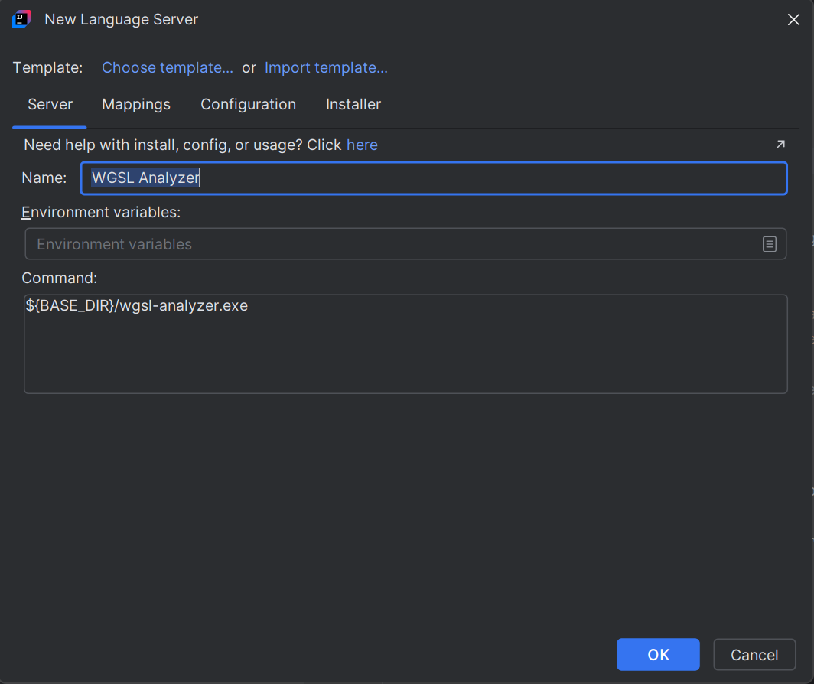
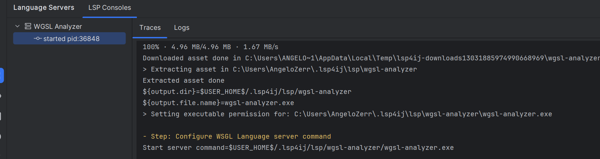
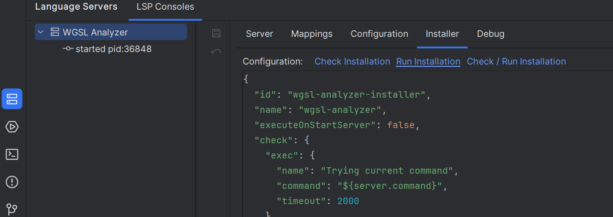

# WGSL Analyzer

To enable [WGSL](https://www.w3.org/TR/WGSL/) language support in your IDE, you can integrate the [wgsl-analyzer](https://github.com/wgsl-analyzer/wgsl-analyzer) by following these steps:



---

## Step 1: Install the Language Server

1. Open an `.wgsl` file in your project.
2. Click on **Install WGSL Analyzer**:

   

3. This will open the [New Language Server Dialog](../UserDefinedLanguageServer.md#new-language-server-dialog) with `Astro Language Server` pre-selected:

   

4. Click **OK**. This will create the `WGSL Analyzer` definition and start the installation:

   

5. Once the installation completes, the server should start automatically and provide [WGSL](https://www.w3.org/TR/WGSL/) language support (autocomplete, diagnostics, etc.).

### Troubleshooting Installation

If the installation fails, you can customize the installation settings in the **Installer** tab,  
then click on the **Run Installation** hyperlink to reinstall the server:



See [Installer descriptor](../UserDefinedLanguageServerTemplate.md#installer-descriptor) for more information.

---

## Step 2: Install TextMate Bundle

Since IntelliJ does not provide native WGSL TextMate support, and the language server does not handle syntax highlighting, you need to set up a TextMate bundle manually.

* Clone the wgsl-analyzer repository:

  ```bash
  git clone https://github.com/wgsl-analyzer/wgsl-analyzer.git

* Open TextMate Bundles settings


* Click the `+` button and select the folder [wgsl-analyzer/editors/code](https://github.com/wgsl-analyzer/wgsl-analyzer/tree/main/editors/code) folder.
  This folder contains the package.json and the TextMate grammar.

Once done, IntelliJ will apply syntax highlighting, bracket matching, and other basic editor features for .wgsl files.